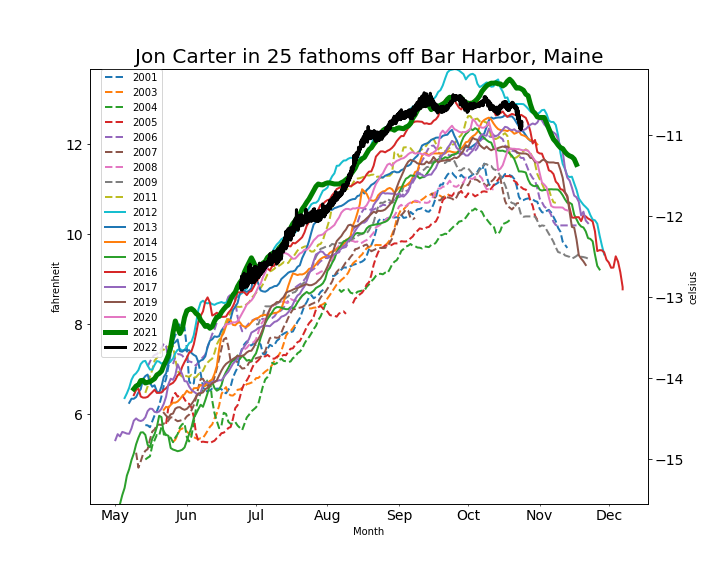

```{r setup, include=FALSE}
knitr::opts_chunk$set(echo = TRUE)
library(blastula)
library(marmap)
library(rstudioapi)
source("../../emolt_serverside/API/API_header.R")
today=Sys.Date()
lastWeek=today-days(7)
conn=dbConnector(db_config)
```

<center> 

<font size="5"> *eMOLT Weekly Update `r Sys.Date()` * </font>

</center>

### Weekly Recap 

As the lobstering season comes to a close for many along the coast of Maine, we are started to get the non-realtime probes mailed in as they have for the last 20 years.  Shown below is the time series of bottom temperature collected, for example, by Jon Carter in 25 fathoms out of Bar Harbor, Maine.  It depicts the last few years as being as warm or warmer than the record 2012. We have simliar plots showing the results of Bobby Ingalls and George Sprague further downeast. We expect to get a few dozen of these Minilog probes in the mail in the coming weeks and complete the documentation of a record warm 2022.


### Realtime Summary (Vessels with Rockblock Satellite Transmitters)

This week, we received `r nrow(dbGetQuery(conn=conn,statement=paste0("SELECT * FROM VESSEL_STATUS WHERE TIMESTAMP >'", lastWeek, "' AND REPORT_TYPE = 'SUMMARY_DATA' AND VESSEL_ID != 23")))` haul-averaged reports from `r nrow(dbGetQuery(conn=conn, statement=paste0("SELECT DISTINCT VESSEL_ID FROM VESSEL_STATUS WHERE TIMESTAMP >'", lastWeek,"' AND REPORT_TYPE = 'SUMMARY_DATA' AND VESSEL_ID != 23")))` vessels. 

```{r statusPlot, dev='png',echo=FALSE, fig.width=8,fig.height=6,fig.show='hide',include=FALSE}
dbDisconnectAll()
conn=dbConnector(db_config)
lastweek=Sys.Date()-days(7)
data=dbGetQuery(
  conn=conn,
  statement=paste0(
    "SELECT * FROM VESSEL_STATUS WHERE TIMESTAMP > '",
    lastweek,
    "' AND VESSEL_ID != 23"
  )
)
data=select(data,REPORT_TYPE,LATITUDE,LONGITUDE,TIMESTAMP)
bath=getNOAA.bathy(
  lon1=min(data$LONGITUDE-0.5),
  lon2=max(data$LONGITUDE+0.5),
  lat1=min(data$LATITUDE-0.5),
  lat2=max(data$LATITUDE+0.5),
  resolution=1
)
## Create color ramp
blues=c(
  "lightsteelblue4", 
  "lightsteelblue3",
  "lightsteelblue2", 
  "lightsteelblue1"
)
## Plotting the bathymetry with different colors for land and sea
plot(
  bath,
  step=100,
  deepest.isobath=-1000,
  shallowest.isobath=0,
  col="darkgray",
  image = TRUE, 
  land = TRUE, 
  lwd = 0.1,
  bpal = list(
    c(0, max(bath), "gray"),
    c(min(bath),0,blues)
  ),
  main=paste0("ALL eMOLT VESSELS with Satellite Transmitters \nREPORTS FROM: ",lastweek," to ",Sys.Date())
)


## Plot the status report locations
x=subset(data,data$REPORT_TYPE=="SHORT_STATUS")
points(
  x$LATITUDE~x$LONGITUDE,
  pch=1,
  col='red',
  cex=2
)
## Plot data uploads
x=subset(data,data$REPORT_TYPE=="SUMMARY_DATA")
points(
  x$LATITUDE~x$LONGITUDE,
  pch=1,
  col='blue',
  cex=2
)
legend(
  'topleft',
  col=c('blue','red'),
  legend=c('Summary Data Upload','Status Report'),
  pch=c(1,1),
  bty='n',
  bg=NULL,
  border='black'
)
```

`)

In the figure above, you can see the approximate locations where we received "Status Reports" (a ping from your system letting us know that it's still working) and "Data Uploads" (actual temperature / depth data collected by your probes). The "Status Reports" come in every 12 hours or so when a system is powered up. "Data Uploads" only come in when you haul the probes. If you were out fishing and don't see your approximate locations on here, please reach out because there may be a problem with your system.

```{r coolPlot,dev='png',echo=FALSE, fig.width=8, fig.height=6}
## Read in the data file
filename = "C:/Users/george.maynard/Downloads/li_7ae3_20220929_210554.csv"
## Open a connection to the file
con=file(filename)
## Dump the whole file
open(con)
all=readLines(
  con=con
)
close(con)
## Some line will have the column names
col_names=which(grepl("Lat,Lon,Temp",all))
## The lines above that contain metadata
metadata=as.list(all[1:col_names])
VESSEL_NAME=vessel_name(strsplit(metadata[[which(grepl("Vessel Name",metadata))]],split=",")[[1]][2])
## Read in the remainder of the file
data=read.table(text=all[(col_names+1):length(all)],sep=",")
colnames(data)=ifelse(
  grepl(" ", tolower(strsplit(all[col_names][[1]],split=",")[[1]]))==TRUE,
  gsub(tolower(strsplit(all[col_names][[1]],split=",")[[1]])," ",""),
  tolower(strsplit(all[col_names][[1]],split=",")[[1]])
)
## Convert all numeric variables to numeric format
data$lat=as.numeric(data$lat)
data$lon=as.numeric(data$lon)
data$`temperature(c)`=as.numeric(data$`temperature(c)`)
## Convert latitude and longitude to the correct format
data$LATITUDE=as.numeric(substr(data$lat,1,2))+as.numeric(substr(data$lat,3,nchar(data$lat)))/60
data$LONGITUDE=(as.numeric(substr(data$lon,1,2))+as.numeric(substr(data$lon,3,nchar(data$lon)))/60)*-1
## Convert the timestamp to the correct format
data$TIMESTAMP=ymd_hms(data$`datet(gmt)`)
## Convert the temp and depth to imperial units
data$TEMPERATURE=data$`temperature(c)`*1.8+32
data$DEPTH=data$`depth(m)`*0.546807
## Save the bottom 75% of depths
data=subset(
  data,
  data$DEPTH>0.75*max(data$DEPTH)
)
## Trim bottom temperature records to allow probe to equilibrate
data=subset(
  data,
  data$TEMPERATURE<1.05*min(data$TEMPERATURE)
)
## Plot the depths
par(mar = c(5, 4, 4, 4) + 0.3)
plot(
  data$DEPTH~data$TIMESTAMP,
  xlab="",
  ylab='Depth (fathoms)',
  ylim=c(rev(range(data$DEPTH))),
  type='l',
  main=paste0("F/V ",VESSEL_NAME),
  col='darkgray',
  lwd=1.5
)
par(new=TRUE)
plot(
  data$TEMPERATURE~data$TIMESTAMP,
  xlab="",
  ylab="",
  axes=FALSE,
  type='l',
  col='red',
  lwd=1.5
)
axis(side=4, at = pretty(range(data$TEMPERATURE)))
mtext("Bottom Temperature (F)", side=4, line=3)
legend(
  "topleft",
  lwd=c(1.5,1.5),
  col=c('darkgray','red'),
  legend=c("Depth", "Temp")
)
```


### Other Science

- Most of us think of the St John River as that flowing into the Gulf of Maine. Well, there is another big St John River flowing out of Jacksonville Florida.  The students at the Jacksonville Marine Lab just deployed a set of our drifters
  last week at the mouth.  They documented the river plume dynamics and the alongshore flow to the south but unfortunately the
units came ashore before getting into the Gulf Stream. Seeing these contraptions come ashore near  St Augustine area as shown  at:
[JML_tracks](https://studentdrifters.org/tracks/drift_jml_2022_2.html) made a scene and it got into the news
[msc.com_news](https://www.msn.com/en-us/video/weather/strange-contraption-washes-up-on-beach-turns-out-to-be-a-piece-of-scientific-equipment/vi-AA13KOeN?t=2). 
[jml_drifters_at_the_dock](drift_jml_2022_2_on_dock.png)

- Thanks to Keston Smith, Jim's former officemate, a miniboat Rowe RIda was recovered off the beach on Martha's Vineyard (see photo below) on Wednesday afternoon before it may have been damaged by today's storm waves. There is quite a story behind this unit you can find on Cassie's websites [rowrida](https://educationalpassages.org/boats/rowerida/). [pic of rowerida](ROWE_RIda_ashore_on_MV.jpg)

### Announcements and Upcoming Weeks

- The Cooperative Research Branch at the Northeast Fisheries Science Center is hosting two "Cooperative Research Summits" in early 2023 (January 31 in Newport News, VA and February 15 in Providence, RI) to highlight current coooperative research projects in the region and discuss opportunities for additional collaborations. There are stipends available to support fishermen attending. If you are interested, you can find more information [here](https://www.fisheries.noaa.gov/new-england-mid-atlantic/outreach-and-education/cooperative-research-fosters-regional-partnerships#2023-northeast-cooperative-research-summits). Registration is online and closes on **December 2, 2022**.

All the best,

-George
