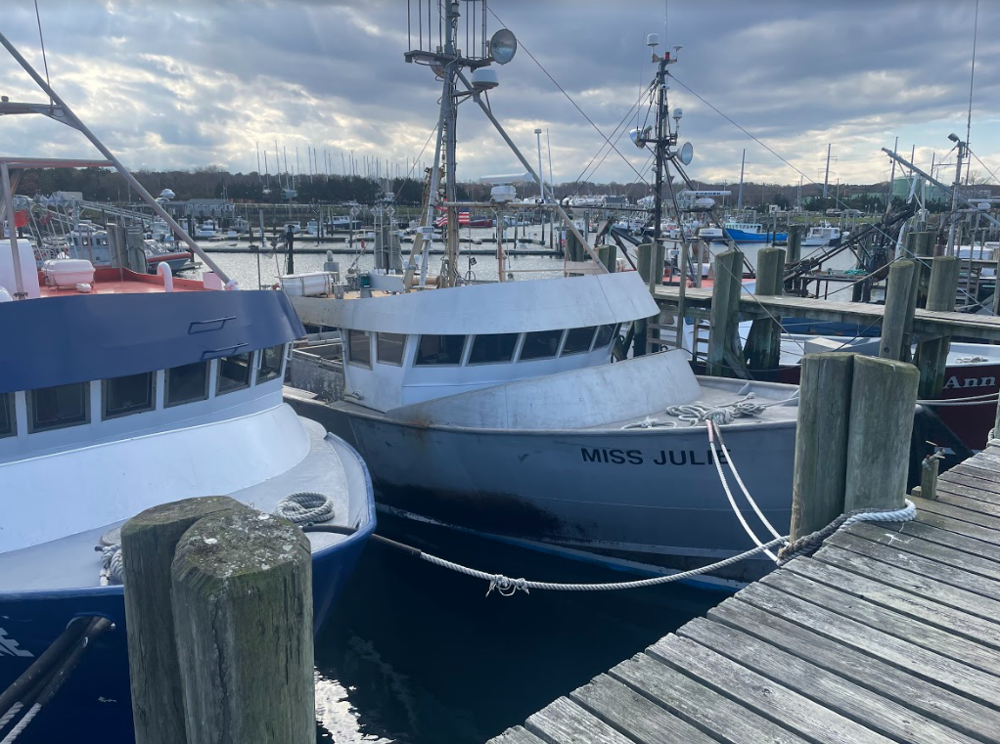

```{r setup, include=FALSE}
knitr::opts_chunk$set(echo = TRUE)
library(blastula)
library(marmap)
library(rstudioapi)
source("../../emolt_serverside/API/API_header.R")
today=Sys.Date()
lastWeek=today-days(7)
conn=dbConnector(db_config)
```

<center> 

<font size="5"> *eMOLT Weekly Update `r Sys.Date()` * </font>

</center>

### Weekly Recap 
For this week's newsletter, we welcome back the man, the myth, the legend **JiM** who put together some plots and accompanying write ups from the non-realtime data that's coming in. 

As the lobstering season comes to a close for many along the coast of Maine, we are started to get the non-realtime probes mailed in as they have for the last 20 years.  Shown below is the time series of bottom temperature collected, for example, by Frank Kristy at Dave Kandrick's old site in 20 fathoms in Cape Cod Bay. We can see the effect of a strong storm in late Sept and early Oct (>20 knot daily means) that mixed up the water column and warmed the bottom by several degrees.


Jon Carter's observations from 25 fathoms off Bar Harbor Maine depict (see figure below) the last few years as being as warm or warmer than the record 2012. We have simliar plots showing the results of Frank Kristy, Bobby Ingalls, and George Sprague further downeast. We expect to get a few dozen of these Minilog probes in the mail in the coming weeks and complete the documentation of a record warm 2022.


In the realtime portion of the program, the Lowell team were able to remotely work on the **F/V Miss Emma** earlier this week, and **Huanxin** and I spent the morning in Sandwich where we visited the **F/V Terri Ann**, **F/V Virginia Marie**, and **F/V Miss Julie**. 



It was great to spend a bit of time talking with longtime lobsterman and eMOLT participant **Marc Palombo**. Once again, we got to see a crazy temperature bottom temperature spike over their gear, coincident with a push of warm surface water as the remnants of Hurricane Nicole pushed northwards last week. 

```{r terriPlot, dev='png',echo=FALSE, fig.width=8,fig.height=6,fig.show='hide',include=FALSE}
terri=read.csv("C:/Users/george.maynard/Downloads/li_7ae3_20221116_192834.csv",skip=9)

terri$TIMESTAMP=ymd_hms(terri$Datet.GMT.)
times=c(terri$TIMESTAMP)
temps=c(terri$Temperature.C.)
plot(temps~times,type='n',xlab="",ylab="Temperature (C)")
lines(terri$Temperature.C.~terri$TIMESTAMP,col='red')
```
`)


### Realtime Summary (Vessels with Rockblock Satellite Transmitters)

This week, we received `r nrow(dbGetQuery(conn=conn,statement=paste0("SELECT * FROM VESSEL_STATUS WHERE TIMESTAMP >'", lastWeek, "' AND REPORT_TYPE = 'SUMMARY_DATA' AND VESSEL_ID != 23")))` haul-averaged reports from `r nrow(dbGetQuery(conn=conn, statement=paste0("SELECT DISTINCT VESSEL_ID FROM VESSEL_STATUS WHERE TIMESTAMP >'", lastWeek,"' AND REPORT_TYPE = 'SUMMARY_DATA' AND VESSEL_ID != 23")))` vessels. 

```{r statusPlot, dev='png',echo=FALSE, fig.width=8,fig.height=6,fig.show='hide',include=FALSE}
dbDisconnectAll()
conn=dbConnector(db_config)
lastweek=Sys.Date()-days(7)
data=dbGetQuery(
  conn=conn,
  statement=paste0(
    "SELECT * FROM VESSEL_STATUS WHERE TIMESTAMP > '",
    lastweek,
    "' AND VESSEL_ID != 23"
  )
)
data=select(data,REPORT_TYPE,LATITUDE,LONGITUDE,TIMESTAMP)
bath=readGEBCO.bathy("C:/Users/george.maynard/Downloads/GEBCO_17_Nov_2022_4faab929240a/GEBCO_17_Nov_2022_4faab929240a/gebco_2022_n45.0_s35.0_w-78.0_e-63.0.nc",resolution=10)
## Create color ramp
blues=c(
  "lightsteelblue4", 
  "lightsteelblue3",
  "lightsteelblue2", 
  "lightsteelblue1"
)
## Plotting the bathymetry with different colors for land and sea
plot(
  bath,
  step=100,
  deepest.isobath=-1000,
  shallowest.isobath=0,
  col="darkgray",
  image = TRUE, 
  land = TRUE, 
  lwd = 0.1,
  bpal = list(
    c(0, max(bath), "gray"),
    c(min(bath),0,blues)
  ),
  main=paste0("ALL eMOLT VESSELS with Satellite Transmitters \nREPORTS FROM: ",lastweek," to ",Sys.Date())
)


## Plot the status report locations
x=subset(data,data$REPORT_TYPE=="SHORT_STATUS")
points(
  x$LATITUDE~x$LONGITUDE,
  pch=1,
  col='red',
  cex=2
)
## Plot data uploads
x=subset(data,data$REPORT_TYPE=="SUMMARY_DATA")
points(
  x$LATITUDE~x$LONGITUDE,
  pch=1,
  col='blue',
  cex=2
)
legend(
  'topleft',
  col=c('blue','red'),
  legend=c('Summary Data Upload','Status Report'),
  pch=c(1,1),
  bty='n',
  bg=NULL,
  border='black'
)
```

`)

In the figure above, you can see the approximate locations where we received "Status Reports" (a ping from your system letting us know that it's still working) and "Data Uploads" (actual temperature / depth data collected by your probes). The "Status Reports" come in every 12 hours or so when a system is powered up. "Data Uploads" only come in when you haul the probes. If you were out fishing and don't see your approximate locations on here, please reach out because there may be a problem with your system.

### Other Science

- Most of us think of the St John River as that flowing into the Gulf of Maine. Well, there is another big St John River flowing out of Jacksonville Florida.  The students at the Jacksonville Marine Lab deployed a set of our drifters a few weeks ago at the mouth.  They documented the river plume dynamics and the alongshore flow to the south but unfortunately the units came ashore before getting into the Gulf Stream. Seeing these contraptions come ashore near  St Augustine area as shown  at:
[JML_tracks](https://studentdrifters.org/tracks/drift_jml_2022_2.html) made a scene and it got into the news
[msc.com_news](https://www.msn.com/en-us/video/weather/strange-contraption-washes-up-on-beach-turns-out-to-be-a-piece-of-scientific-equipment/vi-AA13KOeN?t=2). 
[jml_drifters_at_the_dock](drift_jml_2022_2_on_dock.png)

- Thanks to Keston Smith, Jim's former officemate, a miniboat Rowe RIda was recovered off the beach on Martha's Vineyard (see photo below) last Wednesday afternoon before it may have been damaged by storm waves. There is quite a story behind this unit you can find on Cassie's websites [rowrida](https://educationalpassages.org/boats/rowerida/) but the saga continues. Since Keston brought it into the Island Charter School, they want to get involved with the project and have their own drifter or miniboat. [pic of rowerida](ROWE_RIda_ashore_on_MV.jpg)

### Announcements and Upcoming Weeks

- The Cooperative Research Branch at the Northeast Fisheries Science Center is hosting two "Cooperative Research Summits" in early 2023 (January 31 in Newport News, VA and February 15 in Providence, RI) to highlight current coooperative research projects in the region and discuss opportunities for additional collaborations. There are stipends available to support fishermen attending. If you are interested, you can find more information [here](https://www.fisheries.noaa.gov/new-england-mid-atlantic/outreach-and-education/cooperative-research-fosters-regional-partnerships#2023-northeast-cooperative-research-summits). Registration is online and closes on **December 2, 2022**.

**Huanxin** and his family are traveling south to Florida for the holiday next week, while my family is headed in the opposite direction to visit relatives in northern Vermont, so you won't see us or a Friday newsletter next week. Wherever you are though, whether on land or at sea, best wishes for a wonderful Thanksgiving from the whole eMOLT team.  
