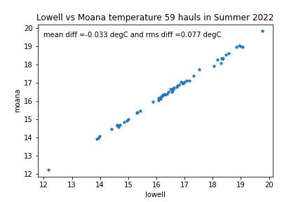
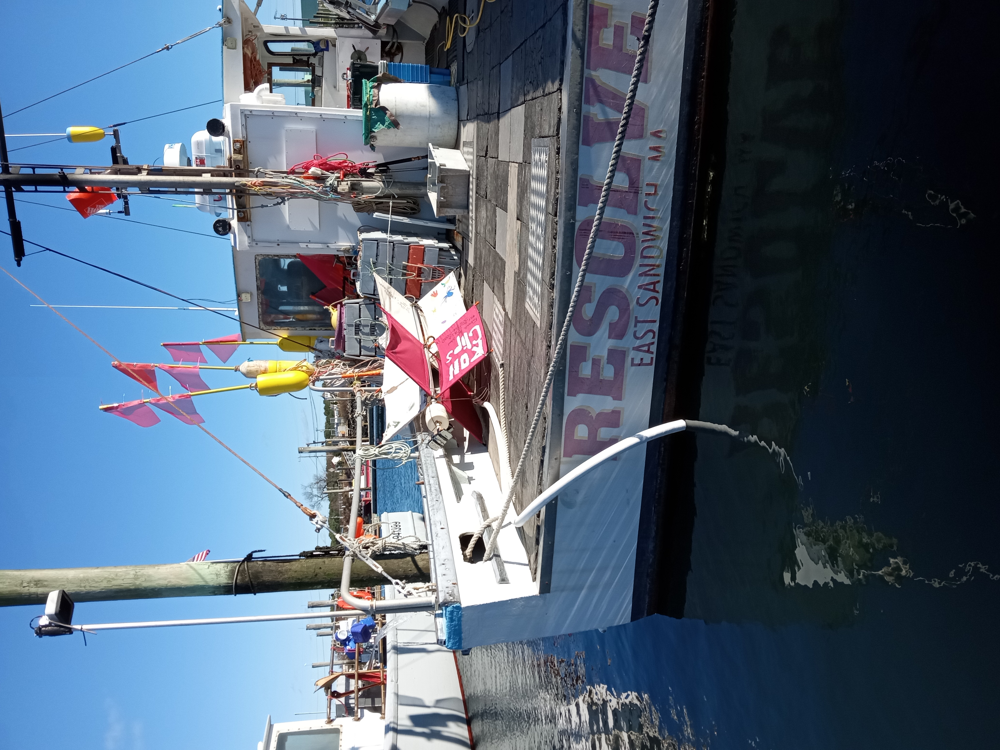

```{r setup, include=FALSE}
knitr::opts_chunk$set(echo = TRUE)
library(blastula)
library(marmap)
library(rstudioapi)
source("../../emolt_serverside/API/API_header.R")
today=Sys.Date()
lastWeek=today-days(7)
conn=dbConnector(db_config)
```

<center> 

<font size="5"> *eMOLT Weekly Update `r Sys.Date()` * </font>

</center>

### Weekly Recap 

As we continue to experiment with new sensors every year, it is essential that we assess their performance/accuracy relative to those we have used to date. In the case of the new Moana probe, we are thankful for Mark Phillips who has had mulitple probes lashed to his gear this past Summer. We were able to look at the difference in haul-averaged bottom temperatures as reported by both the Lowell sensor (our standard for the last several years) and the Moana sensor.  As shown in the figure below, we are happy with the results in that they recorded a mean difference of ~0.03 degC with a root-mean-square differenc of ~0.07 degC which is well within our 0.1 degC goal.


### Realtime Summary (Vessels with Rockblock Satellite Transmitters)

This week, we received `r nrow(dbGetQuery(conn=conn,statement=paste0("SELECT * FROM VESSEL_STATUS WHERE TIMESTAMP >'", lastWeek, "' AND REPORT_TYPE = 'SUMMARY_DATA' AND VESSEL_ID != 23")))` haul-averaged reports from `r nrow(dbGetQuery(conn=conn, statement=paste0("SELECT DISTINCT VESSEL_ID FROM VESSEL_STATUS WHERE TIMESTAMP >'", lastWeek,"' AND REPORT_TYPE = 'SUMMARY_DATA' AND VESSEL_ID != 23")))` vessels. 

```{r statusPlot, dev='png',echo=FALSE, fig.width=8,fig.height=6,fig.show='hide',include=FALSE}
dbDisconnectAll()
conn=dbConnector(db_config)
lastweek=Sys.Date()-days(7)
data=dbGetQuery(
  conn=conn,
  statement=paste0(
    "SELECT * FROM VESSEL_STATUS WHERE TIMESTAMP > '",
    lastweek,
    "' AND VESSEL_ID != 23"
  )
)
data=select(data,REPORT_TYPE,LATITUDE,LONGITUDE,TIMESTAMP)
bath=getNOAA.bathy(
  lon1=min(data$LONGITUDE-0.5),
  lon2=max(data$LONGITUDE+0.5),
  lat1=min(data$LATITUDE-0.5),
  lat2=max(data$LATITUDE+0.5),
  resolution=1
)
## Create color ramp
blues=c(
  "lightsteelblue4", 
  "lightsteelblue3",
  "lightsteelblue2", 
  "lightsteelblue1"
)
## Plotting the bathymetry with different colors for land and sea
plot(
  bath,
  step=100,
  deepest.isobath=-1000,
  shallowest.isobath=0,
  col="darkgray",
  image = TRUE, 
  land = TRUE, 
  lwd = 0.1,
  bpal = list(
    c(0, max(bath), "gray"),
    c(min(bath),0,blues)
  ),
  main=paste0("ALL eMOLT VESSELS with Satellite Transmitters \nREPORTS FROM: ",lastweek," to ",Sys.Date())
)
## Plot the status report locations
x=subset(data,data$REPORT_TYPE=="SHORT_STATUS")
points(
  x$LATITUDE~x$LONGITUDE,
  pch=1,
  col='red',
  cex=2
)
## Plot data uploads
x=subset(data,data$REPORT_TYPE=="SUMMARY_DATA")
points(
  x$LATITUDE~x$LONGITUDE,
  pch=1,
  col='blue',
  cex=2
)
legend(
  'topleft',
  col=c('blue','red'),
  legend=c('Summary Data Upload','Status Report'),
  pch=c(1,1),
  bty='n',
  bg=NULL,
  border='black'
)
```

`)
In the figure above, you can see the approximate locations where we received "Status Reports" (a ping from your system letting us know that it's still working) and "Data Uploads" (actual temperature / depth data collected by your probes). The "Status Reports" come in every 12 hours or so when a system is powered up. "Data Uploads" only come in when you haul the probes. If you were out fishing and don't see your approximate locations on here, please reach out because there may be a problem with your system.
```{r coolPlot,dev='png',echo=FALSE, fig.width=8, fig.height=6}
## Read in the data file
filename = "C:/Users/george.maynard/Downloads/li_7ae3_20220929_210554.csv"
## Open a connection to the file
con=file(filename)
## Dump the whole file
open(con)
all=readLines(
  con=con
)
close(con)
## Some line will have the column names
col_names=which(grepl("Lat,Lon,Temp",all))
## The lines above that contain metadata
metadata=as.list(all[1:col_names])
VESSEL_NAME=vessel_name(strsplit(metadata[[which(grepl("Vessel Name",metadata))]],split=",")[[1]][2])
## Read in the remainder of the file
data=read.table(text=all[(col_names+1):length(all)],sep=",")
colnames(data)=ifelse(
  grepl(" ", tolower(strsplit(all[col_names][[1]],split=",")[[1]]))==TRUE,
  gsub(tolower(strsplit(all[col_names][[1]],split=",")[[1]])," ",""),
  tolower(strsplit(all[col_names][[1]],split=",")[[1]])
)
## Convert all numeric variables to numeric format
data$lat=as.numeric(data$lat)
data$lon=as.numeric(data$lon)
data$`temperature(c)`=as.numeric(data$`temperature(c)`)
## Convert latitude and longitude to the correct format
data$LATITUDE=as.numeric(substr(data$lat,1,2))+as.numeric(substr(data$lat,3,nchar(data$lat)))/60
data$LONGITUDE=(as.numeric(substr(data$lon,1,2))+as.numeric(substr(data$lon,3,nchar(data$lon)))/60)*-1
## Convert the timestamp to the correct format
data$TIMESTAMP=ymd_hms(data$`datet(gmt)`)
## Convert the temp and depth to imperial units
data$TEMPERATURE=data$`temperature(c)`*1.8+32
data$DEPTH=data$`depth(m)`*0.546807
## Save the bottom 75% of depths
data=subset(
  data,
  data$DEPTH>0.75*max(data$DEPTH)
)
## Trim bottom temperature records to allow probe to equilibrate
data=subset(
  data,
  data$TEMPERATURE<1.05*min(data$TEMPERATURE)
)
## Plot the depths
par(mar = c(5, 4, 4, 4) + 0.3)
plot(
  data$DEPTH~data$TIMESTAMP,
  xlab="",
  ylab='Depth (fathoms)',
  ylim=c(rev(range(data$DEPTH))),
  type='l',
  main=paste0("F/V ",VESSEL_NAME),
  col='darkgray',
  lwd=1.5
)
par(new=TRUE)
plot(
  data$TEMPERATURE~data$TIMESTAMP,
  xlab="",
  ylab="",
  axes=FALSE,
  type='l',
  col='red',
  lwd=1.5
)
axis(side=4, at = pretty(range(data$TEMPERATURE)))
mtext("Bottom Temperature (F)", side=4, line=3)
legend(
  "topleft",
  lwd=c(1.5,1.5),
  col=c('darkgray','red'),
  legend=c("Depth", "Temp")
)
```


### Drifter and Miniboat Update

- A few weeks ago, while R/V Neil Armstrong was out recovering the last of the Ocean Observatory Initiative moorings on the shelf edge south of Martha's Vineyard, they deployed both a miniboat and a drifter as prepared by students in Waterford CT.
- A video of the launch is posted at https://vimeo.com/user110037220/ladylance. The full story of the miniboat is posted at https://educationalpassages.org/boats/ladylance/.  The track of both units is posted at  https://studentdrifters.org/tracks/drift_whs_2022_1.html along with an animation of modeled surface temps at https://studentdrifters.org/tracks/2022-11-14SNE_DOPPIO_-1.gif.
- Two Falmouth High School drifters are being deployed today by Rob Martine off F/V Resolve in Cape Cod Bay.  You can follow their tracks at https://studentdrifters.org/tracks/drift_fhs_2022_1.html.
-  

### Announcements and Upcoming Weeks

- The Cooperative Research Branch at the Northeast Fisheries Science Center is hosting two "Cooperative Research Summits" in early 2023 (January 31 in Newport News, VA and February 15 in Providence, RI) to highlight current coooperative research projects in the region and discuss opportunities for additional collaborations. There are stipends available to support fishermen attending. If you are interested, you can find more information [here](https://www.fisheries.noaa.gov/new-england-mid-atlantic/outreach-and-education/cooperative-research-fosters-regional-partnerships#2023-northeast-cooperative-research-summits). Registration is online and closes on **December 2, 2022**.

- There is also a workshop scheduled at Woods Hole Oceanographic Institute on January 18-20 as described at https://www.us-ocb.org/coastal-bgc-obs-network-with-fishing-community/
- Fishers are especially welcome and funds are available to cover their travel.
- 
All the best,

-George
