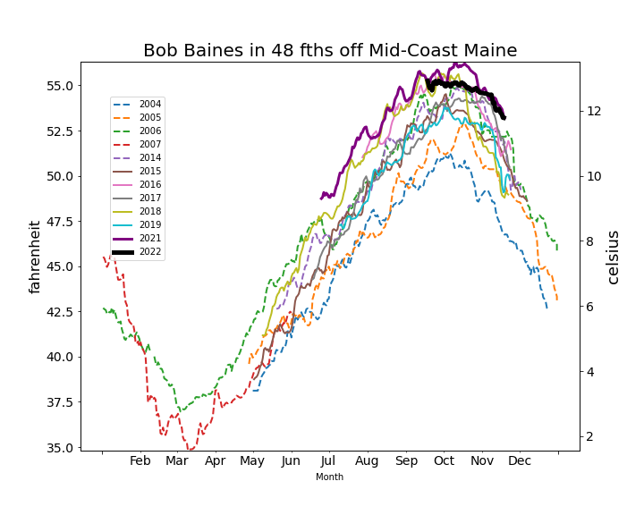
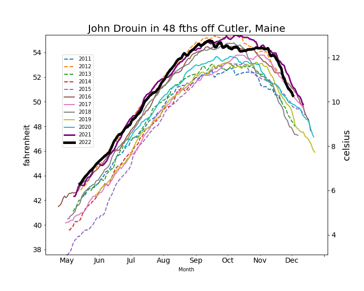

```{r setup, include=FALSE}
knitr::opts_chunk$set(echo = TRUE)
library(blastula)
library(marmap)
library(rstudioapi)
source("../../../emolt_serverside/API/API_header.R")
today=Sys.Date()
lastWeek=today-days(14)
db_config=config::get(file="C:/Users/george.maynard/Documents/GitHubRepos/emolt_serverside/API/config.yml")$dev_intranet
conn=dbConnector(db_config)
```

<center> 

<font size="5"> *eMOLT Weekly Update `r Sys.Date()` * </font>

</center>

### Weekly Recap 

Last week, George and Huanxin spent a rainy morning in Newport and Point Judith. In Newport, we delivered a second logger to the **F/V Excalibur** and collected the deckbox for some refurbishing in the workshop. 


*Figure 1 - Despite disassembling the deckbox on the F/V Excalibur, we were unable to identify the problem with the unit in the field. Huanxin was able to run more diagnostics back in the workshop and fix the problems.*

Across the bridge, we installed a new satellite transmitter and deckbox on board the **F/V Brooke C**, and downloaded raw data from the **F/V Virginia Marise**, **F/V Linda Marie**, and **F/V Illusion**. The Point was pretty much deserted because of the weather.


*Figure 2 -- Seagulls picking at the bait barrels were the only living things we ran into on the first few boats we worked on*

However, we did spend some time chatting with Capt. **Mark Phillips** on the Illusion to get his perspective on the variety of loggers he's tried out. One interesting takeaway is that he'd rather see fine-resolution bottom data (similar to what comes off Aquatecs) than the water column profiles provided by the new Moana loggers. This type of feedback is invaluable as we work with our partners in the sensor manufacturing industry and other industry-based environmental monitoring programs like Study Fleet and the Commercial Fisheries Research Foundation to develop systems that are robust, affordable, and useful. Do you have a preferred logger and display system? [Send us an email](mailto:george.maynard@noaa.gov) and let us know!

A big thank you to our partners **Jack Carroll** (Ocean Data Network) and **Owen Nichols** (Center for Coastal Studies). Between Jack's work on the North Shore and Owen's work on the Outer Cape, we've got all systems on participating vessels in Newburyport, Gloucester, and Provincetown running smoothly. Thank you both for all your efforts over the last few weeks! 

As we struggle with the day-to-day operations, we need to occasionally remind ourselves of the general progress.  A couple of significant milestones have recently been reached in the longterm evolution of eMOLT. 1) The total number of hauls that have reported realtime bottom temperatures has surpassed 20 thousand. 2) The total number of hourly records of bottom temperature from non-realtime traps has surpassed 10 million which, given the hundreds of instrumented traps, converts to over 1000 years of data. 

Bob Baines, John Drouin, and Jamie Hallowell, all active members of the Maine Lobstermen Association, mailed in their Minilog probes in the past few weeks. Like many of the original eMOLT lobstermen, Bob is fishing shorter seasons as he approaches retirement age. In 2022, he had his probe in the water only for a few months but, as seen in the graphic below, it was enough to document his 48 fathom (87 meters) site off Spruce Head Maine being warm like last year. Jamie, who took over Arnie's old site in 22 fathoms off Mid-Coast, returned a longer season showing similar results compared to earlier years. and John, who fishes off Cutler also in 48 fathoms, returned similar records as well.





*Figure 3 - Time series plots of temperature over the fishing season from Bob Baines (top), Jamie Halowell (mid) and John Drouin (bottom)*

We recently heard from the engineers at Creare Inc on their wireless probe development. As with many tech companies in the last few years, they are struggling with supply chain issues in getting the parts they need but, nevertheless, they are now on track to provide another instrument for testing in 2023.

We also had a call with some of the partners on a new grant to the Gulf of Maine Lobster Foundation funded by the [American Lobster Initiative](https://seagrant.umaine.edu/extension/american-lobster-initiative/research-projects/). We'll be working with NERACOOS and Ocean Data Networks to serve up data faster and in more useful ways for the fishing industry, providing data to scientists at SMAST for incorporation into more ocean forecasting models, and providing data to scientists at SUNY Stony Brook working on lobster population forecasting. Additionally, we'll be outfitting another five vessels homeported in Maine with realtime eMOLT systems, specifically targeting vessel that fish in the Gulf of Maine. If you or someone you know operate out of a harbor in Maine, fish the Gulf of Maine, and are interested in an eMOLT rig, please reach out to George to get on our list of potential new fishing industry partners. 

### Realtime Summary (Vessels with Rockblock Satellite Transmitters)

Over the last two weeks, we received `r nrow(dbGetQuery(conn=conn,statement=paste0("SELECT * FROM VESSEL_STATUS WHERE TIMESTAMP >'", lastWeek, "' AND REPORT_TYPE = 'SUMMARY_DATA' AND VESSEL_ID != 23")))` haul-averaged reports from `r nrow(dbGetQuery(conn=conn, statement=paste0("SELECT DISTINCT VESSEL_ID FROM VESSEL_STATUS WHERE TIMESTAMP >'", lastWeek,"' AND REPORT_TYPE = 'SUMMARY_DATA' AND VESSEL_ID != 23")))` vessels. 

```{r statusPlot, dev='png',echo=FALSE, fig.width=8,fig.height=6,fig.show='hide',include=FALSE}
dbDisconnectAll()
conn=dbConnector(db_config)
lastweek=Sys.Date()-days(14)
data=dbGetQuery(
  conn=conn,
  statement=paste0(
    "SELECT * FROM VESSEL_STATUS WHERE TIMESTAMP > '",
    lastweek,
    "' AND VESSEL_ID != 23"
  )
)
data=select(data,REPORT_TYPE,LATITUDE,LONGITUDE,TIMESTAMP)
bath=readGEBCO.bathy(
  file="../../UtilityScripts/GEBCO/gebco_2022_n47.0_s38.0_w-76.0_e-59.0.nc",
  resolution=10
)
## Create color ramp
blues=c(
  "lightsteelblue4", 
  "lightsteelblue3",
  "lightsteelblue2", 
  "lightsteelblue1"
)
## Plotting the bathymetry with different colors for land and sea
plot(
  bath,
  step=100,
  deepest.isobath=-1000,
  shallowest.isobath=0,
  col="darkgray",
  image = TRUE, 
  land = TRUE, 
  lwd = 0.1,
  bpal = list(
    c(0, max(bath), "gray"),
    c(min(bath),0,blues)
  ),
  main=paste0("ALL eMOLT VESSELS with Satellite Transmitters \nREPORTS FROM: ",lastweek," to ",Sys.Date())
)
## Plot the status report locations
x=subset(data,data$REPORT_TYPE=="SHORT_STATUS")
points(
  x$LATITUDE~x$LONGITUDE,
  pch=1,
  col='red',
  cex=2
)
## Plot data uploads
x=subset(data,data$REPORT_TYPE=="SUMMARY_DATA")
points(
  x$LATITUDE~x$LONGITUDE,
  pch=1,
  col='blue',
  cex=2
)
legend(
  'topleft',
  col=c('blue','red'),
  legend=c('Summary Data Upload','Status Report'),
  pch=c(1,1),
  bty='n',
  bg=NULL,
  border='black'
)
```

`)

*Figure 4 - eMOLT Satellite Transmitter status plot for the previous two weeks, since there was no update last week.*

In the figure above, you can see the approximate locations where we received "Status Reports" (a ping from your system letting us know that it's still working) and "Data Uploads" (actual temperature / depth data collected by your probes). The "Status Reports" come in every 12 hours or so when a system is powered up. "Data Uploads" only come in when you haul the probes. If you were out fishing and don't see your approximate locations on here, please reach out because there may be a problem with your system.

### Data Portal News

We are continuing to load all of the data that this program has collected over the last few decades into our new database, which interfaces with the Ocean Data Network portal to provide easy, on-demand access to data visualizations for fishermen who are interested in viewing their historic data. We are closing in on 6 million individual temperature/depth records in the database, with millions more to go. If you are interested in seeing your data on the portal, please reach out and let me know. 

### Drifter and Miniboat Update

Congrats to Erin Pelletier (Gulf of Maine lobster Foundation) in getting a $15K grant for "Student Drifters STEM Curriculum Project" from the Davis Conservation Foundation. One of the primary outcomes will be to "Expand awareness of climate change among Maine students through hands-on
involvement in a science project in the Gulf of Maine."

While there has been a few hundred miniboat deployments in the past few decades, one of the most interesting stories is that of the "Lancer" which started its journey in a Waterbury Ct High School years ago.  It was relaunched off the island off Teneriffe this past week. See the full story at https://educationalpassages.org/boats/lancer/.


### Announcements and Upcoming Weeks

- The whole eMOLT team will be taking some time off for the holidays, so this will be the last email missive until after New Year's. We hope you and your families have some time to relax and enjoy yourselves as well. 

All the best,

-George and JiM
