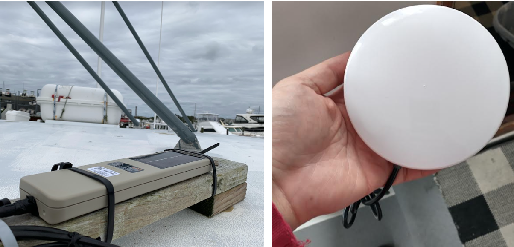
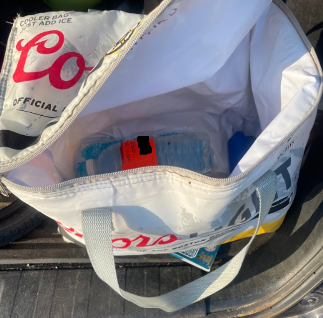

```{r setup, include=FALSE}
knitr::opts_chunk$set(echo = TRUE)
library(blastula)
library(marmap)
library(rstudioapi)
source("../../emolt_serverside/API/API_header.R")
today=Sys.Date()
lastWeek=today-days(7)
conn=dbConnector(db_config)
```

<center> 

<font size="5"> *eMOLT Weekly Update `r Sys.Date()` * </font>

</center>

### Weekly Recap 

As you all know, there is no singular "eMOLT" hardware system. Every participating vessel has a slightly different configuration of sensors, computers, and transmitters. To some extent, this is by design. We want to know what works in real-world, at-sea conditions, not just on the benches in our workshop. However, as we identify things that work, we like to roll them out across the fleet. To that end, we'd like to get all vessels using the newer-style Rockblock transmitters, which look like a large, white puck. **Huanxin** and I identified five vessels that are still using the old AP3-style satellite transmitters.



*Figure 1 -- Older style AP3 Transmitter (L), previously installed on the **F/V Tenacious II** and the newer Rockblock Transmitter (R) that replaced it.*

If you are on this list, we will be reaching out to you with a new SD card for your vessel as well as a new Rockblock satellite transmitter. If you are not on this list but think you should be, please reach out.

- **F/V Devocean**
- **F/V Dorcas Anne**
- **F/V Excalibur**
- **F/V Freemantle Doctor**
- **F/V Virginia Marise**

Besides the vessels with AP3 transmitters and Rockblock transmitters, there is also a subset of eMOLT participants who report solely via a cell modem that's built in to their deckbox. 


*Figure 2 -- Captain **Phil Lynch** with a cell-integrated deckbox on the **F/V Mary Elizabeth*** 

Congratulations to the captain and crew of the **F/V Noah** for reporting their first successful hauls as eMOLT participants this week using one of these cell-powered platforms.

**Joaquim Oller** at Lowell Instruments, **Carles Castro Muniain** at Ocean Data Networks, and **Huanxin** have been experimenting with getting these cell modems to work alongside the satellite transmitters. If we can get these operational, and start installing them across the fleet, it will mean you no longer have to connect to Wi-Fi hotspots or have **Huanxin** come download the data to a flash drive, like he's doing on-board the **F/V Charger** today.

I've also spent a considerable amount of time this week working with my colleagues in the Oceans and Climate Branch, the Ecosystem Dynamics and Assessment Branch, and the Information Technology Division to make non-proprietary data more easily accessible to our external partners and the fishing industry. It's amazing how much red tape the government puts in its own way, but we are making slow progress through it. Taxpayer funded data belong to the people, not locked away inside our firewall. On that front, if you're someone from outside of NOAA who uses data we produce, how do you access it? Please shoot me a message or give me a call. I'd be curious to know what we could be doing to make that process easier.

### Realtime Summary (Vessels with Rockblock Satellite Transmitters)

This week, we received `r nrow(dbGetQuery(conn=conn,statement=paste0("SELECT * FROM VESSEL_STATUS WHERE TIMESTAMP >'", lastWeek, "' AND REPORT_TYPE = 'SUMMARY_DATA' AND VESSEL_ID != 23")))` haul-averaged reports from `r nrow(dbGetQuery(conn=conn, statement=paste0("SELECT DISTINCT VESSEL_ID FROM VESSEL_STATUS WHERE TIMESTAMP >'", lastWeek,"' AND REPORT_TYPE = 'SUMMARY_DATA' AND VESSEL_ID != 23")))` vessels. 

```{r statusPlot, dev='png',echo=FALSE, fig.width=8,fig.height=6,fig.show='hide',include=FALSE}
dbDisconnectAll()
conn=dbConnector(db_config)
lastweek=Sys.Date()-days(7)
data=dbGetQuery(
  conn=conn,
  statement=paste0(
    "SELECT * FROM VESSEL_STATUS WHERE TIMESTAMP > '",
    lastweek,
    "' AND VESSEL_ID != 23"
  )
)
data=select(data,REPORT_TYPE,LATITUDE,LONGITUDE,TIMESTAMP)
bath=getNOAA.bathy(
  lon1=min(data$LONGITUDE-0.5),
  lon2=max(data$LONGITUDE+0.5),
  lat1=min(data$LATITUDE-0.5),
  lat2=max(data$LATITUDE+0.5),
  resolution=1
)
## Create color ramp
blues=c(
  "lightsteelblue4", 
  "lightsteelblue3",
  "lightsteelblue2", 
  "lightsteelblue1"
)
## Plotting the bathymetry with different colors for land and sea
plot(
  bath,
  step=100,
  deepest.isobath=-1000,
  shallowest.isobath=0,
  col="darkgray",
  image = TRUE, 
  land = TRUE, 
  lwd = 0.1,
  bpal = list(
    c(0, max(bath), "gray"),
    c(min(bath),0,blues)
  ),
  main=paste0("ALL eMOLT Vessels with Satellite Transmitters \nReports from: ",lastweek," to ",Sys.Date())
)


## Plot the status report locations
x=subset(data,data$REPORT_TYPE=="SHORT_STATUS")
points(
  x$LATITUDE~x$LONGITUDE,
  pch=1,
  col='red',
  cex=2
)
## Plot data uploads
x=subset(data,data$REPORT_TYPE=="SUMMARY_DATA")
points(
  x$LATITUDE~x$LONGITUDE,
  pch=1,
  col='blue',
  cex=2
)
legend(
  'topleft',
  col=c('blue','red'),
  legend=c('Summary Data Upload','Status Report'),
  pch=c(1,1),
  bty='n',
  bg=NULL,
  border='black'
)
```

`)

*Figure 3 -- eMOLT weekly status plot*

In the figure above, you can see the approximate locations where we received "Status Reports" (a ping from your system letting us know that it's still working) and "Data Uploads" (actual temperature / depth data collected by your probes). The "Status Reports" come in every 12 hours or so when a system is powered up. "Data Uploads" only come in when you haul the probes. If you were out fishing and don't see your approximate locations on here, please reach out because there may be a problem with your system or with the data plumbing on our end.

I firmly believe that science is a team sport, and we all benefit from a better understanding of the ocean. While the eMOLT program is primarily focused on collecting temperature and dissolved oxygen data, we're happy to field other questions from industry partners as well. During his normal fishing in Cape Cod Bay this week, Captain **David Marsh** of the **F/V Grace Sarah** came across an area of water that was opaque and brown, despite several days of relative calm. Reaching out through the network of scientists here, we were able to coordinate delivery of some water samples to **Dr. Amy Costa** at the Center for Coastal Studies. Her lab group is in the process of analyzing those samples, so stay tuned for results!



*Figure 4 -- When the packy was giving out free coolers, I'm not sure if transporting water quality samples was the intended purpose. Disclaimer: eMOLT is not sponsored by Coors Light or the Boston Bruins*

### Announcements and Upcoming Weeks

- Just a reminder that The Cooperative Research Branch at the Northeast Fisheries Science Center is hosting two "Cooperative Research Summits" in early 2023 (January 31 in Newport News, VA and February 15 in Providence, RI) to highlight current coooperative research projects in the region and discuss opportunities for additional collaborations. There are stipends available to support fishermen attending. If you are interested, you can find more information [here](https://www.fisheries.noaa.gov/new-england-mid-atlantic/outreach-and-education/cooperative-research-fosters-regional-partnerships#2023-northeast-cooperative-research-summits). Registration is online and closes on **December 2, 2022**.

- For our academic partners and / or any industry members who want to take a foray into submitting public comments, NOAA is requesting information as the agency develops an Ocean Climate Action Plan. Among the topics they're looking to address are "climate-ready fisheries" and "opportunities for partnerships and collaboration". Working with the fishing industry to better understand oceanographic changes in real time is a powerful way to collect some of the data that will be needed to inform fisheries management in the future. You can submit your comments [here](https://www.federalregister.gov/documents/2022/10/04/2022-21480/ocean-climate-action-plan)

As always, if there's anything we could be doing to make these data more useful to you or make this program easier to participate in, don't hesitate to reach out. If we all keep pulling in the same direction, we can make headway.  

All the best,

-George
