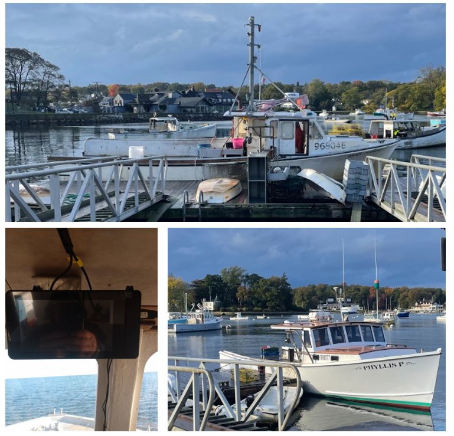
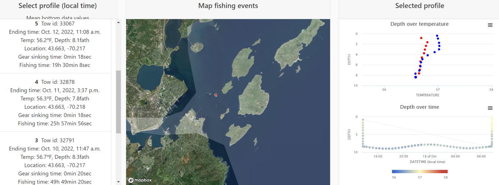

```{r setup, include=FALSE}
knitr::opts_chunk$set(echo = TRUE)
library(blastula)
library(marmap)
library(rstudioapi)
source("../../emolt_serverside/API/API_header.R")
today=Sys.Date()
lastWeek=today-days(7)
conn=dbConnector(db_config)
```

<center> 

<font size="5"> *eMOLT Weekly Update `r Sys.Date()` * </font>

</center>

### Weekly Recap 

It's been a busy week on multiple fronts for the eMOLT team -- even those of us who are allegedly retired. On Monday afternoon, **Huanxin** and I headed up to Cohasset where we met with captains **Mike Lane** and **Joe Barrow** to install new eMOLT systems with Moana temperature profilers on the **F/V Phyliss P** and the **F/V Ryan Joseph**. Rather than spending his retirement at a golf course or staring slack-jawed at another Price is Right rerun, **JiM** spent some time this week working on miniboats with science classes in the Falmouth public schools.



*Figure 1 -- A view of the eMOLT deckbox (bottom-left) in the wheelhouse of **F/V Ryan** Joseph (top), and a look at the **F/V Phyliss P** (bottom-right), the two newest members of the eMOLT fleet.*

**Carles** at Ocean Data Networks and I have made some strides towards returning data back to you, the fishermen who've collected it, via the [ODN Portal](https://www.portal.fishydata.com/register/). If you haven't already requested an account, we encourage you to do so. In true eMOLT spirit, we are building this system as we go, so it may take some time for your data to be available after you request an account. However, once it's available, you should be able to log in and see your vessel's historic data in a little more detail than you can in the wheelhouse. 




*Figure 2 -- Screenshots from the ODN Portal of demo data made available in collaboration with the **F/V St. Croix***.

If you'd like to play around with the portal and give us some feedback right away on how we could improve it, you're welcome to visit the [demo data page](https://www.portal.fishydata.com/lucky_catch/). 

We had two great examples of cooperative research data being used in peer-reviewed, scientific publications this week. 

**JiM** and several co-authors published the article ["Spreading pathways of Pilgrim Nuclear Power Station wastewater in and around Cape Cod Bay: Estimates from ocean drifter observations"](https://www.sciencedirect.com/science/article/pii/S0265931X22002302) in the Journal of Environmental Radioactivity. The drifter project, now in its 18th year, relies heavily on eMOLT fishing industry partners to deploy these student-built instruments. Over the years, this project has been able to thoroughly document surface currents on the Northeast Shelf with hundreds of tracks. With **JiM's** retirement, processing and archiving the drifter data has shifted from our lab at NOAA over to the [Burkholder Lab](https://burkholderlab.org/) at Stonehill College. Despite slow years during covid, several schools have signed up to build drifters in the classroom over the next few months. If you're interested in helping deploy them, please reach out and let us know! You can also follow the project at its [recently-revised website here](http://www.studentdrifters.org).


*Figure 3 -- A plot of the archive of all drifter tracks off the Northeastern USA from the start of the program until September 2022.*

Additionally, several co-authors and I published the article ["Evaluating growth dimorphism, maturation, and skip spawning of Atlantic Halibut in the Gulf of Maine using a collaborative research approach"](https://www.researchgate.net/publication/364353854_Evaluating_growth_dimorphism_maturation_and_skip_spawning_of_Atlantic_halibut_in_the_Gulf_of_Maine_using_a_collaborative_research_approach) in the Journal of Northwest Atlantic Fisheries Research. While this project doesn't explicitly have anything to do with eMOLT, several current and former eMOLT participants were involved. Thanks to especially to captains **Eric Hesse** (F/V Tenacious II), **Phil Lynch** (F/V Mary Elizabeth), **Nick Muto** (F/V Miss Evelyn), and **Greg Walinski** (F/V Alicia Ann) for their efforts on this work. 

Speaking of cooperative research, if you haven't already, please check out the [Northeast Cooperative Research Summits webpage](https://www.fisheries.noaa.gov/event/new-england-cooperative-research-summit) and consider attending. We'd really enjoy having a chance to meet face to face and discuss current and future cooperative research ideas and opportunities with you.

### Realtime Summary (Vessels with Rockblock Satellite Transmitters)

This week, we received `r nrow(dbGetQuery(conn=conn,statement=paste0("SELECT * FROM VESSEL_STATUS WHERE TIMESTAMP >'", lastWeek, "' AND REPORT_TYPE = 'SUMMARY_DATA' AND VESSEL_ID != 23")))` haul-averaged reports from `r nrow(dbGetQuery(conn=conn, statement=paste0("SELECT DISTINCT VESSEL_ID FROM VESSEL_STATUS WHERE TIMESTAMP >'", lastWeek,"' AND REPORT_TYPE = 'SUMMARY_DATA' AND VESSEL_ID != 23")))` vessels. 

```{r statusPlot, dev='png',echo=FALSE, fig.width=8,fig.height=6,fig.show='hide',include=FALSE}
dbDisconnectAll()
conn=dbConnector(db_config)
lastweek=Sys.Date()-days(7)
data=dbGetQuery(
  conn=conn,
  statement=paste0(
    "SELECT * FROM VESSEL_STATUS WHERE TIMESTAMP > '",
    lastweek,
    "' AND VESSEL_ID != 23"
  )
)
data=select(data,REPORT_TYPE,LATITUDE,LONGITUDE,TIMESTAMP)
bath=getNOAA.bathy(
  lon1=min(data$LONGITUDE-0.5),
  lon2=max(data$LONGITUDE+0.5),
  lat1=min(data$LATITUDE-0.5),
  lat2=max(data$LATITUDE+0.5),
  resolution=1
)
## Create color ramp
blues=c(
  "lightsteelblue4", 
  "lightsteelblue3",
  "lightsteelblue2", 
  "lightsteelblue1"
)
## Plotting the bathymetry with different colors for land and sea
plot(
  bath,
  step=100,
  deepest.isobath=-1000,
  shallowest.isobath=0,
  col="darkgray",
  image = TRUE, 
  land = TRUE, 
  lwd = 0.1,
  bpal = list(
    c(0, max(bath), "gray"),
    c(min(bath),0,blues)
  ),
  main=paste0("ALL eMOLT Vessels with Satellite Transmitters \nReports from: ",lastweek," to ",Sys.Date())
)


## Plot the status report locations
x=subset(data,data$REPORT_TYPE=="SHORT_STATUS")
points(
  x$LATITUDE~x$LONGITUDE,
  pch=1,
  col='red',
  cex=2
)
## Plot data uploads
x=subset(data,data$REPORT_TYPE=="SUMMARY_DATA")
points(
  x$LATITUDE~x$LONGITUDE,
  pch=1,
  col='blue',
  cex=2
)
legend(
  'topleft',
  col=c('blue','red'),
  legend=c('Summary Data Upload','Status Report'),
  pch=c(1,1),
  bty='n',
  bg=NULL,
  border='black'
)
```

`)

*Figure 4 -- eMOLT weekly status plot*

In the figure above, you can see the approximate locations where we received "Status Reports" (a ping from your system letting us know that it's still working) and "Data Uploads" (actual temperature / depth data collected by your probes). The "Status Reports" come in every 12 hours or so when a system is powered up. "Data Uploads" only come in when you haul the probes. If you were out fishing and don't see your approximate locations on here, please reach out because there may be a problem with your system or with the data plumbing on our end.

### Announcements and Upcoming Weeks

- Vitalii Sheremet and some of his colleagues at WHOI will be deploying 7 km (~3.75 nautical mile) longlines rigged with oceanographic instrumentation on the shelf south of Martha's Vineyard in November and December as well as potentially some time next spring. They are trying to avoid conflict with fishing gear. So, if you or anyone you know fishes in that area and wouldn't mind sharing general coordinates to avoid, please reach out to me or to Vitalii directly at vsheremet@whoi.edu

- A reminder that we're always interested to hear from you about your experiences on the water while we're (mostly) stuck behind desks. This past week, an unofficial state record wahoo was caught off Rhode Island, and **Brian Tarbox** at Southern Maine Community College reported catches of juvenile permit, northern barracuda, crevalles, and northern puffer in some of their seine sampling. The eMOLT realtime program is recording another warm one this year with temperatures somewhere around 3&deg;F warmer than the 30 year average. We may not always be able to get back to you quickly (the water samples from the **F/V Grace Sarah** are still being processed), but we'll do our best. 

- If you participate in the non-realtime portion of the eMOLT program, please mail your probes back to **JiM's** house at **21 Pleasant View Avenue, Falmouth, MA 02540**. He'll be showing me how to download the data and process those probes to get them ready for next year over the upcoming months. 

- If you participate in the Dissolved Oxygen monitoring portion of eMOLT and are planning to pull your gear soon, please reach out so I can get those probes from you. If you're switching to another fishery for the winter, we can probably set you up with regular temperature probes if that's of interest.


All the best,

-George
