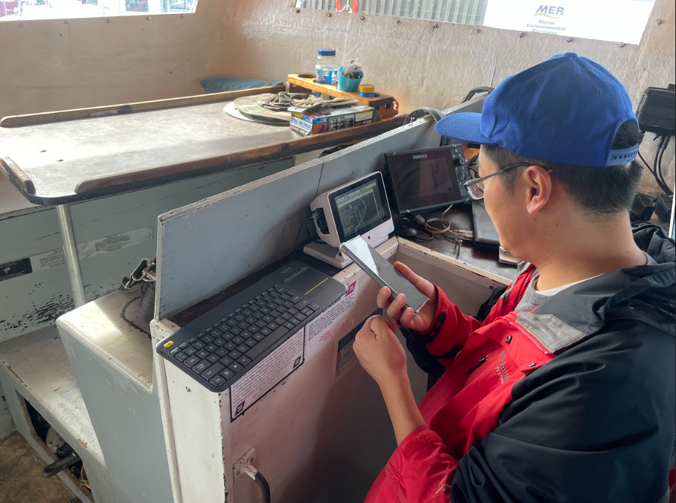
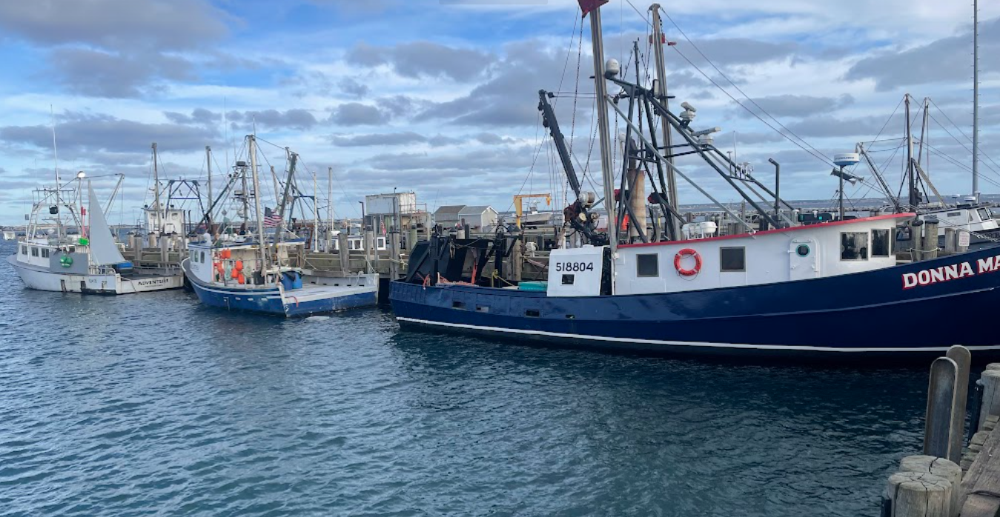
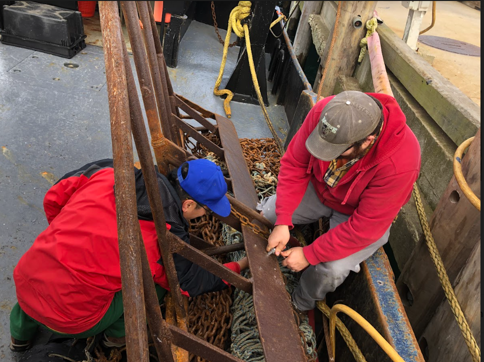
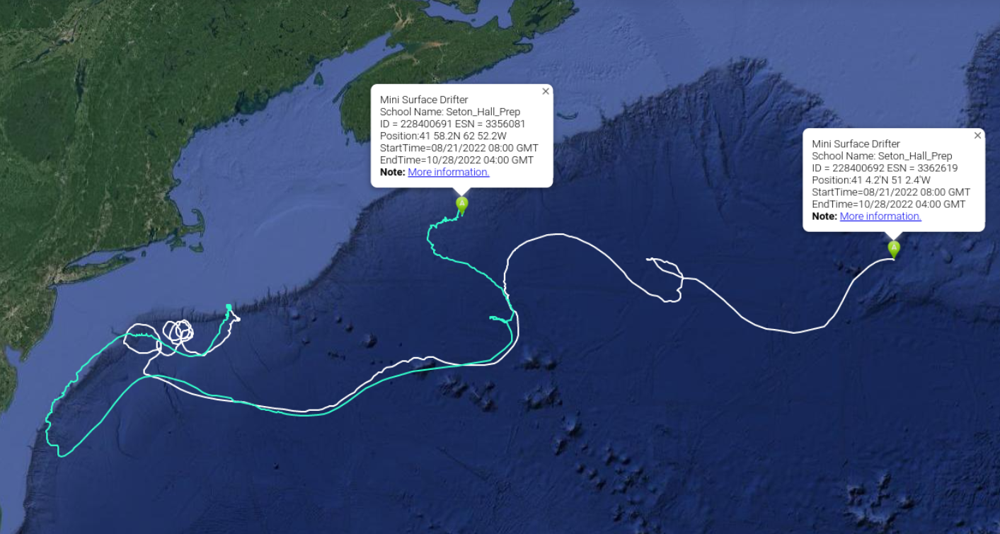

```{r setup, include=FALSE}
knitr::opts_chunk$set(echo = TRUE)
library(blastula)
library(marmap)
library(rstudioapi)
source("../../emolt_serverside/API/API_header.R")
today=Sys.Date()
lastWeek=today-days(7)
conn=dbConnector(db_config)
```

<center> 

<font size="5"> *eMOLT Weekly Update `r Sys.Date()` * </font>

</center>

### Weekly Recap 

This week's write up is a late one, but it's still coming in before the buzzer. My kids' preschool was closed this week because their teacher's son got COVID, so I've been working weird hours to make up for normal hours taking care of them. 


*Figure 1 -- My daughter exploring the commercial pier in Woods Hole. She decided this boat was her favorite because of its "long beautiful green hair"*

We've started to get in the first loggers of the season from participants in the traditional (non-realtime) eMOLT program. **JiM** and I will be processing those together this fall, so just a reminder to please send them either to the lab at **166 Water Street, Woods Hole, MA 02543** or to **JiM's** house at **21 Pleasantview Avenue, Falmouth, MA 02540**. The first logger this year belonged to **Captain Bobby Ingalls** fishing out of Bucks Harbor, ME. The plot of his data going back to 2008 is shown below. 2021 is plotted in blue and 2022 is plotted in red. *Note that the 2022 data have not passed through the QA/QC check yet, so there are some weird points at either end of the series.* 

```{r IngallsPlot, dev='png',echo=FALSE, fig.width=8,fig.height=6,fig.show='hide',include=FALSE}
historic=read.csv("C:/Users/george.maynard/Downloads/Ingalls_historic.csv")
historic$TIMESTAMP=dmy_hms(as.character(historic$TIME))
historic$yday=yday(historic$TIMESTAMP)
historic$year=year(historic$TIMESTAMP)
historic$TEMP=historic$TEMP*(9/5)+32
plot(historic$TEMP~historic$yday,type='n', xlab="Day of Year", ylab="Temperature (Fahrenheit)",main='Downeast Maine, 11 fathoms')
for(i in 2008:2020){
  x=subset(historic,historic$year==i)
  x=x[order(x$yday),]
  lines(x$TEMP~x$yday,col='lightgray',lwd=2)
}
x=subset(historic,historic$year==2021)
x=x[order(x$yday),]
lines(x$TEMP~x$yday,col='blue',lwd=2)
newdat=read.csv("C:/Users/george.maynard/Downloads/mbi0309.csv")
newdat$TIMESTAMP=mdy(newdat$Date.yyyy.mm.dd.)+hms(newdat$Time.hh.mm.ss.)
newdat$yday=yday(newdat$TIMESTAMP)
newdat=newdat[order(newdat$yday),]
newdat$TEMP=newdat$Temperature..C.*(9/5)+32
lines(newdat$TEMP~newdat$yday,col='red',lwd=2)
legend('topleft', c('2021','2022'),col=c('blue','red'),lwd=c(2,2))
```
`)

*Figure 2 -- Data from Bobby Ingalls' logger, 2008-present. 2021 is plotted in blue and 2022 is plotted in red. **Note that the 2022 data have not passed through a QAQC check.***

We've also been busy on the realtime side of the project. Today, **Huanxin** got started early and visited the F/V Virginia Marie in Sandwich to troubleshoot some issues. Then, he and I met at the F/V Charger in Hyannis before driving up to Provincetown to meet with our collaborators **Owen Nichols** from the Center for Coastal Studies and Captains **Willis King** of the F/V Donna Marie and **Mike Russo** of the F/V Adventure. While there, we were able to troubleshoot problems on both vessels and wrap up the MassTech program by installing a Lowell Deck Data Hub on the F/V Rolex for Captain **Bob Dutra**. 


*Figure 3 -- **Huanxin** tackles a software problem on Captain **Phil Michaud's** F/V Charger in Hyannis.*


*Figure 4 -- The three vessels we visited this afternoon, (L-R, F/V Adventure, F/V Rolex, F/V Donna Marie)*


*Figure 5 -- **Huanxin** and **George** bolt a new temperature profile to the dredge on the F/V Donna Marie. Photo credit: **Owen Nichols***

### Realtime Summary (Vessels with Rockblock Satellite Transmitters)

This week, we received `r nrow(dbGetQuery(conn=conn,statement=paste0("SELECT * FROM VESSEL_STATUS WHERE TIMESTAMP >'", lastWeek, "' AND REPORT_TYPE = 'SUMMARY_DATA' AND VESSEL_ID != 23")))` haul-averaged reports from `r nrow(dbGetQuery(conn=conn, statement=paste0("SELECT DISTINCT VESSEL_ID FROM VESSEL_STATUS WHERE TIMESTAMP >'", lastWeek,"' AND REPORT_TYPE = 'SUMMARY_DATA' AND VESSEL_ID != 23")))` vessels. 

```{r statusPlot, dev='png',echo=FALSE, fig.width=8,fig.height=6,fig.show='hide',include=FALSE}
dbDisconnectAll()
conn=dbConnector(db_config)
lastweek=Sys.Date()-days(7)
data=dbGetQuery(
  conn=conn,
  statement=paste0(
    "SELECT * FROM VESSEL_STATUS WHERE TIMESTAMP > '",
    lastweek,
    "' AND VESSEL_ID != 23"
  )
)
data=select(data,REPORT_TYPE,LATITUDE,LONGITUDE,TIMESTAMP)
bath=getNOAA.bathy(
  lon1=min(data$LONGITUDE-0.5),
  lon2=max(data$LONGITUDE+0.5),
  lat1=min(data$LATITUDE-0.5),
  lat2=max(data$LATITUDE+0.5),
  resolution=1
)
## Create color ramp
blues=c(
  "lightsteelblue4", 
  "lightsteelblue3",
  "lightsteelblue2", 
  "lightsteelblue1"
)
## Plotting the bathymetry with different colors for land and sea
plot(
  bath,
  step=100,
  deepest.isobath=-1000,
  shallowest.isobath=0,
  col="darkgray",
  image = TRUE, 
  land = TRUE, 
  lwd = 0.1,
  bpal = list(
    c(0, max(bath), "gray"),
    c(min(bath),0,blues)
  ),
  main=paste0("ALL eMOLT Vessels with Satellite Transmitters \nReports from: ",lastweek," to ",Sys.Date())
)


## Plot the status report locations
x=subset(data,data$REPORT_TYPE=="SHORT_STATUS")
points(
  x$LATITUDE~x$LONGITUDE,
  pch=1,
  col='red',
  cex=2
)
## Plot data uploads
x=subset(data,data$REPORT_TYPE=="SUMMARY_DATA")
points(
  x$LATITUDE~x$LONGITUDE,
  pch=1,
  col='blue',
  cex=2
)
legend(
  'topleft',
  col=c('blue','red'),
  legend=c('Summary Data Upload','Status Report'),
  pch=c(1,1),
  bty='n',
  bg=NULL,
  border='black'
)
```

`)

*Figure 6 -- eMOLT weekly status plot*

In the figure above, you can see the approximate locations where we received "Status Reports" (a ping from your system letting us know that it's still working) and "Data Uploads" (actual temperature / depth data collected by your probes). The "Status Reports" come in every 12 hours or so when a system is powered up. "Data Uploads" only come in when you haul the probes. If you were out fishing and don't see your approximate locations on here, please reach out because there may be a problem with your system or with the data plumbing on our end.

### Other Science

The water samples from Captain **David Marsh** on the F/V Grace Sarah from a few weeks back were analyzed by the CCS plankton lab. The samples looked normal for this time of year and weren't cloudy or brown. However, a conversation with **David** revealed that the samples were taken near the surface of the water column. *Karenia*, a genus of plankton that can turn water murky and brown and is responsible for red tides, hypoxic zones, and other unpleasant things tends to congregate near the thermocline. **Dr. Amy Costa** at the Center for Coastal Studies doesn't expect any more blooms this season, but... in her words,

> *"If you hear anything like this happening in the future, please do pass it along and we’ll try to respond better on this end and get a boat and equipment out to the area to sample.  We’ve been looking into this (Karenia blooms) for a few years now and it’s been really difficult to predict when and where it will occur so having information like this passed along from fishermen is invaluable!"*

Thanks for the heads up and being willing to grab those samples **David**!

Another hearty thanks goes out to captain **Gator Silvia** of the F/V Nathaniel Lee. **Gator** and his crew deployed two surface drifters together on the shelf edge southeast of Cape Cod at the end of August. The drifters are now hundreds of miles apart, with one south of Nova Scotia and the other approaching The Grand Banks.


*Figure 7 -- Tracks of the drifters deployed from the F/V Nathaniel Lee in Augutst 2022.*

Finally, thank you to captain **David Goethel** who sent along some cool pictures of a juvenile African Pompano sighted at Portsmouth Naval Shipyard. Juveniles of this species have evolved long fins as a defense against predators. There appears to be some debate among evolutionary biologists as to whether the fins are supposed to mimic a jellyfish or simply make the juvenile look bigger. Either way, it's a pretty neat thing to see. African pompanos are a warmer water species, but periodically show up north of the Carolinas, especially during hurricane season. 


*Figure 8 -- African pompano*

### Announcements

- You've heard it before, but I'll say it again. Fishermen feedback is what makes cooperative research successful. Please check out the [Northeast Cooperative Research Summits webpage](https://www.fisheries.noaa.gov/event/new-england-cooperative-research-summit) and consider attending. We'd really enjoy having a chance to meet face to face and discuss current and future cooperative research ideas and opportunities with you.

- Vitalii Sheremet and some of his colleagues at WHOI will be deploying 7 km (~3.75 nautical mile) longlines rigged with oceanographic instrumentation on the shelf south of Martha's Vineyard in November and December as well as potentially some time next spring. They are trying to avoid conflict with fishing gear. So, if you or anyone you know fishes in that area and wouldn't mind sharing general coordinates to avoid, please reach out to me or to Vitalii directly at vsheremet@whoi.edu

- If you participate in the non-realtime portion of the eMOLT program, please mail your probes back to **JiM's** house at **21 Pleasant View Avenue, Falmouth, MA 02540**. He'll be showing me how to download the data and process those probes to get them ready for next year over the upcoming months. 

- If you participate in the Dissolved Oxygen monitoring portion of eMOLT and are planning to pull your gear soon, please reach out so I can get those probes from you. If you're switching to another fishery for the winter, we can probably set you up with regular temperature probes if that's of interest.


All the best,

-George
