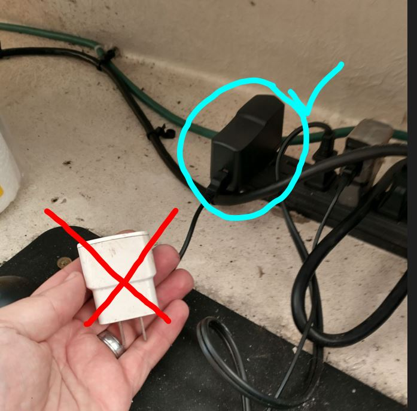

```{r setup, include=FALSE}
knitr::opts_chunk$set(echo = TRUE)
library(blastula)
```

<center> 

<font size="5"> *eMOLT Update `r Sys.Date()` * </font>

</center>

Over the last two weeks, we've been working  with several industry partners to get our dissolved oxygen monitors deployed in support of [MADMF's Cape Cod Bay Study Fleet program](https://www.mass.gov/info-details/tracking-dissolved-oxygen-with-the-cape-cod-bay-study-fleet-and-dmf). Thanks to Captain Tony on the F/V Raider III and Captain Dave on the F/V Grace Sarah for signing up for another year of supporting this program. Next week, we hope to complete our installs with Captain Frank on the F/V Sarah K. 

Just a reminder for all eMOLT participants with AC powered systems, not all power supplies are created equal. Although all the pieces fit together to use a cell phone charger with your deckbox, oftentimes those chargers don't output enough juice. If you're experiencing issues with your box power cycling, not powering on, or periodically shutting down for no apparent reason, check the power supply. It should be rated for at least 3 amps. 

{width=330px}

As I mentioned the other week, we've started our installs up in the Gulf of Maine, but appear to have hit a bit of a stumbling block on the F/V Ella V. Without a functioning wi-fi connection, it's tough to deal with software bugs happening nearly five hours away. Thanks to Captain Jamien for his patience with us as we try to resolve the issues on this system. Hopefully we can get it off of his boat and into the lab at UMaine where the internet connection is more stable. 

Along those lines, if you've noticed an issue with your system, please feel free to reach out. We can't be everywhere at once, but we can't fix things if we don't know they're broken. This week, we were able to take action on a text from Captain Mike on the F/V Adventure to get his system back up and running. Phone calls, texts, picture messages, and even Facebook messenger are all good ways to get in touch, so please don't hesitate to let me know. 

On the drifter front, thank you to everyone who reached out after the email a few weeks ago. The drifters on Isle au Haut and Nantucket have both been recovered. 

### Announcements

- The Massachusetts Division of Marine Fisheries is providing free weak rope and marking materials to state waters pot and trap fishermen to comply with buoy line trap gear modification requirements. If you're on Cape Cod and haven't gotten your free gear yet, please contact Ray Kane at 508-367-1693 to schedule a pickup. Each fishermen receives the following until supplies run out:

  - 5/16" red sink rope 1700# breaking strength, 600' coil
  - 3/8" candy cane sink rope 1700# breaking strength, 600' coil with Mass Lobster Ribbon
  - 10x weak links
  - 1 spool of 2 lbs Red Twine
  - 10x 3' strips of 5/8" red heat shrink
  - 20x orange breakaway sleeves for 3/8" rope
  
  > For more information on MA gear marking requirements, visit NMFS's [Massachusetts summary guide](https://media.fisheries.noaa.gov/2021-11/Massachusetts%20Summary%2011152021.pdf).
  
  > For information on all gear marking requirements in the region, vist NMFS's [Final rule](https://www.fisheries.noaa.gov/new-england-mid-atlantic/marine-mammal-protection/2021-atlantic-large-whale-take-reduction-plan) published in 2021. 

- The [Commercial Fishing Business Cost Survey](https://www.fisheries.noaa.gov/new-england-mid-atlantic/commercial-fishing/commercial-fishing-business-cost-survey?utm_medium=email&utm_source=govdelivery) is live for vessel owners to provide feedback on the economic realities faced by people who run fishing businesses. The survey closes July 31. 

- The [Commercial Fishing Crew Survey](https://www.fisheries.noaa.gov/new-england-mid-atlantic/socioeconomics/2023-commercial-fishing-crew-survey?utm_medium=email&utm_source=govdelivery) is an opportunity for crewmembers and hired vessel operators to provide information about the social and economic well-being of commercial fishing vessel crews and better understand how management and environmental change affect important, socially vulnerable groups.


All the best,
George and JiM
