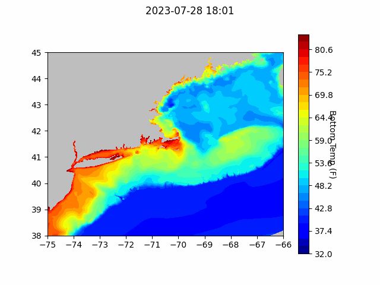
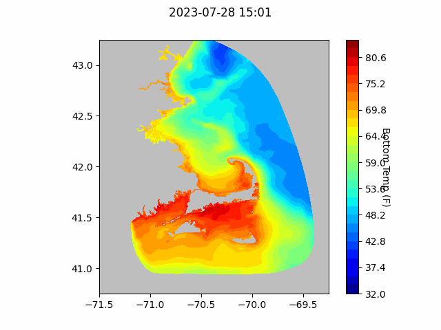

```{r setup, include=FALSE}
knitr::opts_chunk$set(echo = TRUE)
library(blastula)
```

<center> 

<font size="5"> *eMOLT Update `r Sys.Date()` * </font>

</center>

### Dissolved Oxygen Monitoring

This week, we completed our installations in support of Massachusetts DMF's
Cape Cod Bay Study Fleet program. Vessels participating in this program deploy
dissolved oxygen sensors to track the seasonal development of 
hypoxic zones in Cape Cod Bay. Behind the scenes, the team at Lowell Instruments
turned on the data pipeline from eMOLT participants in this program to DMF's [online
dashboard](https://www.mass.gov/info-details/tracking-dissolved-oxygen-with-the-cape-cod-bay-study-fleet-and-dmf). This means the data from these systems flows seamlessly to the data
visualization tool developed by DMF and available to the public (see the snapshot below).


### Strange happenings

It's been a weird week in oceanography. Water temperatures near the surface 
off the coast of Florida [crossed into triple digits](https://www.npr.org/2023/07/26/1190218132/florida-ocean-temperatures-101-marine-life-damage).

Closer to home, scientists are tracking the development of a large plankton bloom in the 
Gulf of Maine. We will be working with colleagues at UMaine to install some 
dissolved oxygen sensors up north over the next few weeks. In the meantime, if 
you fish in the western Gulf and start noticing anything weird, please feel free 
to reach out.

### Acknowledgements

Thanks this week to Captain Frank for helping get the F/V Sarah K's eMOLT system
online. In addition to running up to the hardware store to grab some screws I 
forgot to bring, Frank also graciously welcomed [Simonne Dodge](https://seagrant.whoi.edu/meet-our-summer-interns/), a science
communications intern at WHOI to come aboard and grab some information for her
upcoming write up about eMOLT.

Thanks also to Jeff, Joaquim, and Nick at Lowell Instruments for completing the
data pipeline from our deckboxes to Mass DMF's website. 

## Forecasts

### NECOFS Bottom Temperature Forecasts

{width=300px}

{width=300px}

### Doppio Bottom Temperature Forecasts

{width=300px}

### Announcements

- The [Woods Hole Science Stroll](https://woodsholesciencestroll.org/) is back on this year! On August 12, we welcome
anyone who's interested in meeting scientists and learning more about the work
we do to come down to Water Street in Woods Hole. In addition to the Cooperative
Research Branch staff many of you already know and other NOAA Fisheries scientists
staff from other scientific organizations will be around giving demos of hardware 
and explaining their research. We'd be happy to have you stop in! Participating
organizations include:
    - Marine Biological Laboratory
    - US Coast Guard
    - US Geological Survey
    - Woodwell Climate Research Center
    - Woods Hole Oceanographic Institution
  ...and more!

- The [Commercial Fishing Business Cost Survey](https://www.fisheries.noaa.gov/new-england-mid-atlantic/commercial-fishing/commercial-fishing-business-cost-survey?utm_medium=email&utm_source=govdelivery) is live for vessel owners to provide feedback on the economic realities faced by people who run fishing businesses. The survey closes July 31. 

- The [Commercial Fishing Crew Survey](https://www.fisheries.noaa.gov/new-england-mid-atlantic/socioeconomics/2023-commercial-fishing-crew-survey?utm_medium=email&utm_source=govdelivery) is an opportunity for crewmembers and hired vessel operators to provide information about the social and economic well-being of commercial fishing vessel crews and better understand how management and environmental change affect important, socially vulnerable groups.

All the best,
George and JiM
