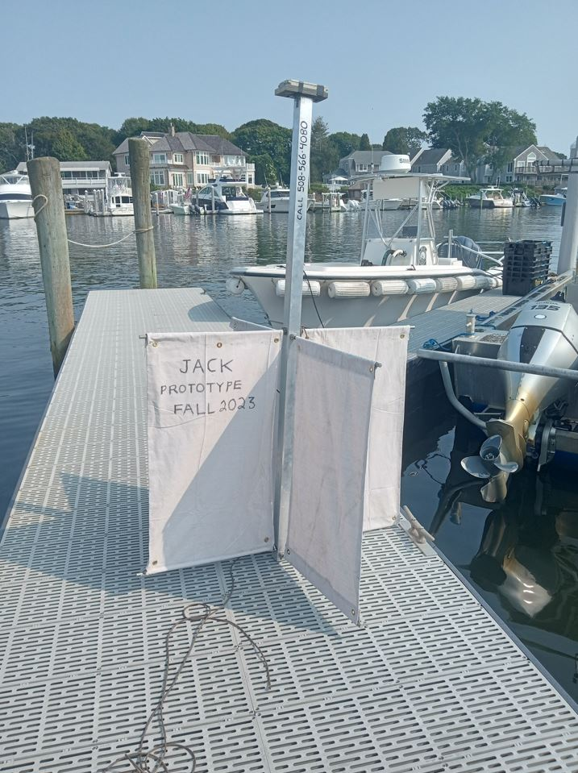
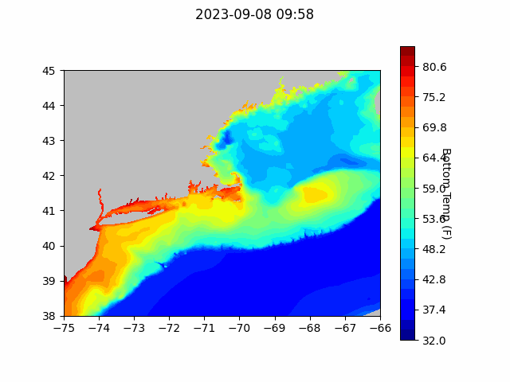

```{r setup, include=FALSE}
knitr::opts_chunk$set(echo = TRUE)
library(blastula)
```

<center> 

<font size="5"> *eMOLT Update `r Sys.Date()` * </font>

</center>

JiM got time this past week to work on a new satellite-tracked surface drifter design. After testing the prototype Falmouth Harbor (see photos), he found more ballast needed below the foam-filled mast. 
The objective in this buoyless case, as in all previous designs, is to minimize windage, maintain oceanographic standards in approximate size/shape, minimizes dangers to both mariners and wildlife, and experiment with new more eco-friendly low-cost materials.



## [Cape Cod Bay Dissolved Oxygen Snapshot](https://experience.arcgis.com/experience/0d553dfc6c60487cb1f4d20b5366ee0b/page/Map-Page/)


## Forecasts


### NECOFS Bottom Temperature Forecast

{width=800px}

{width=800px}

### Doppio Bottom Temperature Forecast

{width=800px}

### Acknowledgements


### Announcements

- The next [meeting of the New England Fisheries Management Council](https://www.nefmc.org/calendar/september-2023-council-meeting) will be September 25-28 in Plymouth, MA. 

- Saildrone is operating two Uncrewed Surface Vessels in the eastern third of the Gulf of Maine to collect high resolution bathymetric data from August 28 - October 18. Coordinates by date and contact information can be found [here](https://d23h0vhsm26o6d.cloudfront.net/Saildrone-Gulf-of-Maine-Mapping-Project-Announcement.pdf)

All the best,
George and JiM
