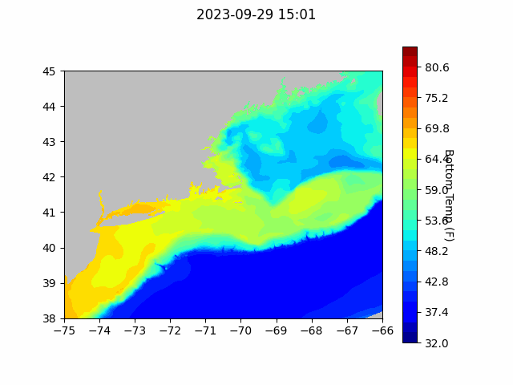

```{r setup, include=FALSE}
knitr::opts_chunk$set(echo = TRUE)
library(blastula)
```

<center> 

<font size="5"> *eMOLT Update `r Sys.Date()` * </font>

</center>

This week, George participated in a data workshop organized by our colleagues at the Fishing Vessel Ocean Observing Network. The purpose of the workshop was to learn from the [Argo Program](https://argo.ucsd.edu/), an international ocean observing system that provides copious amounts of data to global weather forecasters. Argo data managers from France, the United Kingdom, and both coasts of the United States worked with us to discuss best practices for data management and quality control with the idea that in the future, data collected by fishermen could be incorporated into global weather forecasting systems. 

For those of you who aren't familiar Argo is an international program that measures water properties across the world’s ocean using a fleet of robotic instruments that drift with the ocean currents and move up and down between the surface and a mid-water level. They've been really successful at collecting data from a large swath of the ocean, but because of hardware limitations, Argo's robots can't operate in shallow coastal seas. 


That limitation makes our work complimentary to Argo's data collection efforts. In the plot above, you can see profiles collected by Argo robots (red) and fishing vessel based sensors (eMOLT in blue and Ocean Data Network in purple) since the beginning of 2023. We're excited to work with the Argo team on getting our data into those bigger, international pipelines, which will make it more useful to the broader scientific community.

## [Cape Cod Bay Dissolved Oxygen Snapshot](https://experience.arcgis.com/experience/0d553dfc6c60487cb1f4d20b5366ee0b/page/Map-Page/)


## Forecasts


### NECOFS Bottom Temperature Forecast

{width=800px}

{width=800px}

### Doppio Bottom Temperature Forecast

{width=800px}


### Announcements

- The US Geological Survey deploys buoys to collect real time data during hurricanes. One of the three buoys deployed during Lee is currently drifting off of Race Point in Provincetown, and they'd like it back to deploy somewhere else. The buoy is yellow and about the size of a basketball. You can track it [here](https://spotters.sofarocean.com/historical/SPOT-31232C?user-filter=110). If you happen across the buoy while you're out fishing or if you collect it on a joy ride, please contact Chris Sherwood at csherwood@usgs.gov or 774-269-9399.

- With the impending government shutdown, George's email and phone will be locked down starting on Monday. Please contact Erin Pelletier at erin@gomlf.org if you run into any issues during this time.

- Saildrone is operating two Uncrewed Surface Vessels in the eastern third of the Gulf of Maine to collect high resolution bathymetric data from August 28 - October 18. Coordinates by date and contact information can be found [here](https://d23h0vhsm26o6d.cloudfront.net/Saildrone-Gulf-of-Maine-Mapping-Project-Announcement.pdf)


All the best,
George and JiM
