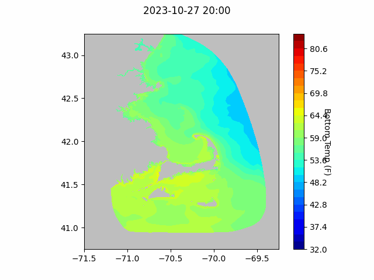
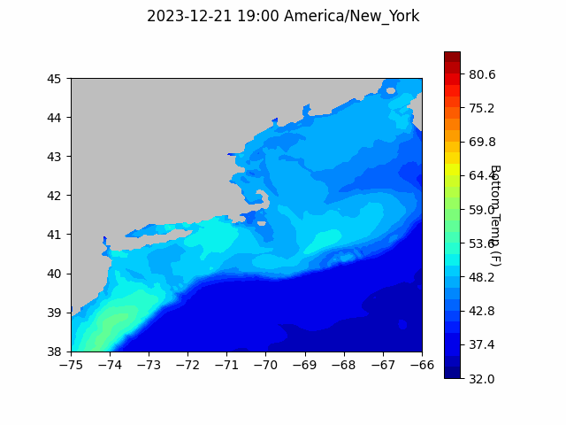

```{r setup, include=FALSE}
knitr::opts_chunk$set(echo = TRUE)
library(blastula)
```

<center> 

<font size="5"> *eMOLT Update `r Sys.Date()` * </font>

</center>

A few weeks ago, the semi-annual newsletter was printed and mailed to 35 lobstermen, mostly those who participate in the non-realtime project.  Since many do not read emails or websites, this is another way to communicate with them. It reminds them that a) the project is still alive and b) to mail in their probes when they are done fishing for the year.  

A few dozen have mailed in their probes so far. It appears that, as in the case of the examples below, there was a warm Spring in 2023 was followed by a normal Summer and a warm Fall. In all cases, the dramatic effect of Hurricane Ian in late September is evident.


The StudentDrifter Program is slowly coming back from its Covid-era slump. You can see the last month of tracks at [https://studentdrifters.org/tracks/drift_X.html](https://studentdrifters.org/tracks/drift_X.html). Most interesting, as seen in the  animation below, is the result of three clusters deployed in Cape Cod Bay on Nov 25th, Dec 2nd, and Dec 15th. They were deployed by mariners in Sandwich: USCG, Dave Marsh, and Rob Martin, respectively. The last two clusters included a pair of sensor laden miniboats which sail quickly across the bay. 

## Forecasts


### NECOFS Bottom Temperature Forecast

{width=800px}

{width=800px}

### Doppio Bottom Temperature Forecast

{width=800px}


### Announcements
- Using a set of floating instruments, an interesting study was published by scientists at Woods Hole Oceanographic Institute last month entitled "Warming and lateral shift of the Gulf Stream from in situ observations since 2001" and described [here](https://www.whoi.edu/press-room/news-release/gulf-stream-is-warming-and-shifting/). The [Portland Herald article](https://www.pressherald.com/2023/10/23/a-warming-gulf-stream-is-edging-ever-closer-to-shore/) focusses on the effects in the Gulf of Maine.

- A memoir by David Goethel, a longtime eMOLT participant, was published recently describing his decades in the New England commercial fisheries. A great story entitled "Endangered Species", it can be found, for example, [here](https://perpublisher.com/portfolio-item/endangered-species/).


All the best,
George and JiM
