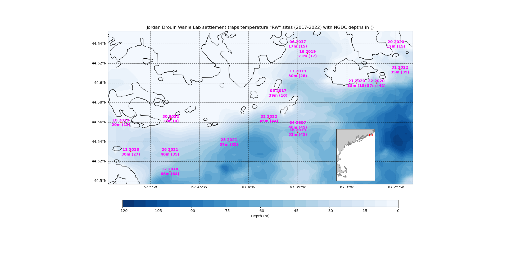
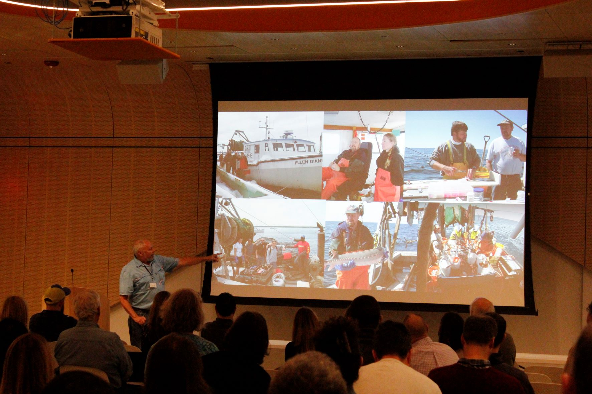

```{r setup, include=FALSE}
knitr::opts_chunk$set(echo = TRUE)
library(blastula)
library(marmap)
library(rstudioapi)
source("C:/Users/george.maynard/Documents/GitHubRepos/emolt_serverside/API/API_header.R")
today=Sys.Date()
lastWeek=today-days(7)
db_config=config::get(file="C:/Users/george.maynard/Documents/GitHubRepos/emolt_serverside/API/config.yml")$dev_intranet
conn=dbConnector(db_config)
```

<center> 

<font size="5"> *eMOLT Weekly Update `r Sys.Date()` * </font>

</center>

### Weekly Recap 

For the past several years, we have supplied Rick Wahle's Lab at the Lobster Institute with Minilog temperature probes to install on some of their lobster larvae settlement traps. Both Curt Brown and
Jordan Drouin typically deploy three probes at different depths in their area. See station plots below. As part of our QA/QC routine, we check on the depths recorded in the log files
with those derived from bathymetric datasets. Often times, as in at least one site this year, we needed to check the positions as recorded in multiple ways (wheelhouse plotter, googlemaps, and webserved nautical charts). 
It is critical we be as accurate as possible in documenting these positions and depths. We need make sure, for example, there isn't any issues with units recorded.
{width=400px}
{width=400px}

In recent years, many of the original eMOLT lobstermen have shortened their season as they approach retirement.  You can see this, for example, in the case of Rick Alley's plot (see below) where he only fished Aug-Oct but long enough to document 2022 as being one of the warmest yet at his Mid-Coast Maine location.
{width=400px}

For those captains who are still participating in the non-realtime program, know that you have outlasted not just the sensor that we've been using, but also the sensor manufacturer. With the Vemco Minilog no longer in production, and no viable replacement candidate in the wings, we're hoping to begin to transition many of you over to the realtime systems if you're interested. If you'd like to learn more about how those systems work, please stop by the GOMLF booth at the Forum next week. If you aren't going to be at the Forum, please feel free to send George an email or call/text 508-299-9693. We'll keep sending out the minilogs as long as their batteries last, but the clock is definitely running out on those sensors. 

### Northeast Cooperative Research Summit

It was great to see many current and retired eMOLT participants at the Cooperative Research Summit in Providence last week.

{width=400px}
*Cooperative Research Branch Chief, Dr. Anna Mercer, gives an introduction to cooperative research, encouraging scientists in the room to work more closely with the fishing industry*

{width=450px}
*The summit was well attended, with a mix of fishermen, resource managers, and scientists in the room*

{width=400px}
*Long time eMOLT participant Dave Goethel gave the closing remarks*

One consistent theme at meetings over the last few months has been the need for more environmental data across our region, and especially in the Gulf of Maine. So, if you're an eMOLT participant up that way already, thank you! And if you know other people who would be interested, please have them reach out. We can't promise a speedy response, but we can promise to keep chugging forward. 

### Realtime Summary (Vessels with Rockblock Satellite Transmitters)

This week, we received `r nrow(dbGetQuery(conn=conn,statement=paste0("SELECT * FROM VESSEL_STATUS WHERE TIMESTAMP >'", lastWeek, "' AND REPORT_TYPE = 'SUMMARY_DATA' AND VESSEL_ID != 23")))` haul-averaged reports from `r nrow(dbGetQuery(conn=conn, statement=paste0("SELECT DISTINCT VESSEL_ID FROM VESSEL_STATUS WHERE TIMESTAMP >'", lastWeek,"' AND REPORT_TYPE = 'SUMMARY_DATA' AND VESSEL_ID != 23")))` vessels. 

```{r statusPlot, dev='png',echo=FALSE, fig.width=8,fig.height=6,fig.show='hide',include=FALSE}
dbDisconnectAll()
conn=dbConnector(db_config)
lastweek=Sys.Date()-days(7)
data=dbGetQuery(
  conn=conn,
  statement=paste0(
    "SELECT * FROM VESSEL_STATUS WHERE TIMESTAMP > '",
    lastweek,
    "' AND VESSEL_ID != 23"
  )
)
data=select(data,REPORT_TYPE,LATITUDE,LONGITUDE,TIMESTAMP)
bath=readGEBCO.bathy(
  file="C:/Users/george.maynard/Documents/GitHubRepos/emolt_project_management/UtilityScripts/GEBCO/gebco_2022_n47.0_s38.0_w-76.0_e-59.0.nc",
  resolution=10
)
## Create color ramp
blues=c(
  "lightsteelblue4", 
  "lightsteelblue3",
  "lightsteelblue2", 
  "lightsteelblue1"
)
## Plotting the bathymetry with different colors for land and sea
plot(
  bath,
  step=100,
  deepest.isobath=-1000,
  shallowest.isobath=0,
  col="darkgray",
  image = TRUE, 
  land = TRUE, 
  lwd = 0.1,
  bpal = list(
    c(0, max(bath), "gray"),
    c(min(bath),0,blues)
  ),
  main=paste0("ALL eMOLT VESSELS with Satellite Transmitters \nREPORTS FROM: ",lastweek," to ",Sys.Date())
)
## Plot the status report locations
x=subset(data,data$REPORT_TYPE=="SHORT_STATUS")
points(
  x$LATITUDE~x$LONGITUDE,
  pch=1,
  col='red',
  cex=2
)
## Plot data uploads
x=subset(data,data$REPORT_TYPE=="SUMMARY_DATA")
points(
  x$LATITUDE~x$LONGITUDE,
  pch=1,
  col='blue',
  cex=2
)
legend(
  'topleft',
  col=c('blue','red'),
  legend=c('Summary Data Upload','Status Report'),
  pch=c(1,1),
  bty='n',
  bg=NULL,
  border='black'
)
```

`)
*Figure 3 - eMOLT Satellite Transmitter status plot for the previous week.*

In the figure above, you can see the approximate locations where we received "Status Reports" (a ping from your system letting us know that it's still working) and "Data Uploads" (actual temperature / depth data collected by your probes). The "Status Reports" come in every 12 hours or so when a system is powered up. "Data Uploads" only come in when you haul the probes. If you were out fishing and don't see your approximate locations on here, please reach out because there may be a problem with your system.

### Announcements
We hope to see many of you at the Maine Fishermen's Forum next week. The eMOLT program is cohosting a symposium with our colleagues from Commercial Fisheries Research Foundation and Ocean Data Networks on Saturday at 1:00-2:30 in the Camden Room. If you're planning to attend the Forum, please stop by the symposium or the booth to meet George and provide your feedback and suggestions for the program.

All the best,
George and JiM
