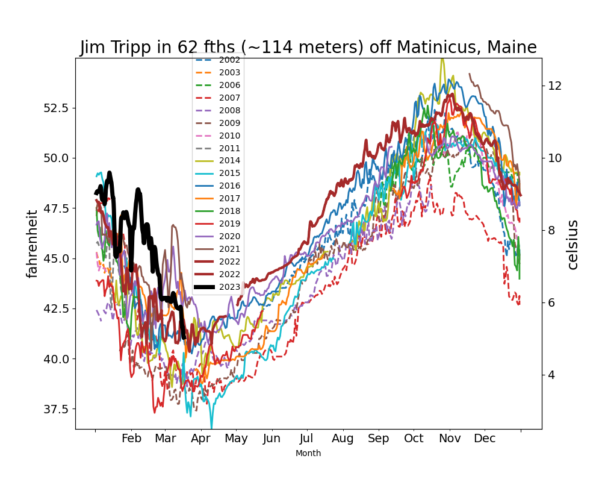
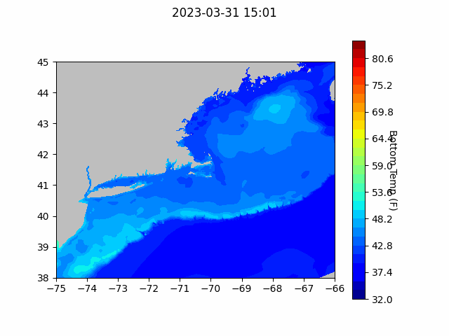

```{r setup, include=FALSE}
knitr::opts_chunk$set(echo = TRUE)
library(blastula)
library(marmap)
library(rstudioapi)
source("C:/Users/george.maynard/Documents/GitHubRepos/emolt_serverside/API/API_header.R")
today=Sys.Date()
lastWeek=today-days(7)
db_config=config::get(file="C:/Users/george.maynard/Documents/GitHubRepos/emolt_serverside/API/config.yml")$dev_intranet
conn=dbConnector(db_config)
```

<center> 

<font size="5"> *eMOLT Update `r Sys.Date()` * </font>

</center>

Thanks to those of you who stopped by to introduce yourselves at the Mass Lobstermen's meeting last weekend in Hyannis. It's always good to put faces to some of the longtime participants I still haven't met and introduce the eMOLT program to potential new participants. Thanks especially to Captain John Thomas and his crew who were gracious enough to let Huanxin's daughter and my daughter hop aboard the F/V Rachel Leah and meet a real lobster last Saturday while Huanxin and I worked on their eMOLT system. 

We continue to make headway on our software consolidation project. By taking the best running code from the deckboxes that Huanxin and Jim built and combining it with the newer features developed by the team at Lowell Instruments, we're hoping to make troubleshooting easier for everyone and provide all of you with the best deckboxes we can. One major improvement will be adding a way to dim the screen. Yes, you read that right... once we implement this change, there will be no more need for socks, hats, gaiters, or cardboard covers over your deckbox. 

We've also been working with the National Ocean Service to make sure the deckboxes calculate all of the parameters they need to put these data to use in marine forecasts. By this time next month, we hope to have a test server up and running at the Gulf of Maine Lobster Foundation to serve those data up to NOAA's High Performance Computing Center. 

Jim Tripp, a longtime eMOLT participant out of Spruce Head Maine, documented his warmest year yet in 63 fathoms (~114 meters).  As seen in the figure below , early February 2023 was especially warmer than 
all his other years at this site.  While Jim is retiring from fishing at this site, we hope his son John may be able to maintain a year round location nearby.
We also got another year of data from Bruce Fernald's site in 25 fathoms off Little Cranberry and hoping his brother Mark's 30 fathom probe shows up soon.

We were happy to secure the last 17 Minilog-II probes available from INNOVASEA (aka VEMCO).  These devices have served us well.  This new batch will provide us the instruments needed to maintain the original eMOLT sites for another decade.

An article was published in Nature Communications this past month entitled "Bottom marine heatwaves along the continental shelves of North America" describing the similarities and, most importantly, the differences with surface heatwaves. While the results were obtained purely from model output, they did, at least, mentioned the importance of observations a couple times.

The Southern Maine Community College prepared a drifter and had it deployed by Capt Jeff Putman on the F/V Captain B. You can follow that track [here](studentdrifters.org/track/drift_smcc_2023_1.html).


### Realtime Summary (Vessels with Rockblock Satellite Transmitters)

This week, we received `r nrow(dbGetQuery(conn=conn,statement=paste0("SELECT * FROM VESSEL_STATUS WHERE TIMESTAMP >'", lastWeek, "' AND REPORT_TYPE = 'SUMMARY_DATA' AND VESSEL_ID != 23")))` haul-averaged reports from `r nrow(dbGetQuery(conn=conn, statement=paste0("SELECT DISTINCT VESSEL_ID FROM VESSEL_STATUS WHERE TIMESTAMP >'", lastWeek,"' AND REPORT_TYPE = 'SUMMARY_DATA' AND VESSEL_ID != 23")))` vessels. 

```{r statusPlot, dev='png',echo=FALSE, fig.width=8,fig.height=6,fig.show='hide',include=FALSE}
dbDisconnectAll()
conn=dbConnector(db_config)
lastweek=Sys.Date()-days(7)
data=dbGetQuery(
  conn=conn,
  statement=paste0(
    "SELECT * FROM VESSEL_STATUS WHERE TIMESTAMP > '",
    lastweek,
    "' AND VESSEL_ID != 23"
  )
)
data=select(data,REPORT_TYPE,LATITUDE,LONGITUDE,TIMESTAMP)
bath=readGEBCO.bathy(
  file="C:/Users/george.maynard/Documents/GitHubRepos/emolt_project_management/UtilityScripts/GEBCO/gebco_2022_n47.0_s38.0_w-76.0_e-59.0.nc",
  resolution=10
)
## Create color ramp
blues=c(
  "lightsteelblue4", 
  "lightsteelblue3",
  "lightsteelblue2", 
  "lightsteelblue1"
)
## Plotting the bathymetry with different colors for land and sea
plot(
  bath,
  step=100,
  deepest.isobath=-1000,
  shallowest.isobath=0,
  col="darkgray",
  image = TRUE, 
  land = TRUE, 
  lwd = 0.1,
  bpal = list(
    c(0, max(bath), "gray"),
    c(min(bath),0,blues)
  ),
  main=paste0("ALL eMOLT VESSELS with Satellite Transmitters \nREPORTS FROM: ",lastweek," to ",Sys.Date())
)
## Plot the status report locations
x=subset(data,data$REPORT_TYPE=="SHORT_STATUS")
points(
  x$LATITUDE~x$LONGITUDE,
  pch=1,
  col='red',
  cex=2
)
## Plot data uploads
x=subset(data,data$REPORT_TYPE=="SUMMARY_DATA")
points(
  x$LATITUDE~x$LONGITUDE,
  pch=1,
  col='blue',
  cex=2
)
legend(
  'topleft',
  col=c('blue','red'),
  legend=c('Summary Data Upload','Status Report'),
  pch=c(1,1),
  bty='n',
  bg=NULL,
  border='black'
)
```

`)
*eMOLT Satellite Transmitter status plot for the previous week.*

In the figure above, you can see the approximate locations where we received "Status Reports" (a ping from your system letting us know that it's still working) and "Data Uploads" (actual temperature / depth data collected by your probes). The "Status Reports" come in every 12 hours or so when a system is powered up. "Data Uploads" only come in when you haul the probes. If you were out fishing and don't see your approximate locations on here, please reach out because there may be a problem with your system.

### NECOFS Bottom Temperature Forecast



### Announcements

- Recently, we've heard reports from some lobstermen about shells not hardening up as much as they used to. If you've noticed something similar, please reach out. Shell hardness can be influenced by many environmental factors including water temperature, salinity, pH, and dissolved oxygen. 

- We appreciate your patience as we work our way through the waitlist of vessels. We rely on grant funds to expand eMOLT to new platforms, and those grants often have specific goals. For example, we recently wrapped up a major effort here in Massachusetts to outfit 12 additional vessels that was funded by the Massachusetts Seaport Economic Council. That project was designed to dovetail with and support the Cape Cod Bay Dissolved Oxygen Study Fleet organized by Tracy Pugh at MADMF. Our next large scale deployment will be funded by the Lobster Institute to add 6-12 new vessels in Mid-Coast Maine and Downeast. There are additional vessels in New Bedford and on Cape Cod who we're working to find systems for as well. 

- For those of you who've caught the research bug and are looking for another piece of environmental data to collect off your vessels, consider checking out the [SeaHawk Project](https://coast-lab.org/hawkeyeCitSci/). This project uses low-cost Secchi disks to ground-truth water clarity measurements taken from satellite imagery, which is one way to study phytoplankton abundance. For more information, please contact [Delaney McBride](dam2534@uncw.edu) at the University of North Carolina, Wilmington. 

All the best,
George and JiM
