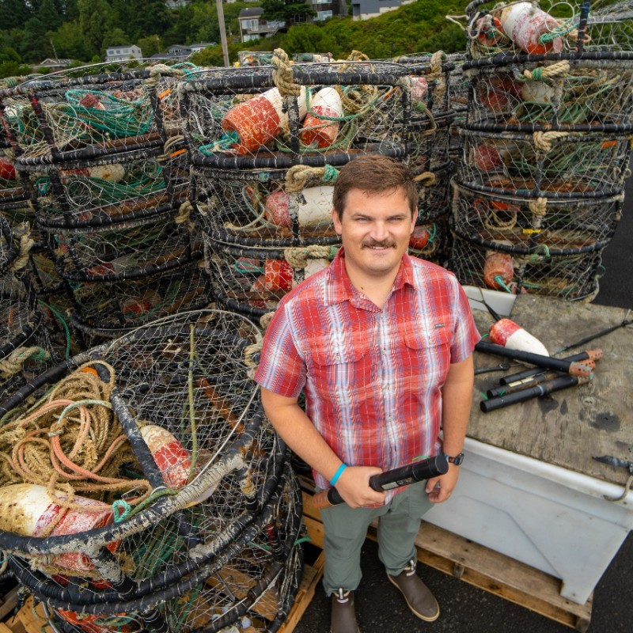
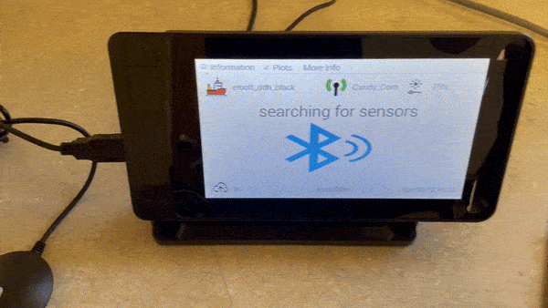
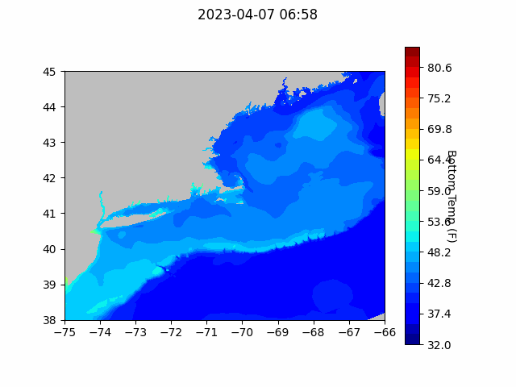

```{r setup, include=FALSE}
knitr::opts_chunk$set(echo = TRUE)
library(blastula)
library(marmap)
library(rstudioapi)
source("C:/Users/george.maynard/Documents/GitHubRepos/emolt_serverside/API/API_header.R")
today=Sys.Date()
lastWeek=today-days(7)
db_config=config::get(file="C:/Users/george.maynard/Documents/GitHubRepos/emolt_serverside/API/config.yml")$dev_intranet
conn=dbConnector(db_config)
```

<center> 

<font size="5"> *eMOLT Update `r Sys.Date()` * </font>

</center>

This update is a short one since it's a short week for schools in Massachusetts
and my kids will be home all day today.

I'd offer up a warm New England welcome to Linus Stoltz, but we all know such a 
thing doesn't really exist. So Linus, have a cold, foggy welcome I guess. In all
seriousness, the eMOLT team is very excited that Linus is coming over from the 
West Coast to join CFRF in Rhode Island as their data manager. He has a bunch of
experience [working with the crab industry](http://fishresearch.net/#/mission) to monitor dissolved oxygen and
temperature using very similar technology to what's in use in DMF's Cape Cod Bay
Study Fleet and those of you in eMOLT with DO sensors and Lowell Deck Data Hubs. 
We're looking forward to improving the data pipelines between our programs so 
that all the information you collect on the water will be that much more valuable
to scientists. 
{width=200px}

We continue to work with the team at Lowell to merge deckbox software. As 
mentioned in last week's email, here's a look at the dimming feature we're
testing with our hardware.



Additionally, we are continuing our effort to make sure the data from eMOLT can
be put to use in a range of applications. In this effort, we are also working
with other research groups inside NOAA to make sure taxpayer funded data 
collections are available to the public. Progress on this front isn't always 
quick because the amount of red tape (even internal) to go through is substantial,
but we are making progress. The 2022 non-realtime eMOLT data were supposed to go
live online today, but that's been pushed back to next week. In the meantime,
the data from the last 20 years are available on the NEFSC ERDDAP server 
[here](https://comet.nefsc.noaa.gov/erddap/index.html). 

### Realtime Summary (Vessels with Rockblock Satellite Transmitters)

This week, we received `r nrow(dbGetQuery(conn=conn,statement=paste0("SELECT * FROM VESSEL_STATUS WHERE TIMESTAMP >'", lastWeek, "' AND REPORT_TYPE = 'SUMMARY_DATA' AND VESSEL_ID != 23")))` haul-averaged reports from `r nrow(dbGetQuery(conn=conn, statement=paste0("SELECT DISTINCT VESSEL_ID FROM VESSEL_STATUS WHERE TIMESTAMP >'", lastWeek,"' AND REPORT_TYPE = 'SUMMARY_DATA' AND VESSEL_ID != 23")))` vessels. 

```{r statusPlot, dev='png',echo=FALSE, fig.width=8,fig.height=6,fig.show='hide',include=FALSE}
dbDisconnectAll()
conn=dbConnector(db_config)
lastweek=Sys.Date()-days(7)
data=dbGetQuery(
  conn=conn,
  statement=paste0(
    "SELECT * FROM VESSEL_STATUS WHERE TIMESTAMP > '",
    lastweek,
    "' AND VESSEL_ID != 23"
  )
)
data=select(data,REPORT_TYPE,LATITUDE,LONGITUDE,TIMESTAMP)
bath=readGEBCO.bathy(
  file="C:/Users/george.maynard/Documents/GitHubRepos/emolt_project_management/UtilityScripts/GEBCO/gebco_2022_n47.0_s38.0_w-76.0_e-59.0.nc",
  resolution=10
)
## Create color ramp
blues=c(
  "lightsteelblue4", 
  "lightsteelblue3",
  "lightsteelblue2", 
  "lightsteelblue1"
)
## Plotting the bathymetry with different colors for land and sea
plot(
  bath,
  step=100,
  deepest.isobath=-1000,
  shallowest.isobath=0,
  col="darkgray",
  image = TRUE, 
  land = TRUE, 
  lwd = 0.1,
  bpal = list(
    c(0, max(bath), "gray"),
    c(min(bath),0,blues)
  ),
  main=paste0("ALL eMOLT VESSELS with Satellite Transmitters \nREPORTS FROM: ",lastweek," to ",Sys.Date())
)
## Plot the status report locations
x=subset(data,data$REPORT_TYPE=="SHORT_STATUS")
points(
  x$LATITUDE~x$LONGITUDE,
  pch=1,
  col='red',
  cex=2
)
## Plot data uploads
x=subset(data,data$REPORT_TYPE=="SUMMARY_DATA")
points(
  x$LATITUDE~x$LONGITUDE,
  pch=1,
  col='blue',
  cex=2
)
legend(
  'topleft',
  col=c('blue','red'),
  legend=c('Summary Data Upload','Status Report'),
  pch=c(1,1),
  bty='n',
  bg=NULL,
  border='black'
)
```

`)

In the figure above, you can see the approximate locations where we received "Status Reports" (a ping from your system letting us know that it's still working) and "Data Uploads" (actual temperature / depth data collected by your probes). The "Status Reports" come in every 12 hours or so when a system is powered up. "Data Uploads" only come in when you haul the probes. If you were out fishing and don't see your approximate locations on here, please reach out because there may be a problem with your system.

Thanks to an email from Capt. Joe Barrow (F/V Ryan Joseph), we were able to identify
a bug in our system that's causing some vessels to not show up. Please let us 
know if your vessel seems to be affected as we work to clean that up. Thanks
for all of your communication. Your feedback helps us make the system more 
efficient and resilient. 

### Bottom Temperature Forecasts

*We plan to add more animations to this section with other models in the future*

#### Northeast Coastal Ocean Forecast System (NECOFS)



Above, please find the bottom temperature forecasts at one hour intervals from 
the Northeast Coastal Ocean Forecast System run by the 
[Chen Lab](http://fvcom.smast.umassd.edu/) at the University of Massachusetts 
School for Marine Science and Technology in New Bedford. 

### Announcements and Other News

- The American Association for the Advancement of Science recently highlighted a
[study showing that participating in citizen science projects can improve peoples'
well being](https://www.eurekalert.org/news-releases/978926). I'm not exactly sure
where the line is between "cooperative research" and "citizen science" but I know
that spending time talking with captains and crews participating in eMOLT has 
been a learning experience for me and definitely improves my well being. 


All the best,

-George and JiM