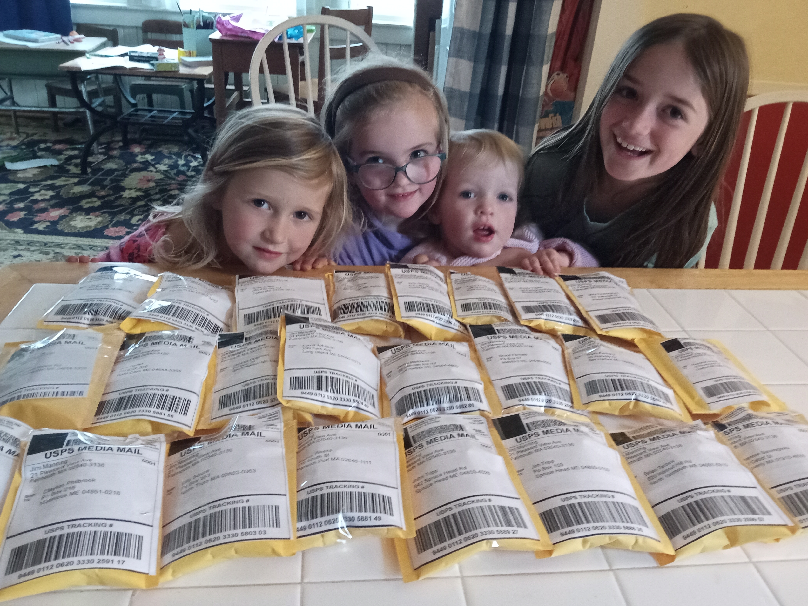
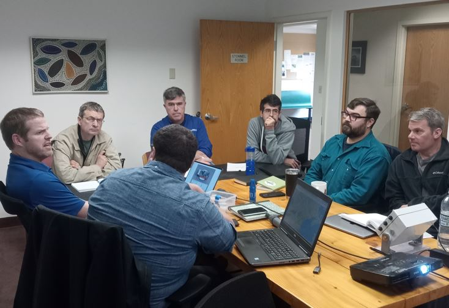
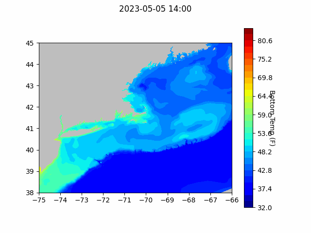

```{r setup, include=FALSE}
knitr::opts_chunk$set(echo = TRUE)
library(blastula)
library(marmap)
library(rstudioapi)
source("C:/Users/george.maynard/Documents/GitHubRepos/emolt_serverside/API/API_header.R")
today=Sys.Date()
lastWeek=today-days(7)
db_config=config::get(file="C:/Users/george.maynard/Documents/GitHubRepos/emolt_serverside/API/config.yml")$dev_intranet
conn=dbConnector(db_config)
```

<center> 

<font size="5"> *eMOLT Update `r Sys.Date()` * </font>

</center>

We mailed out thirty four Minilog temperature probes were to most of the original eMOLT lobstermen a few weeks ago. These non-realtime sensors have been recording hourly bottom temperatures at most of the sites for 20 years or more during the fishing season. JiM got help from his granddaughters in the annual envelope-stuffing routine.
{width=300px}
{width=300px}

Sixteen multi-month time series of hourly bottom temperatures collected by several Maine lobstermen in 2022 as part of the Division of Marine Resources Ventless Trap Program were processed, plotted, and archived this week to become part of the master database. See emolt.org/dmr and scroll down to the bottom to see a list of names. The data should also be available on the [Northeast Fisheries Science Center ERDDAP Server](https://comet.nefsc.noaa.gov/erddap/tabledap/eMOLT.html) sometime in the next week or so. 

Yesterday, we spent a few hours at the Lowell Instruments workshop where the engineers from Creare Inc demonstrated their new WOWL (Wireless Open Water Logger) temperature depth probes. These prototype probes are designed to work with a smartphone app that downloads the data from the probe and pushes it up into the cloud as soon as the phone is in range of a tower. Several of these prototypes will likely be deployed alongside eMOLT systems this summer by scientists working out of the University of Maine.

{width=300px}

{width=300px}

We are watching a [few drifters move along the coast in the past month](https://studentdrifters.org/tracks/drift_X.html). One of them, deployed by F/V Captain B on Jeffreys Ledge back in late March, entered Cape Cod Bay and, driven by last night's easterlies,  is now located off the Plymouth coast. One of them, deployed by Mississippi's Dept of Natural Resouces off Biloxi back in early March, is headed to Galveston Texas. While the drifter program slowed during the Covid years, Erin and Kristi are making progress in recent months to restart it.

### NECOFS Bottom Temperature Forecast



### Announcements

- The deadline has been extended for applications to the [Commercial Fishing Apprenticeship Program](https://www.cfcri.org/apprenticeship.html) hosted by the Commercial Fisheries Center of Rhode Island. 

- The Northeast Fisheries Science Center is seeking responses from commercial fishing businesses to the [2023 Commercial Fishing Business Cost Survey](https://www.fishingcostsurvey.com/NOAA_Vessel). Cost information provided by survey participants allows us to track trends in costs over time and understand the economic performance of fishing fleets. These analyses in turn inform management decisions. Aggregated data summaries found on our [cost data visualization tool](https://apps-nefsc.fisheries.noaa.gov/socialsci/cost-data/) can also be used by fishermen for business planning purposes.

- A few of us plan to meet in Newport RI on May 18th to participate in the [Ocean Race activities](https://theoceanracenewport.com/schedule) including presentations on eMOLT by JiM, on Educational Passages Miniboat Program by Cassie, on Ocean Data Networks by Cooper, and on the StudentDrifter Program by Kristi Burkholder (Stonehill Oceanographer) during the "Citizen Science" session at 2pm.

All the best,
George and JiM
