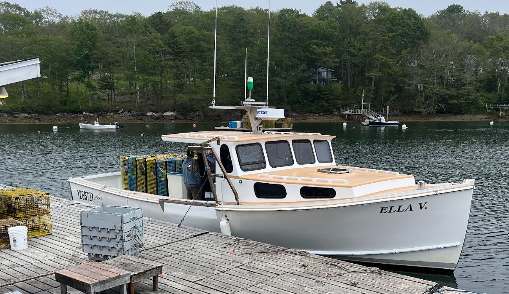
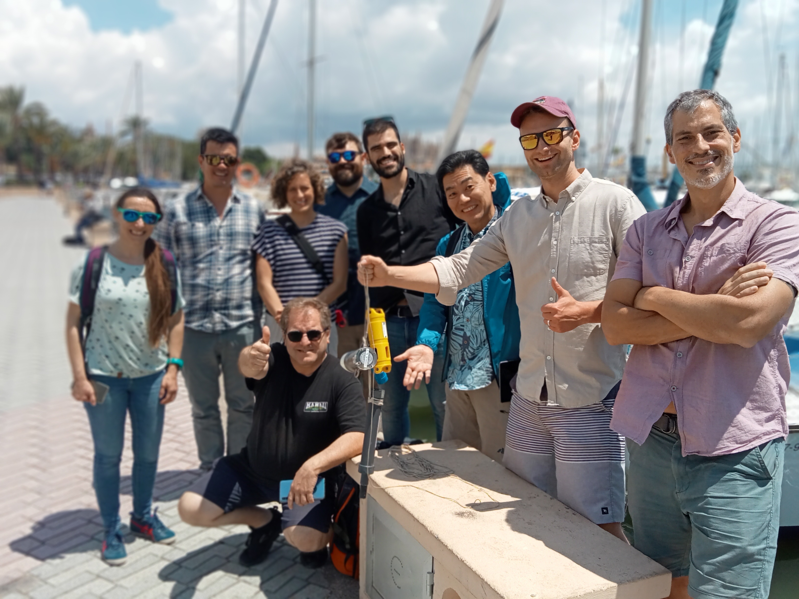
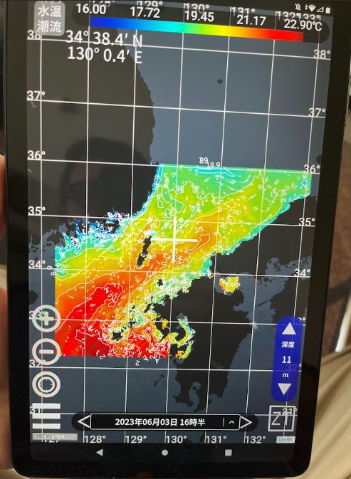
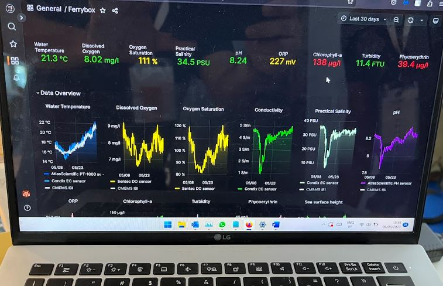
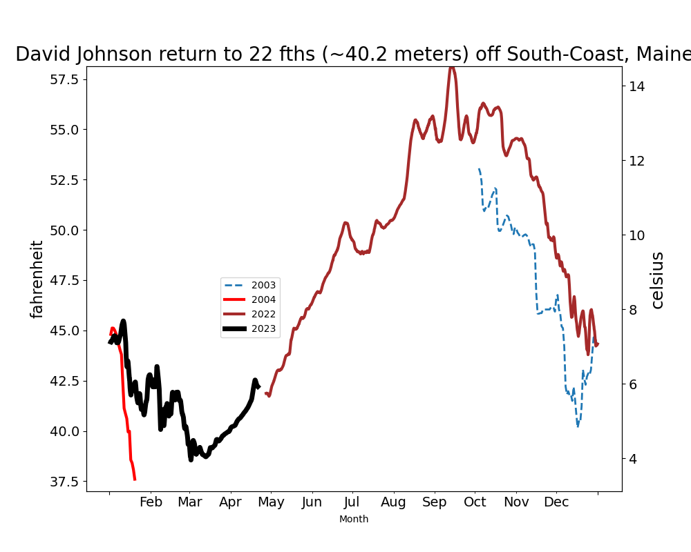
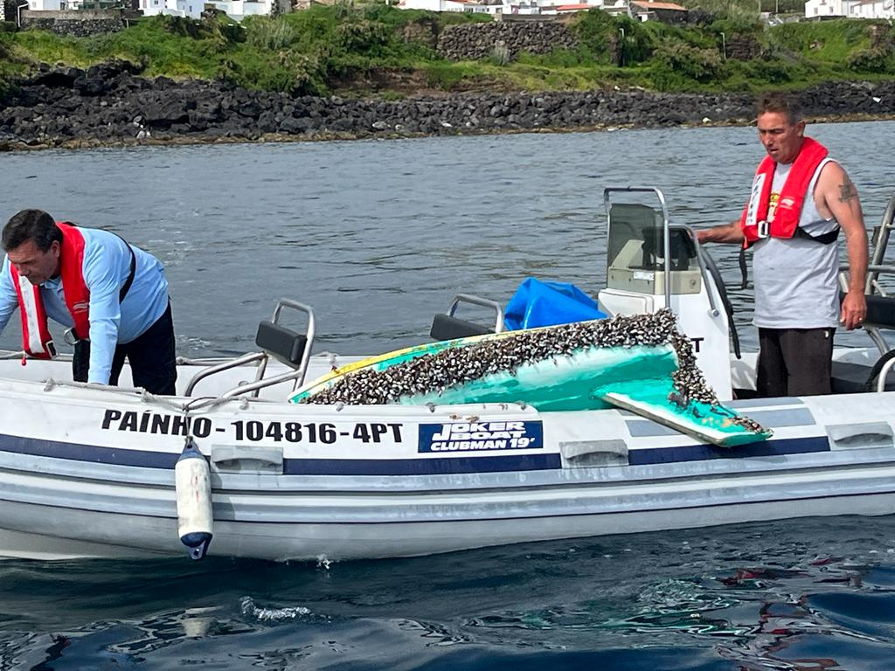

```{r setup, include=FALSE}
knitr::opts_chunk$set(echo = TRUE)
library(blastula)
```

<center> 

<font size="5"> *eMOLT Update `r Sys.Date()` * </font>

</center>

Sorry for the long radio silence; it's been a busy month for the eMOLT team! 

This week, Erin and George traveled up to South Bristol, Maine to begin our Gulf of Maine expansion effort on board the F/V Ella V. It was great to meet Captain Jamien and work with some new colleagues from the Maine Lobster Institute. We're looking forward to installing another dozen vessels throughout the Mid-Coast and Downeast later this summer. 

{width=300px}

George and Cooper headed to Spain in early June to meet with representatives from a number of fishing-vessel based ocean observing projects underway around the world, the ["Fishing Vessel Ocean Observing Network"](https://fvon.org/). 

{width=300px}

While it's not the biggest program in the world (the Moana Program in New Zealand has over 300 vessels participating!), eMOLT is one of the longest running programs along with AdriFOOS (an Italian program working primarily with midwater trawlers). It was great to compare notes on hardware, data management, and data use with all of these folks. 


For example, our colleagues in Japan are deploying CTDs (measuring salinity, temperature, and depth) on commercial fishing gear and delivering forecasts back to fishermen through a smartphone app. 



The [UNDERSEE company](https://undersee.io/ferrybox/) in Portugal has developed a surface water monitoring system that attaches to a vessel's cooling water intake and delivers information about water temperature, oxygen, chlorophyll, salinity, and pH to an online dashboard in real time. They've also started working with aquaculturists in Europe to help monitor water quality around farms. 

Back stateside, David Johnson has been deploying temperature probes at a few different locations just outside of Casco Bay.  This past year he returned to his 22 fathom site and documented the warming that has occurred there since he left it in 2004. {width=300px}

Speaking of Casco Bay, Captain Alex Todd (F/V Jacob and Joshua) deployed another Southern Maine Community College drifter on Friday May 26th. You can see the [path of this unit](https://studentdrifters.org/tracks/drift_smcc_2023_1.html) along with their drifter deployed back in March which ended up in Ptown a few months later and another experimental one to be deployed in a few days with plywood sails.  

Speaking of drifters, a couple more drifters were deployed in Cape Cod Bay on 30 May by the 5th grade students from the Meadowbrook Elementary School aboard the M/V Albatross out of Sesuit Harbor. They came ashore a week later on the Barnstable and Dennis beaches. Another unit was deployed by the Sandwich MA USCG folks off Plymouth on 8 June is headed in the opposite direction. Drifter tracks for the past month are always posted at [https://studentdrifters.org/tracks/drift_X.html](https://studentdrifters.org/tracks/drift_X.html) along with four units in Lake Michigan.

On the early morning of 12 May, the miniboat that was deployed by R/V Neil Armstrong back in November south of New England, approached the Azorean Island of Graciosa. Cassie and JiM alerted colleagues who have recovered units there before and, within hours, they rallied their troups and recovered the unit before it might have crashed on the rocks. [Click here for the full story](http://educationalpassages.org/boats/ladylance).

{width=300px} 

In late June, a few miniboats came ashore prematurely on New England soil, the [Gryphon Cruiser](http://educationalpassages.org/boats/gryphoncruiser) on the southern side of Nantucket and the [Topsfield Titan](http://educationalpassages.org/boats/topsfieldtitan) on a small ledge  east of the Isle of Haut in Maine. If anyone has contacts in these areas, please let us know. As of 29 June, we have not recovered them yet.

On Thursday 18 May, most of the eMOLT crew participated in a session at the Ocean Race Event in Newport called "Enabling Tools for Citizen Science in Ocean Data Collection" organized by folks from the European Marine Observation Data Network. While there were very few in the audience, we got to meet fellow speakers in person for the first time. They were associated with OpenCtds, Smart-Buoys, MakerBuoys, and Sailing4Science.

.  

Cassie, pictured front and center, set up near URI Grad School of Oceanography booth and spent most of the week chatting with many tourist and school groups about her Educational Passages Miniboat Program.

### NECOFS Bottom Temperature Forecasts

.gif){width=600px}

{width=600px,height=600px}

### Announcements

- For those of you who haven't heard, our colleagues at Commercial Fisheries Research Foundation and Woods Hole Oceanographic Institution recently published a paper called ["Integrating fishers’ knowledge with oceanographic observations to understand changing ocean conditions in the Northeast United States"](https://www.frontiersin.org/articles/10.3389/fmars.2023.1144178/full)

- The [Commercial Fishing Business Cost Survey](https://www.fisheries.noaa.gov/new-england-mid-atlantic/commercial-fishing/commercial-fishing-business-cost-survey?utm_medium=email&utm_source=govdelivery) is live for vessel owners to provide feedback on the economic realities faced by people who run fishing businesses. The survey closes July 31. 

- The [Commercial Fishing Crew Survey](https://www.fisheries.noaa.gov/new-england-mid-atlantic/socioeconomics/2023-commercial-fishing-crew-survey?utm_medium=email&utm_source=govdelivery) is an opportunity for crewmembers and hired vessel operators to provide information about the social and economic well-being of commercial fishing vessel crews and better understand how management and environmental change affect important, socially vulnerable groups.

- Our colleagues  at the Northeast Fisheries Science Center recently published a report on the [Current Conditions of the Northeast U.S. Shelf Ecosystem](https://www.fisheries.noaa.gov/new-england-mid-atlantic/ecosystems/current-conditions-northeast-us-shelf-ecosystem-spring-2023?utm_medium=email&utm_source=govdelivery) focusing on surface dynamics during the second half of 2022. 

All the best,
George and JiM
