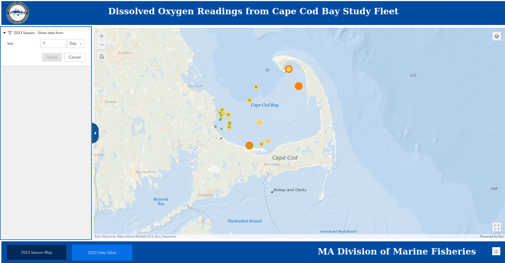
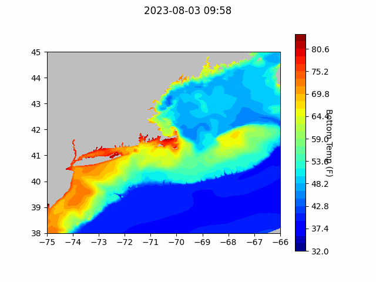
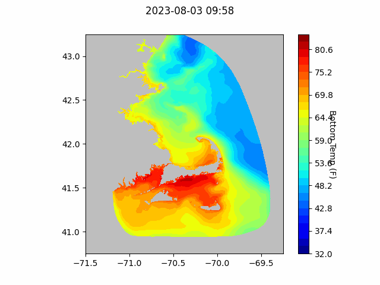
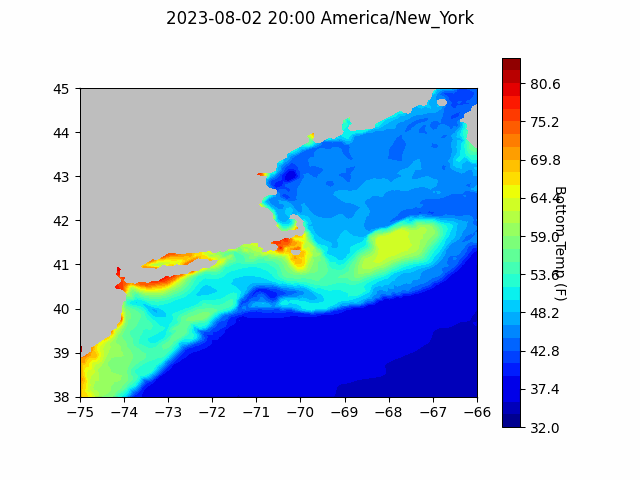

```{r setup, include=FALSE}
knitr::opts_chunk$set(echo = TRUE)
library(blastula)
```

<center> 

<font size="5"> *eMOLT Update `r Sys.Date()` * </font>

</center>

This week has been quiet as we prepare for a busy week next week. George will be
heading up to Maine to assist in setting up several new realtime eMOLT systems
in Jonesport, Northeast Harbor, and Stonington. Huanxin is sticking closer to home
to upgrade systems on the South Shore of Massachusetts to the new DDH software. 

Thanks primarily to our close colleague Cooper Van Vranken, an important paper was published this past week in Frontiers in Marine Science entitled ["Towards a global Fishing Vessel Ocean Observing Network (FVON): State of the art and future directions"](https://www.frontiersin.org/articles/10.3389/fmars.2023.1176814). The paper describes both challenges and successes of several projects from around the world (eMOLT included).

## [Cape Cod Bay Dissolved Oxygen Snapshot](https://experience.arcgis.com/experience/0d553dfc6c60487cb1f4d20b5366ee0b/page/Map-Page/)

{width=600px}

## Forecasts


### NECOFS Bottom Temperature Forecasts

{width=400px}

{width=400px}

### Doppio Bottom Temperature Forecasts

{width=400px}

### Announcements

- The [Woods Hole Science Stroll](https://woodsholesciencestroll.org/) is back on this year! On August 12, we welcome
anyone who's interested in meeting scientists and learning more about the work
we do to come down to Water Street in Woods Hole. In addition to the Cooperative
Research Branch staff many of you already know and other NOAA Fisheries scientists
staff from other scientific organizations will be around giving demos of hardware 
and explaining their research. We'd be happy to have you stop in! Participating
organizations include:
    - Marine Biological Laboratory
    - US Coast Guard
    - US Geological Survey
    - Woodwell Climate Research Center
    - Woods Hole Oceanographic Institution
  ...and more!

All the best,
George and JiM
