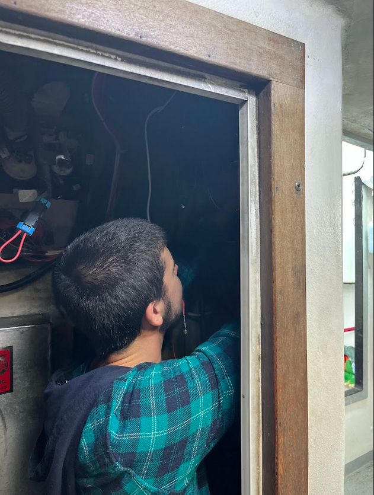
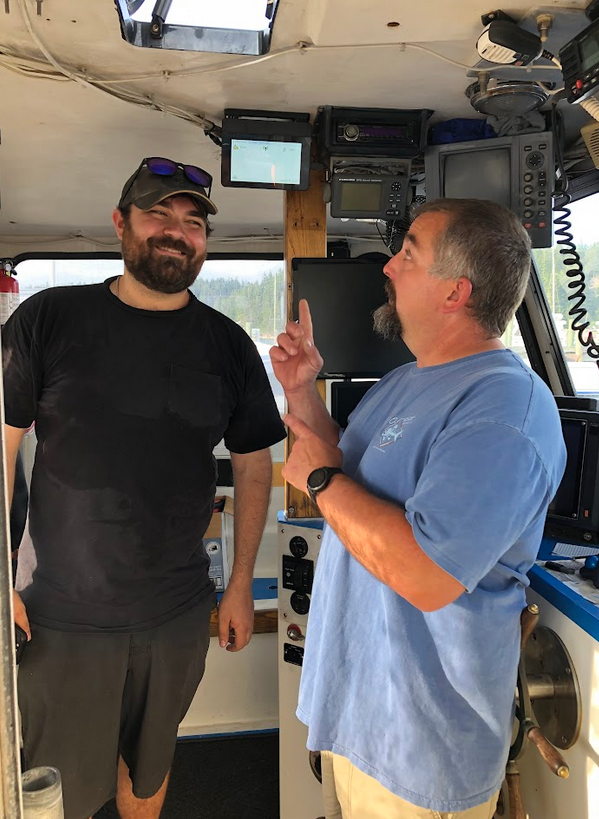
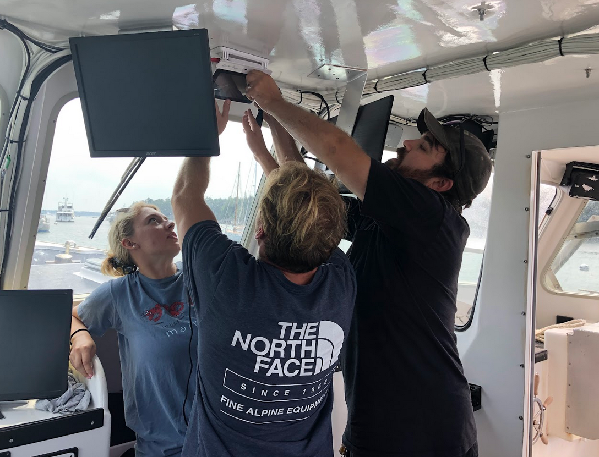
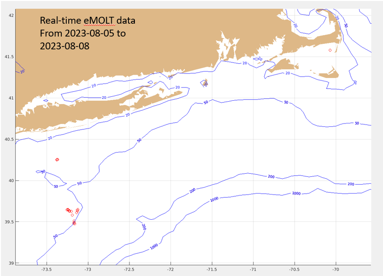
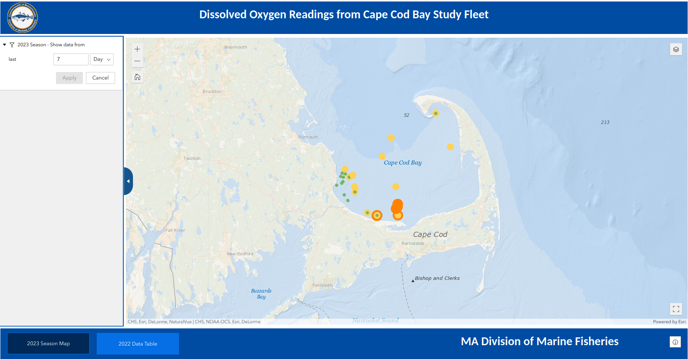
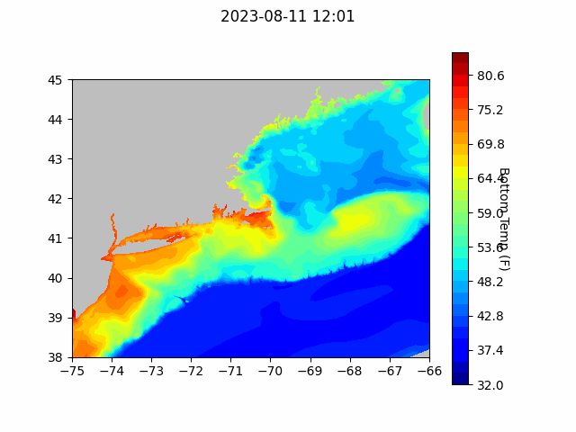
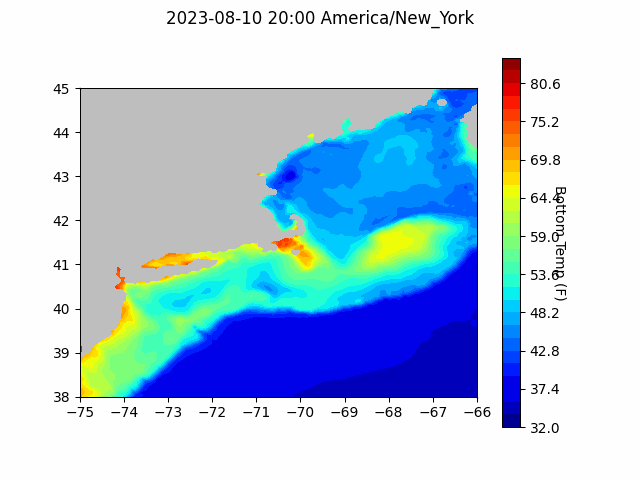

```{r setup, include=FALSE}
knitr::opts_chunk$set(echo = TRUE)
library(blastula)
```

<center> 

<font size="5"> *eMOLT Update `r Sys.Date()` * </font>

</center>

This week is a busy one for the eMOLT team. George put in almost 1000 miles of 
driving to install eMOLT systems along the coast of Maine with Andrew, Chris, 
Ryan, and Tessa from the Maine Lobster Institute. 

{width=300px}
{width=300px}

{width=300px}
{width=300px}

{width=450px}

*How many scientists does it take to install an eMOLT system? Sometimes that 
depends on how many other electronics are already installed in the wheelhouse*

Erin also got out into the field helping to deploy some dissolved oxygen loggers
and working with Huanxin to upgrade the deckbox on the F/V Lina Rose. 

On the modeling side, we also got a notification from Qichun Xu at the Univeristy 
of Massachusetts School for Marine Science and Technology that the NECOFS
group has begun to incorporate realtime eMOLT data into their forecast model!
The plot below shows the first eMOLT points that were assimilated on 2023-08-08

{width=450px}

## Acknowledgements

Thank you to captains Dustin, Sam, Dominic, Jim, and Jamien who graciously made
time for us to work on their boats this week. Welcome aboard! We appreciate your 
willingness to participate in the program. 

Thanks also to the Chen lab at SMAST for their efforts to incorporate eMOLT data
into the NECOFS forecasts. It's all well and good to collect the data, but it's
really great to see it being used!

## [Cape Cod Bay Dissolved Oxygen Snapshot](https://experience.arcgis.com/experience/0d553dfc6c60487cb1f4d20b5366ee0b/page/Map-Page/)

{width=800px}

## Forecasts


### NECOFS Bottom Temperature Forecast

{width=800px}

### Doppio Bottom Temperature Forecast

{width=800px}

### Other News

The Massachusetts Division of Marine Fisheries recently released a report titled 
["Estimating the Costs of Using On-Demand Gear in Massachusetts Lobster 
Fisheries"](https://www.mass.gov/files/documents/2023/07/31/Estimating%20the%20costs%20of%20using%20on-demand%20gear%20in%20Massachusetts%20lobster%20fisheries.pdf). The report indicates
that *"operational time costs and resulting decreases in catch
revenue associated with the decreased efficiency of the type of on-demand gear we used to
parameterize the model could be significant, reaching a similar level of cost to the acquisition of
the gear itself for some classes of lobster fishing vessel."*

### Announcements

- The [Woods Hole Science Stroll](https://woodsholesciencestroll.org/) is back on this year! Tomorrow (August 12), we welcome
anyone who's interested in meeting scientists and learning more about the work
we do to come down to Water Street in Woods Hole. In addition to the Cooperative
Research Branch staff many of you already know and other NOAA Fisheries scientists,
staff from other scientific organizations will be around giving demos of hardware 
and explaining their research. We'd be happy to have you stop in! Participating
organizations include:
    - Marine Biological Laboratory
    - US Coast Guard
    - US Geological Survey
    - Woodwell Climate Research Center
    - Woods Hole Oceanographic Institution
  ...and more!

All the best,
George and JiM
