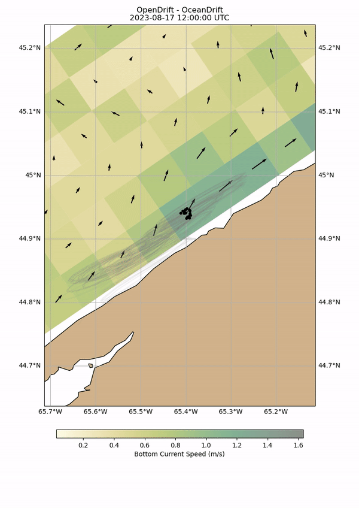
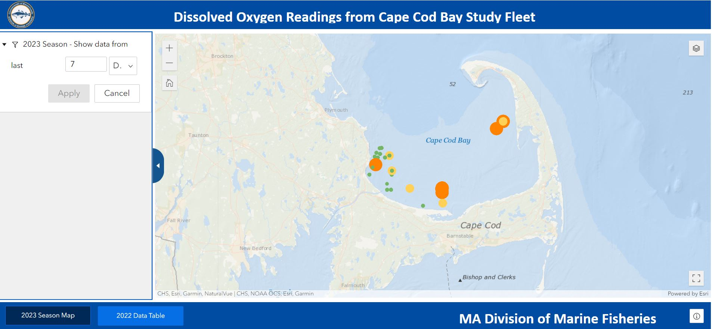
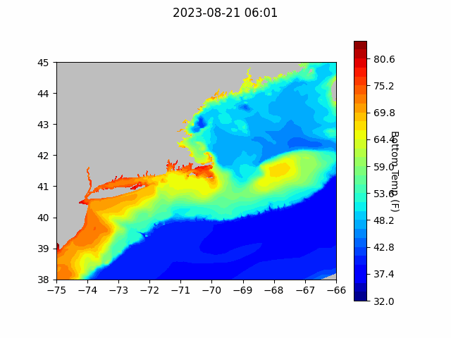
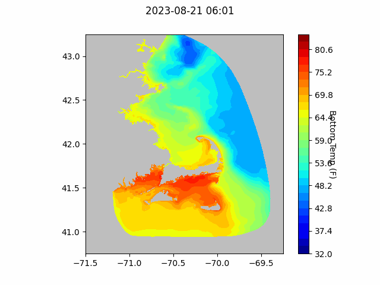
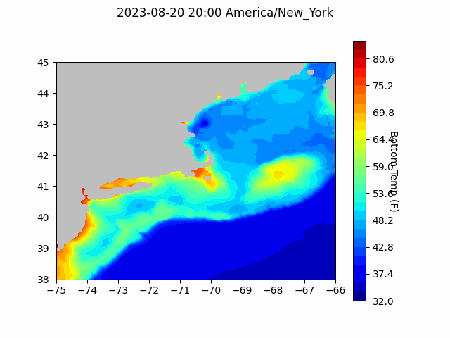

```{r setup, include=FALSE}
knitr::opts_chunk$set(echo = TRUE)
library(blastula)
```

<center> 

<font size="5"> *eMOLT Update `r Sys.Date()` * </font>

</center>

The Woods Hole Science Stroll was a great opportunity to engage the public and showcase
the eMOLT system alongside our other Cooperative Research endeavors. People were 
impressed with the willingness of fishermen to work with scientists to collect data
that benefits the industry, scientific endeavors, and the public at large. One of the 
less talked about benefits of citizen science projects like this is that they 
democratize science, pulling researchers out of our ivory towers, empowering you all
to participate in the process, and promoting engagement with society at large. 
These benefits are highlighted in a recent article published in The Journal of Science Communication
called ["Exploring scientists’ perceptions of citizen science for public engagement with science"](https://jcom.sissa.it/article/pubid/JCOM_2107_2022_A01/). The full article is 
pretty long, but you can read a summary of it [here](https://www.scicommbites.org/post/beyond-data-collection-the-transformative-role-of-citizen-science-in-public-engagement)

This past week, we got our first data from the DO loggers that were hastily deployed
up in Maine last week to monitor the potential impacts of a large plankton bloom
underway in the Gulf of Maine. So far, both loggers that reported are showing good levels of
Dissolved Oxygen with no discernable downward trends off Cape Elizabeth and Isle Au Haut. 
We will be working with our colleagues at The Lobster Institute to get some more of
these sensors out on Maine-based fishing vessels over the next few weeks. 

George and Huanxin went up to the South Shore on Friday afternoon and upgraded the 
deckbox software on two lobster boats out of Cohasset. Of course, driving back onto
the Cape on a Friday afternoon in August isn't a great situation, but we try to
work around fishermen's availability as best we can. It's also why this update
is coming out this morning instead of last Friday. 

JiM has been experimenting with a new open-source "particle tracking" routine, recently developed by oceanographers in Norway, called "OpenDrift". It allows one to numerically simulate drifter tracks through modeled ocean circulation fields.  Thanks to some help from our Rutger's colleagues, he was able to make some initial tests of the system using three student-built units currently drifting in the Gulf of Maine. As see [here](https://studentdrifters.org/tracks/drift_X.html), the real drifters are distributed in different parts of the Gulf including one of the Southern Maine Community Colleage units that has made its way to the upper reaches of the Bay of Fundy.  As seen below, it subjected to the enormous tides. The eastern portion of Digby Harbor is visible in the lower half of the frames.

 

## [Cape Cod Bay Dissolved Oxygen Snapshot](https://experience.arcgis.com/experience/0d553dfc6c60487cb1f4d20b5366ee0b/page/Map-Page/)

As reported by the [Provincetown Independent](https://provincetownindependent.org/featured/2023/08/16/lobstermen-face-hypoxia-in-outer-cape-waters/), last week, Massachusetts DMF issued an advisory that hypoxic zones had been identified near Barnstable and between Provincetown and Wellfleet. While most loggers in western Cape Cod Bay are reporting good oxygen levels, one logger showed a rapid decrease beginning on August 12. Along with our colleagues from the Center for Coastal Studies and DMF, we'll continue to monitor the situation. 

{width=800px}

## Forecasts


### NECOFS Bottom Temperature Forecast

{width=800px}

{width=800px}
### Doppio Bottom Temperature Forecast

{width=800px}

### Acknowledgements

Thanks to Capt. Dave on the F/V Grace Sarah, Capt. Dustin on the F/V Every Last Dollar
and Capt. Sam on the F/V Alison Ann for reaching out last week to report challenges
with their systems. We were able to remotely fix two of the three, and will continue
monitoring the third to see if things are ok. The text messages you send us are 
extremely helpful to us in making the hardware more reliable. 

Thanks also to Owen Nichols from the Center for Coastal Studies for staying on late
with Huanxin the other night as them attempted to troubleshoot a bluetooth error
on board the F/V Donna Marie. Owen has been a patient supporter of the eMOLT program,
and we appreciate his ongoing efforts to keep the Outer Cape eMOLT fleet up and running.


### Announcements

- The next [meeting of the New England Fisheries Management Council](https://www.nefmc.org/calendar/september-2023-council-meeting) will be September 25-28 in Plymouth, MA. 

All the best,
George and JiM
