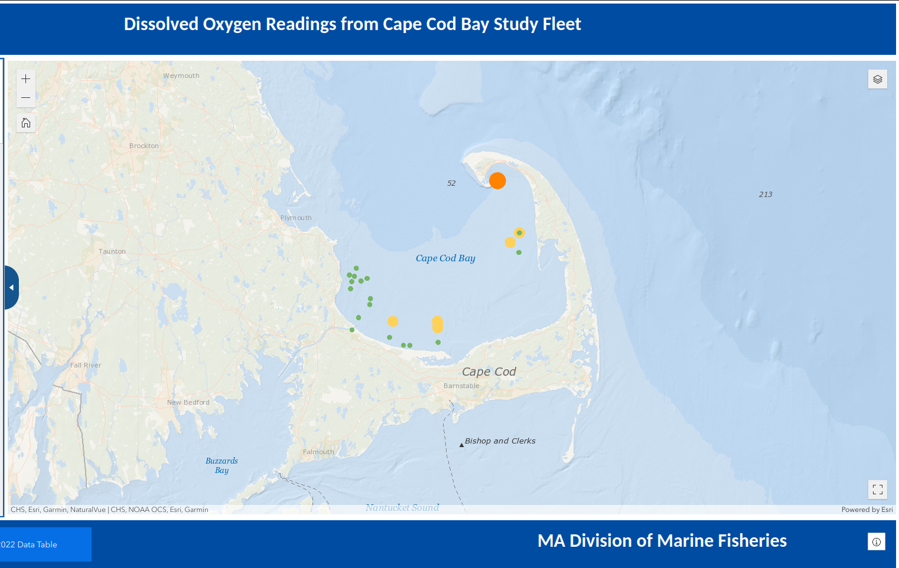
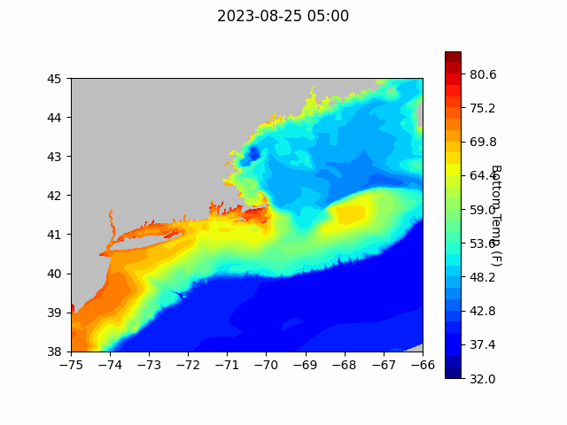
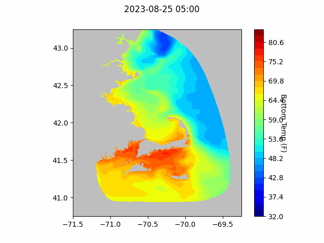
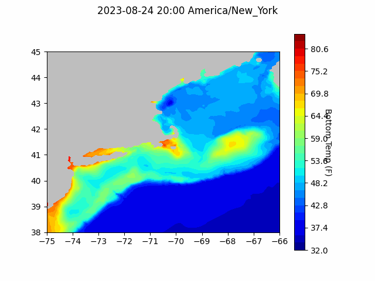

```{r setup, include=FALSE}
knitr::opts_chunk$set(echo = TRUE)
library(blastula)
```

<center> 

<font size="5"> *eMOLT Update `r Sys.Date()` * </font>

</center>

This week's update is a pretty short one. Teachers and students go back to school
in some towns on the Cape next week, so I'm taking the afternoon off to spend some time with my
wife (who's a science teacher) and kids. 

The University of New Hampshire sent out a [press release describing an ongoing plankton bloom
in the Gulf of Maine](https://www.unh.edu/unhtoday/news/release/2023/08/23/researchers-identify-unusually-large-bloom-brown-algae-gulf-maine). We have a few more dissolved oxygen loggers to put out in Maine to support this effort.
Erin will be down in Rhode Island for a hand off sometime next week. 

We're continuing to work with a number of colleagues here at the Northeast Fisheries Science Center to make 
more of our data publicly available. Recently, we finished getting all of the CTD (Conductivity, Temperature, Depth) profiles collected during our surveys out. The data back to 1977 are now available [here](https://comet.nefsc.noaa.gov/erddap/tabledap/ocdbs_v_erddap1.html) and should automatically update as new surveys finish up. 

## [Cape Cod Bay Dissolved Oxygen Snapshot](https://experience.arcgis.com/experience/0d553dfc6c60487cb1f4d20b5366ee0b/page/Map-Page/)

Low DO areas in Cape Cod Bay appear to have receded or shifted over the last week. Since removing the logger that 
was reading low near Manomet, no other loggers in the area have documented low DO. DO concentrations also
appear to be slightly higher off Barnstable and Wellfleet than they were previously, although very low DO concentrations continue to be observed off Provincetown. 

{width=800px}

## Forecasts


### NECOFS Bottom Temperature Forecast

{width=800px}

{width=800px}

### Doppio Bottom Temperature Forecast

{width=800px}

### Acknowledgements

Thanks to Capt. Dominic on the F/V Tyrant for checking in with us about some issues with his deckbox.
We'll see what we can do remotely over the next few days. Please feel free to call or text anytime
you have an issue with one of these systems. Your feedback, good or bad, is what helps us keep 
improving. You can reach George at 508-299-9693 most of the time. 


### Announcements

- The next [meeting of the New England Fisheries Management Council](https://www.nefmc.org/calendar/september-2023-council-meeting) will be September 25-28 in Plymouth, MA. 

- Fishermen aren't just valuable partners in collecting environmental data. In other Cooperative Research news, the [Industry Based Biological Samping Program](https://www.fisheries.noaa.gov/new-england-mid-atlantic/science-data/cooperative-research-northeast#industry-based-biological-sampling) at NEFSC wrapped up this fiscal year with over 5,000 samples from 11 species.

- Offshore wind news from the NEFSC's recent "Science Highlights"

> *"We collaborated with the Woods Hole Oceanographic Institution on a way to continue surveying Atlantic sea scallop populations in wind energy areas. We’re thrilled that we’ve completed the first sea trials on a new long-range autonomous underwater vehicle that can operate in the lease areas. This vehicle carries HabCam—a stereo camera and sensor system that is also used during our federal scallop survey. The AUV is small, has all the necessary sensors and equipment used for surveying scallops, and can be programmed. It's an excellent option for collecting the data and information we need inside wind energy lease areas.  We’ve also evaluated environmental monitoring planned by wind developers for their projects. We found that as currently designed, developer monitoring will not yield information to mitigate data lost from federal surveys in offshore wind energy areas. To help wind developers enhance their monitoring plans, we’ve provided a series of recommendations. These recommendations will also contribute to improved regional understanding of fishery resource responses to wind development." -Jon Hare, Ph.D., Director of NEFSC*

All the best,
George and JiM
