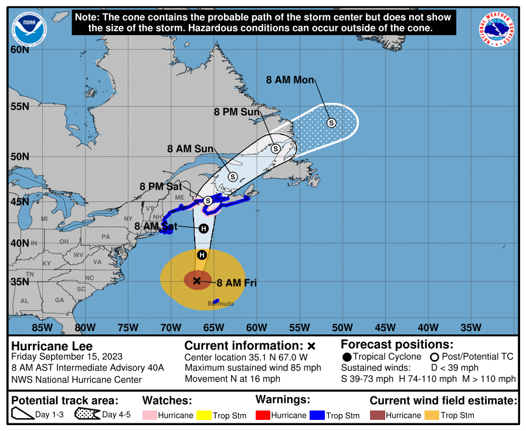
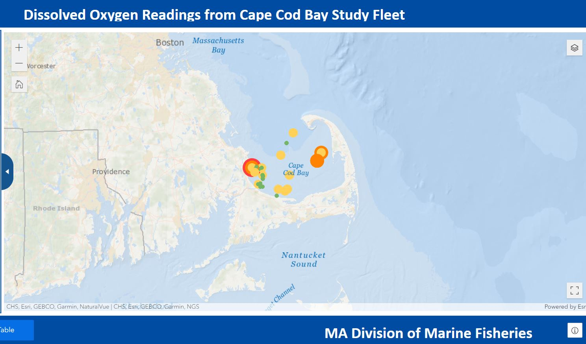
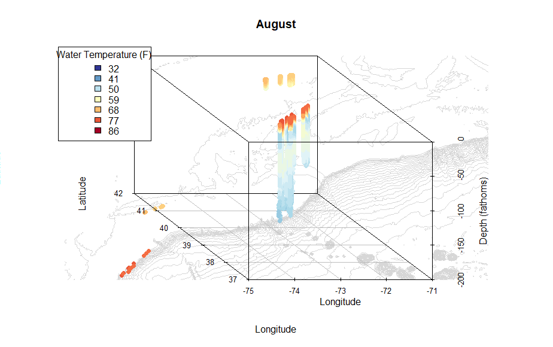
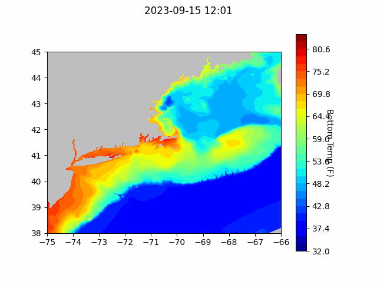
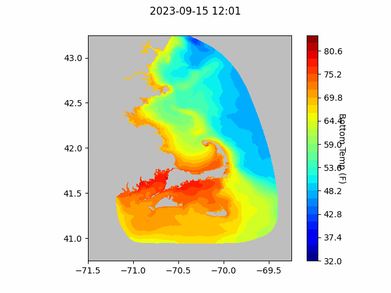
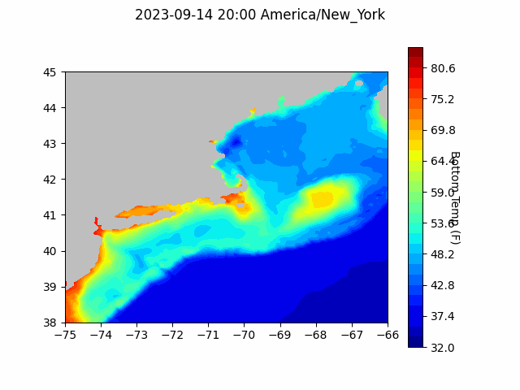

```{r setup, include=FALSE}
knitr::opts_chunk$set(echo = TRUE)
library(blastula)
```

<center> 

<font size="5"> *eMOLT Update `r Sys.Date()` * </font>

</center>

Earlier this week, a grad school colleague of George's died in a tragic accident while conducting a salmon survey out west. She was 31 and had young kids. These kind of events are a sobering reminder that working on the water comes with certain risks. Please do what you can to keep yourselves safe, and give your loved ones an extra hug before you head out. 

Hurricane Lee is now north of Bermuda and will make landfall somewhere along the Maine / Canada border, with impacts throughout coastal New England. 



We're going into the storm down one buoy in Southern New England. The other day, [NERACOOS announced](https://mailchi.mp/neracoos/diversity-equity-inclusion-where-neracoos-goes-from-here-8385016?e=d78516aed4) that their Buzzards Bay buoy had been struck by a passing vessel last Sunday and would be out of the water for repairs until further notice. 

## [Cape Cod Bay Dissolved Oxygen Snapshot](https://experience.arcgis.com/experience/0d553dfc6c60487cb1f4d20b5366ee0b/page/Map-Page/)

Low DO areas persisted throughout Cape Cod Bay this week. A severely low reading between Ellisville and Manomet may be indicative of a failed logger rather than extreme hypoxia. We will work with the fishermen who was assigned that logger to iron things out. Earlier in the week, The Cape Cod Times [published an article](https://www.capecodtimes.com/story/news/environment/2023/09/14/studies-underway-low-dissolved-oxygen-reappear-cape-cod-bay-lobster/70607751007/) on this industry-based monitoring effort. 



## Other Dissolved Oxygen News

In news from the north, the DO loggers we've deployed with realtime systems in the Gulf of Maine continue to produce readings in the normal range.

Earlier this week, George spoke with some colleagues at WHOI about concern over the potential for hypoxic conditions forming south of Long Island. Glen Gawarkiewicz mentioned that the water column stratification in that area has been particularly strong this summer, with fresher, more buoyant, fresher surface water acting almost like a lid to prevent water column mixing. eMOLT temperature profiles from the summer season (such as the August plots below) show this stratification, particularly offshore. Unfortunately, as of now, we don't have a great way to deploy dissolved oxygen loggers on mobile gear. 



## Forecasts


### NECOFS Bottom Temperature Forecast

{width=800px}

{width=800px}

### Doppio Bottom Temperature Forecast

{width=800px}

### Acknowledgements

Thanks to Tracy Pugh at Mass DMF for flagging the potentially problematic reading on one of our loggers this week. 

### Announcements

- The next [meeting of the New England Fisheries Management Council](https://www.nefmc.org/calendar/september-2023-council-meeting) will be September 25-28 in Plymouth, MA. 

- Saildrone is operating two Uncrewed Surface Vessels in the eastern third of the Gulf of Maine to collect high resolution bathymetric data from August 28 - October 18. Coordinates by date and contact information can be found [here](https://d23h0vhsm26o6d.cloudfront.net/Saildrone-Gulf-of-Maine-Mapping-Project-Announcement.pdf)

Stay safe this weekend,
George and JiM
