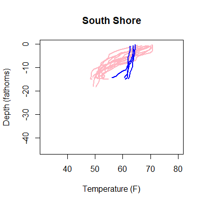
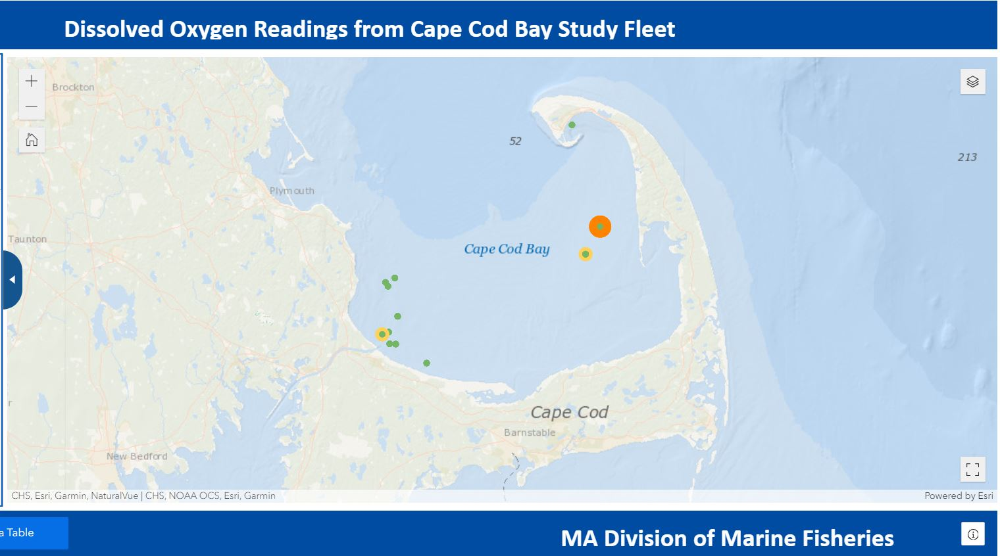
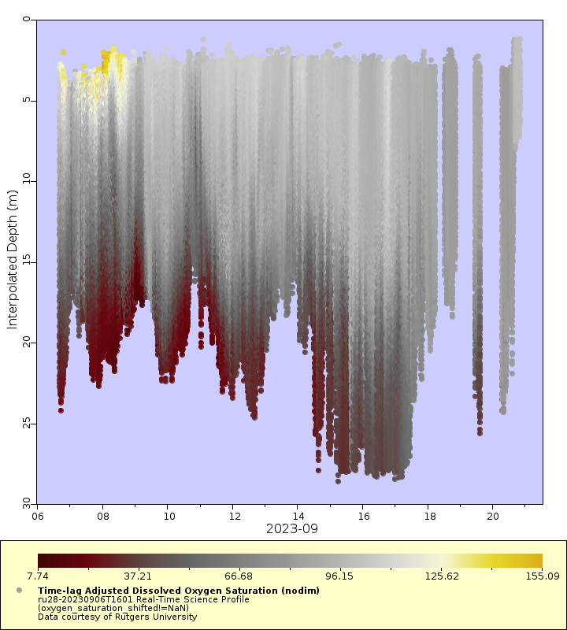
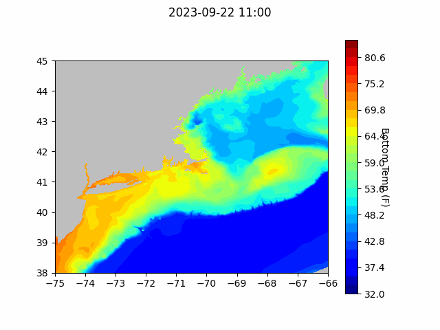
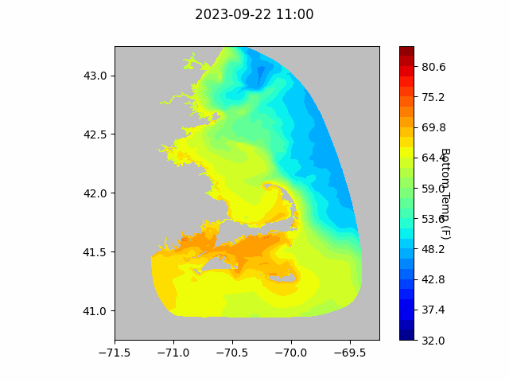
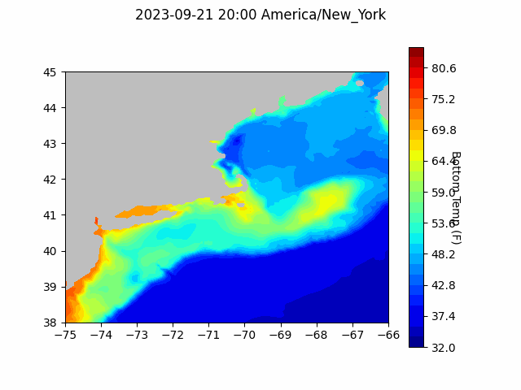

```{r setup, include=FALSE}
knitr::opts_chunk$set(echo = TRUE)
library(blastula)
```

<center> 

<font size="5"> *eMOLT Update `r Sys.Date()` * </font>

</center>

It is often the episodic storm systems that govern the oceanographic conditions any one season. The recent passing of Lee, for example, restructured the water column. It cooled and transported surface waters. As shown in the animation below, the storm arriving about Sept 16th was evidently enough to bring the colder bottom water to the surface and drive the two surface drifters (built by Meadowbrook Elementary and Southern Maine Community College, respectively) a good distance. 


The same story is repeated farther north on the South Shore of Massachusetts. A look at temperature profiles from this area shows cooler surface temperatures and a breakdown of thermal stratification after the storm. Heading further north to coastal Maine, the thermal stratification was less pronounced before the storm, and there's only one profile available after Lee. However, we can still see a drop in surface temperature after the storm. 




> **In these graphs, the blue lines represent temperature profiles from after the storm and pink lines represent temperature profiles from before the storm. Temperature is on the bottom (x) axis (further right = warmer) and depth is on the left (y) axis (top of the graph = top of the water column).**

## [Cape Cod Bay Dissolved Oxygen Snapshot](https://experience.arcgis.com/experience/0d553dfc6c60487cb1f4d20b5366ee0b/page/Map-Page/)



This week, low dissolved oxygen areas persisted west of Wellfleet and Eastham and southeast of Plymouth. There was also a report of dead, blackened spider crabs and rotted bait in traps near Plymouth. Please reach out if you notice things like this in your traps or if you hear of things like this from other captains. More information betters our collective understanding of what's going on out there. 

## Other Dissolved Oxygen News

Loggers in the Gulf of Maine continue to read normal levels. In the Mid-Atlantic, gliders deployed by Rutgers University had documented low DO areas near the bottom just off the coast of New Jersey before last week's storm, but it appears the storm may have mixed things up and alleviated the issue.

{width=500px}

>**In this figure, date is on the bottom (x) axis and depth is on the left (y) axis such that earlier dates are to the left, and the top of the water column is at the top of the figure. Red areas have low dissolved oxygen, gray and yellow areas are more normal readings.** 

## Forecasts


### NECOFS Bottom Temperature Forecast

{width=800px}

{width=800px}

### Doppio Bottom Temperature Forecast

{width=800px}

### Acknowledgements

A big thanks to Captain Mike on the F/V Phyliss P and Captain Joe on the F/V Ryan Joseph who both spent some time discussing their dislike of the new plotting interface with me this week. For everyone who's had problems or concerns with the plotting, Joaquim and Huanxin have been working on a new plotting library. Your feedback is really helpful in improving the software, so keep it coming!

### Announcements

- George and Huanxin will both be out of the office most of next week. If your eMOLT system runs into any issues, please contact George by email or cell phone and he'll get back to you next Friday. 

- NOAA is recruiting professional mariners to crew our research ships. There are [two in-person hiring events in Southern New England next week](https://www.omao.noaa.gov/marinerjobevents), one in Fairhaven, MA and one in Warwick, RI. For more information, please click the link above. If you can't make the events, please [click here](https://marinerhiring.noaa.gov/) to visit the online hiring portal. 

- Next Thursday (9/28/2023) at noon, Dr. Vincent Saba (NEFSC) is presenting a seminar called **Surface vs Bottom Marine Heatwaves in the Northeast U.S.**. You can watch live and ask questions  [here](https://meet.google.com/paw-jhrb-nzr). 

- The next [meeting of the New England Fisheries Management Council](https://www.nefmc.org/calendar/september-2023-council-meeting) will be September 25-28 in Plymouth, MA. 

- Saildrone is operating two Uncrewed Surface Vessels in the eastern third of the Gulf of Maine to collect high resolution bathymetric data from August 28 - October 18. Coordinates by date and contact information can be found [here](https://d23h0vhsm26o6d.cloudfront.net/Saildrone-Gulf-of-Maine-Mapping-Project-Announcement.pdf)


All the best,
George and JiM
