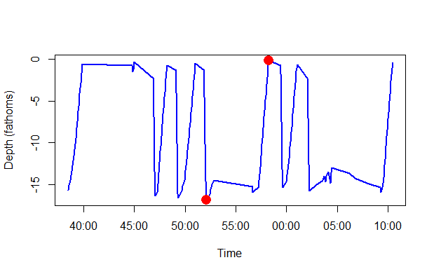
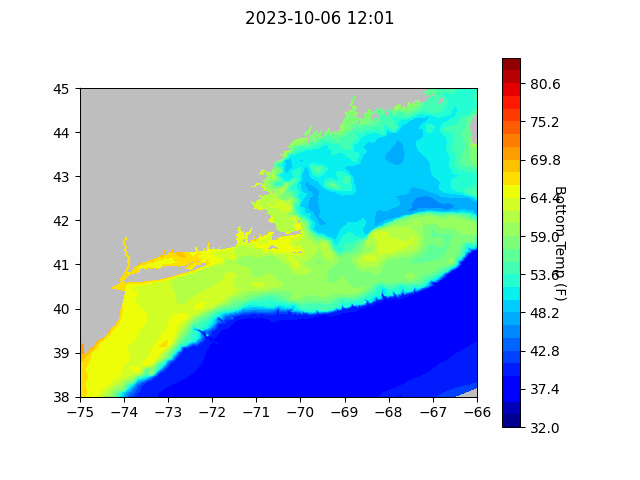
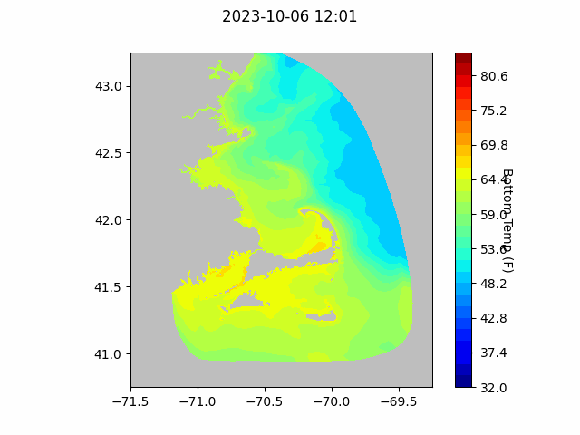
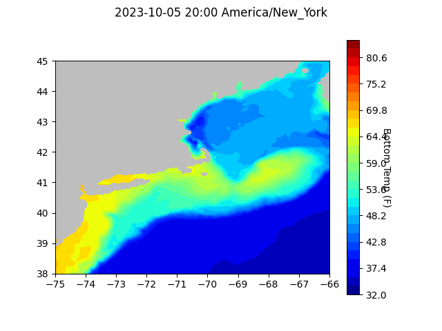

```{r setup, include=FALSE}
knitr::opts_chunk$set(echo = TRUE)
library(blastula)
```

<center> 

<font size="5"> *eMOLT Update `r Sys.Date()` * </font>

</center>

This week, we welcomed two new vessels to the eMOLT program, the F/V Mattie & Ayva
and the F/V No Sympathy. Both are lobster boats fishing out of Maine harbors and
have been equipped with the new DDH-style deckboxes and Moana probes. The No Sympathy
will also deploy two dissolved oxygen loggers for the remainder of the season. 

With the adoption of the Moana profiling sensors, we're now starting to look for 
new ways to make sense of the data, and new software rules for automatic data processing.
For example, the Argo program only delivers upcast data to the Global Telecommunication
System. That's easy enough to parse out when the sensors are attached to a robot that 
operates in a predictable way, but it's much more difficult when you're looking at
something like this...



This gear got hung up and bounced up and down in the water column while the captain was trying to clear it, making several abrupt, vertical changes in direction. In the span between the two red dots, it also starts to come up, then drop back to the bottom, then come back towards the surface again. These types of cases can be really challenging for automated QAQC to resolve, and often take direct communication with the captain to understand what was happening and whether this is real data or a sensor malfunction. So, we'll continue to plug away at writing new data processing software to clean up as many of these cases as we possibly can before the data are used for any research. 

## Forecasts


### NECOFS Bottom Temperature Forecast

{width=800px}

{width=800px}

### Doppio Bottom Temperature Forecast

{width=800px}


### Announcements

- Saildrone is operating two Uncrewed Surface Vessels in the eastern third of the Gulf of Maine to collect high resolution bathymetric data from August 28 - October 18. Coordinates by date and contact information can be found [here](https://d23h0vhsm26o6d.cloudfront.net/Saildrone-Gulf-of-Maine-Mapping-Project-Announcement.pdf)

- Applications for the [Sea Scallop RSA](https://www.grants.gov/web/grants/search-grants.html?keywords=scallop%20rsa) are due 10/23/23

- Applications for the [Saltonstall-Kennedy program](https://www.grants.gov/web/grants/search-grants.html?keywords=saltonstall) are due 11/8/23

- Pre-proposals for the [Bycatch Reduction Engineering Program](https://www.grants.gov/web/grants/search-grants.html?keywords=brep) are due 12/15/23

- Full proposals for the [Bycatch Reduction Engineering Program](https://www.grants.gov/web/grants/search-grants.html?keywords=brep) are due 3/20/24


All the best,
George and JiM
