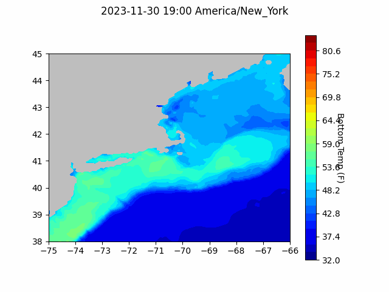

```{r setup, include=FALSE}
knitr::opts_chunk$set(echo = TRUE)
library(blastula)
```

<center> 

<font size="5"> *eMOLT Update `r Sys.Date()` * </font>

</center>

## Invitation to the Northeast Cooperative Research Summits

It is my pleasure to invite you all to the [2024 Northeast Cooperative Research Summit](https://www.fisheries.noaa.gov/event/mid-atlantic-cooperative-research-summit) that will be held in Cape May, New Jersey on February 5, 2024. This one-day summit will bring together scientists, managers, and members of the fishing community to communicate and coordinate cutting edge cooperative fisheries research being conducted in the northeast region, discuss opportunities for enhanced industry involvement, and outline best practices for applying cooperative research results to assessments and management. Agenda items include presentations from researchers and members of the fishing community, panel discussions, and networking. **[Registration](https://forms.gle/EVA86Ku3PBz2h3BD9) is open until December 22, 2023. There is no fee for attendance.**

**If you spearhead ongoing or recently completed research that involves a collaboration between scientists and fishermen, please consider submitting an abstract for an oral presentation when you [register](https://forms.gle/EVA86Ku3PBz2h3BD9).** If you have never been involved in cooperative research, but are interested in learning more and becoming more involved, please consider attending.

Please help us spread the word about the summits by sharing this invitation with your colleagues and networks. These Summits will be most productive with the participation of all parties that engage in cooperative research.

I hope you will join us for this exciting event and help shape the future of cooperative research! If you have any questions or need assistance with registration please contact thomas.swiader@noaa.gov.

## eMOLT Updates

It's been a while since we sent one of these emails out, but it's just a crazy time of year.

- Thanks to Huanxin and Erin, we've brought two more boats online up in Maine. Welcome to the eMOLT fleet F/V Joseph and Peter and F/V Jasmine Marie
- Thanks also to Owen, the team at ODN, and Captain Willis on the F/V Donna Marie for your persistence in getting the system up and running. In an unintentional and dramatic test of the ruggedness of our system, the Moana sensor on the F/V Donna Marie took a direct hit from a rock and ended up back in the bag. There was no external damage, but the impact disconnected a battery terminal inside the logger. Now it's back up and running just fine. 

We are in the process of getting together all of the different sources of eMOLT data to contribute to the upcoming American Lobster stock assessment. This is a reminder that your efforts have impacts beyond just improving forecast models. We are actively working to make sure the data from this program is used in other scientific endeavors as well. Thank you all for participating!

## Forecasts

### Doppio Bottom Temperature Forecast

{width=800px}


### Announcements

- Pre-proposals for the [Bycatch Reduction Engineering Program](https://www.grants.gov/web/grants/search-grants.html?keywords=brep) are due 12/15/23

- Full proposals for the [Bycatch Reduction Engineering Program](https://www.grants.gov/web/grants/search-grants.html?keywords=brep) are due 3/20/24


All the best,
George and JiM
