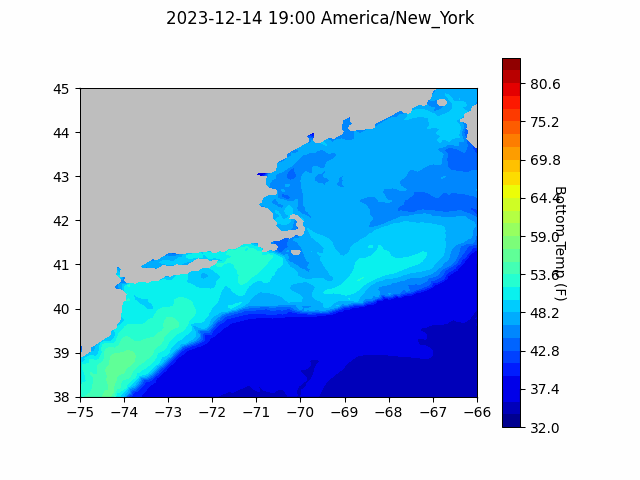

```{r setup, include=FALSE}
knitr::opts_chunk$set(echo = TRUE)
library(blastula)
```

<center> 

<font size="5"> *eMOLT Update `r Sys.Date()` * </font>

</center>

This week, we started uploading the non-realtime data from 2023 into our database. These data are now available on our ERDDAP server. If your information isn't up yet that means we 

- haven't gotten a chance to load it yet
- haven't gotten your sensor back in the mail (please send it!)

Over the next few weeks, we're hoping to finish loading these data up so that they can be available to stock assessment scientists, oceanographers, and all of you. 

We've also been working on rolling out some changes to the realtime system software to fix the graphing issues that many of you were experiencing earlier this summer. If graphs aren't appearing after you haul your sensor, please reach out and let us know. We can set up a time to upgrade your software remotely. In most cases, you don't even have to be on the vessel. All we need is for the device to be powered on and in cell range. 

## Forecasts

### Doppio Bottom Temperature Forecast

{width=800px}


### Announcements

- Pre-proposals for the [Bycatch Reduction Engineering Program](https://www.grants.gov/web/grants/search-grants.html?keywords=brep) are due TODAY!!!

- [Registration](https://forms.gle/EVA86Ku3PBz2h3BD9) for the [Northeast Cooperative Research Summit](https://www.fisheries.noaa.gov/new-england-mid-atlantic/outreach-and-education/cooperative-research-fosters-regional-partnerships) is still open until 12/22. George and Sarah Salois from the Narragansett Lab will be moderating a panel discussion about understanding the impacts of changing environmental conditions on fisheries. We'd love to see you there!

- GMRI has launched recruitment for ultra-low-opening trawl net project. They will pay you to test the net. [Seeking trawl participants to try the net](https://gmri.org/projects/reducing-cod-bycatch-with-new-trawl-nets/)- Applications close 12/31

- Full proposals for the [Bycatch Reduction Engineering Program](https://www.grants.gov/web/grants/search-grants.html?keywords=brep) are due 3/20/24


All the best,
George and JiM
