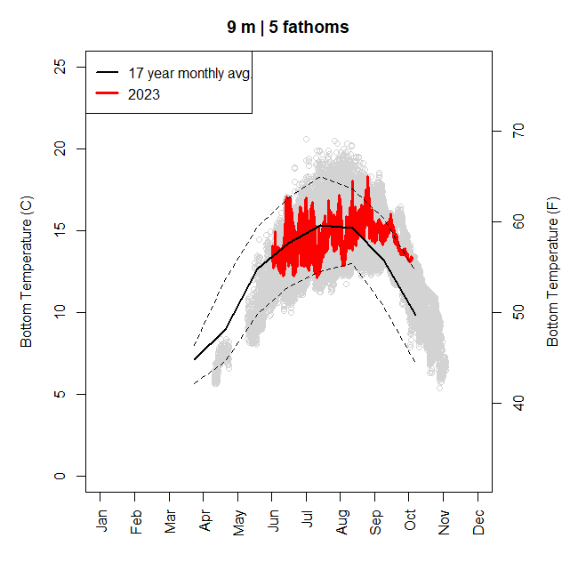
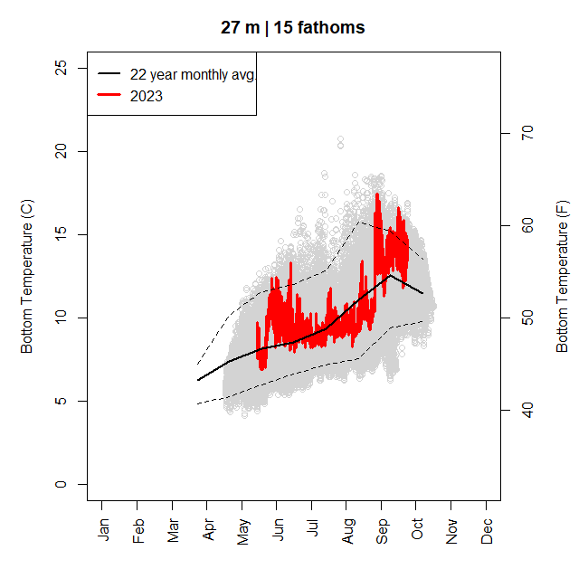
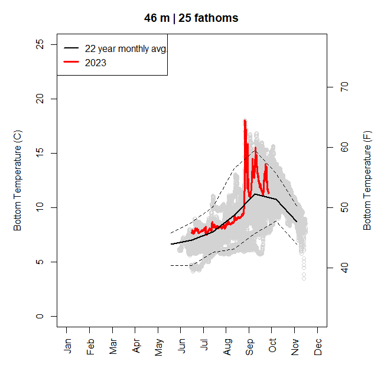
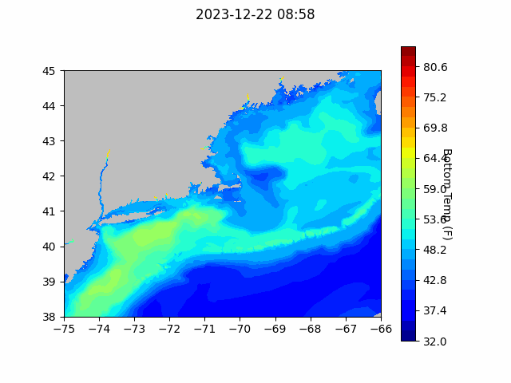
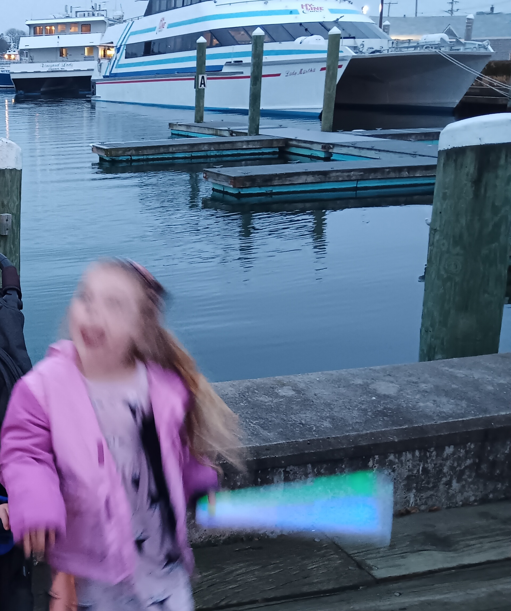

```{r setup, include=FALSE}
knitr::opts_chunk$set(echo = TRUE)
library(blastula)
```

<center> 

<font size="5"> *eMOLT Update `r Sys.Date()` * </font>

</center>

First off, a reminder that **TODAY IS THE LAST DAY TO [REGISTER](https://docs.google.com/forms/d/e/1FAIpQLSeDG_tQFYRgPUgK7L6LPCJIcX_RUjnlN51N5U01iF-JBEThIw/viewform?usp=sf_link) FOR THE [REGIONAL COOPERATIVE RESEARCH SUMMIT](https://www.fisheries.noaa.gov/event/mid-atlantic-cooperative-research-summit) that will take place in Cape May next February**. 

A few weeks ago, the semi-annual newsletter was printed and mailed to 35 lobstermen, mostly those who participate in the non-realtime project to remind them that a) the project is still alive and b) to mail in their probes when they are done fishing for the year.

A few dozen have mailed in their probes so far. It appears that, as in the case of the examples below, there was a warm Spring in 2023 was followed by a normal or slightly cool Summer and a warm Fall. In all cases, the dramatic effect of Hurricane Ian in late September is evident.

### Between Cutler, ME and Grand Manan
{width=600px}

### Casco Bay
{width=600px}

### Outer Cape Cod
{width=600px}

### Cape Cod Bay
{width=600px}

The StudentDrifter Program is slowly coming back from its Covid-era slump. You can see the last month of tracks [here](https://studentdrifters.org/tracks/drift_X.html). Most interesting, as seen in the animation below, is the result of three clusters deployed in Cape Cod Bay on Nov 25th, Dec 2nd, and Dec 15th. They were deployed by mariners in Sandwich: USCG, Capt. Dave on the F/V Grace Sarah, and Capt. Rob on the F/V Resolve, respectively. The last two clusters included a pair of sensor laden miniboats which sail quickly across the bay. 


> *For the full resolution animation, click [here](https://studentdrifters.org/tracks/ccbay_2023_fvcom.gif)*

## Forecasts


### NECOFS Bottom Temperature Forecast

{width=800px}


### Doppio Bottom Temperature Forecast

{width=800px}

## Cooperative Research Opportunities
- Commercial Fisheries Research Foundation is seeking captains interested in *Exploring the Feasibility and Market Potential of a Common Spider Crab Fishery in Southern New England*. To get involved with the project check out their [website](https://www.cfrfoundation.org/spider-crabs?fbclid=IwAR3QoTjBauKFaGM03DO9sWaQbKzKIDcIgoiBPYEvWOvFUhxhQ3cIJhyU79c). 

- The Atlantic States Marine Fisheries Commission and the Northeast Fisheries Science Center are seeking captains interested in contracting out their vessels for a pilot hook-and-line (DNG auto-jig) survey along the east coast. Further information can be found [here](https://asmfc.org/jobs/) under the title *Pilot Hook and Line Survey Request for Proposals*. 

## New research
- In an example of the importance of bottom temperature information, scientists at the Alaska Fisheries Science Center recently published their findings of what happened with the case of the disappearing snow crabs. Long story short, extended marine heatwaves made the waters warm enough that the crabs' caloric requirements increased beyond the food that was available and billions of them likely starved. To read the full paper, request access [here](https://drive.google.com/file/d/11C0J59hvtSTd8dWyv9PW8AAEzOjF2Lk8/view?usp=drive_link). 

- Using a set of floating instruments, an interesting study was published by scientists at Woods Hole Oceanographic Institute last month entitled "Warming and lateral shift of the Gulf Stream from in situ observations since 2001" and described [here](https://www.whoi.edu/press-room/news-release/gulf-stream-is-warming-and-shifting/). The [Portland Herald article](https://www.pressherald.com/2023/10/23/a-warming-gulf-stream-is-edging-ever-closer-to-shore/) focuses on the effects in the Gulf of Maine.

## Announcements

- GMRI has launched recruitment for ultra-low-opening trawl net project. They will pay you to test the net. [Seeking trawl participants to try the net](https://gmri.org/projects/reducing-cod-bycatch-with-new-trawl-nets/)- Applications close 12/31

- Full proposals for the [Bycatch Reduction Engineering Program](https://www.grants.gov/web/grants/search-grants.html?keywords=brep) are due 3/20/24

- Longtime eMOLT participant David Goethel recently published a memoir describing his decades in commercial fishing. Entitled "Endangered Species", you can find it [here](https://perpublisher.com/portfolio-item/endangered-species/)


Finally, I hope you are all able to enjoy the holidays at least half as much as my 5 year old daughter has been. Here she is waving a glow wand and cheering after seeing eMOLT participant F/V Tom Slaughter pull into Hyannis Harbor ahead of the Hyannis Holiday Boat Parade.

{width=150px}

Wishing you and yours a restful and happy holiday season. See you next year!


All the best,

George and JiM
