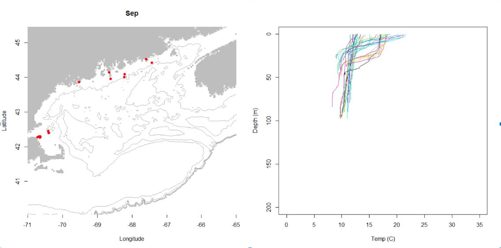
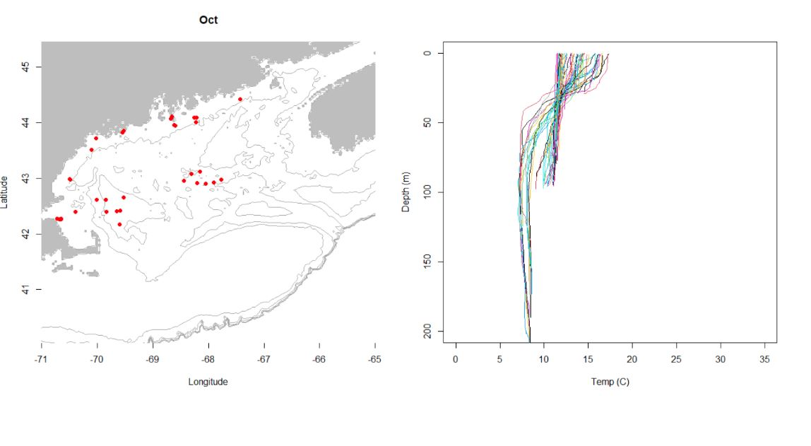
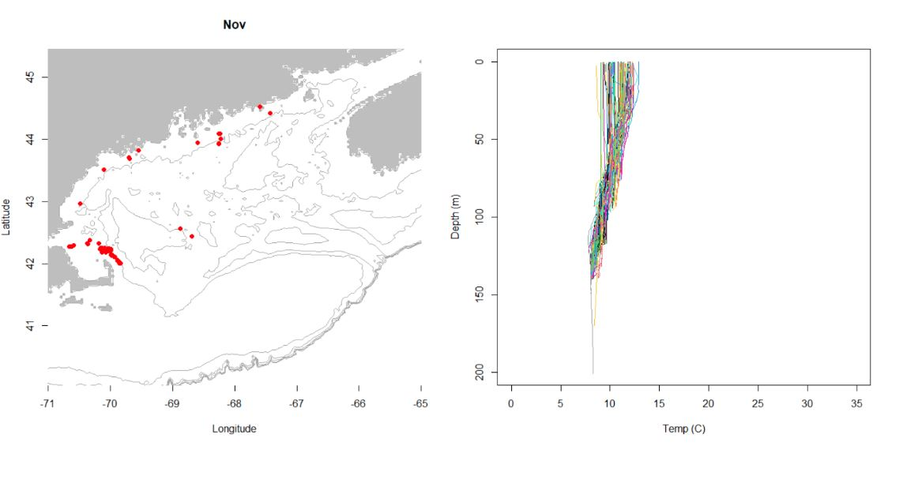
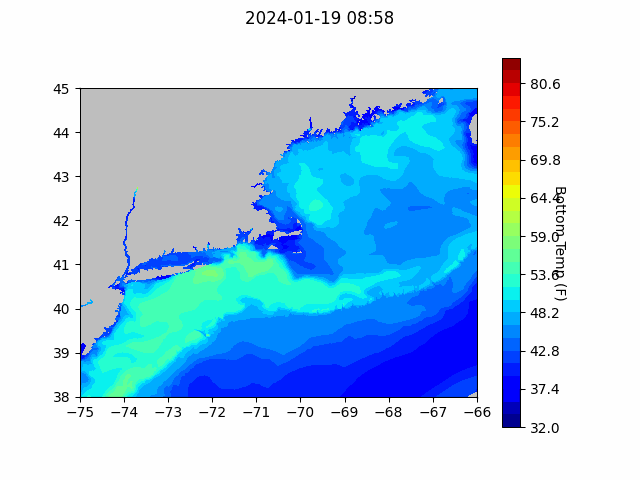
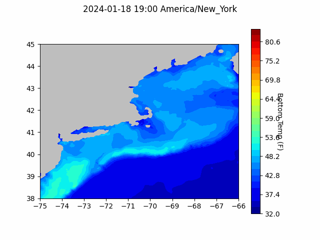

```{r setup, include=FALSE}
knitr::opts_chunk$set(echo = TRUE)
library(blastula)
```

<center> 

<font size="5"> *eMOLT Update `r Sys.Date()` * </font>

</center>

This week, George attended a meeting at the University of New Hampshire that brought together scientists from around the region to discuss the massive plankton bloom that took place in the Gulf of Maine last summer. Two parameters that the group is hoping to better track in the future are water column stratification and dissolved oxygen levels. We are currently building systems for tracking those parameters for deployment in the Gulf of Maine next year. These new systems will augment the growing fleet of eMOLT participants already up that way.

As you can see in the plots below from eMOLT systems currently deployed in the Gulf of Maine, the inshore Gulf was still stratified in September and through part of October, but had completely mixed by the time November rolled around.





Some of the scientists in the room were surprised and excited to hear that we were able to collect profile data from commercial fishing vessels. While the instruments we deploy may not be as precise as the instruments deployed from oceanographic research ships, the data from the eMOLT program are often available to scientists much more quickly (within a few hours) than what's collected through more traditional methods (which can take months).

## Forecasts


### NECOFS Bottom Temperature Forecast

{width=800px}


### Doppio Bottom Temperature Forecast

{width=800px}

## Cooperative Research Opportunities
- Commercial Fisheries Research Foundation is seeking captains interested in *Exploring the Feasibility and Market Potential of a Common Spider Crab Fishery in Southern New England*. To get involved with the project check out their [website](https://www.cfrfoundation.org/spider-crabs?fbclid=IwAR3QoTjBauKFaGM03DO9sWaQbKzKIDcIgoiBPYEvWOvFUhxhQ3cIJhyU79c). 


## New Publications

The International Council for the Exploration of the Seas (ICES) recently published a [report from a workshop on incorporating fishers and other stakeholders' perceptions of fish stocks into ICES management advice](https://ices-library.figshare.com/articles/report/Workshop_on_accounting_for_fishers_and_other_stakeholders_perceptions_of_the_dynamics_of_fish_stocks_in_ICES_advice_WKAFPA_/24866088). This workshop brought together perspectives from a wide variety of countries, fisheries, and stakeholders. During the workshop, participants identified common challenges and recommended solutions for maximizing the use of the fishing industry's knowledge and data in stock assessments and fishery management. Dr. Anna Mercer and Dr. Andy Jones from the NEFSC Narragansett Lab and Dr. Steve Cadrin from SMAST represented the USA at the workshop. Some recommendations from the workshop:

- Include pre-benchmark/roadmap workshops where science and data needs for upcoming benchmark assessments can be identified and make arrangements for scientists and stakeholders to collaborate on preparing all relevant information for use. 
- Organize "sense-checking" sessions with stakeholders when preliminary assessments are available to allow stakeholders and assessment scientists to verify knowledge and data against stock perceptions to help in producing TAC advice.
- Communicate differences between stakeholder perception and data derived perception within ICES assessment reports and advice so that working groups can evaluate those differences to see whether they require further investigation. 

## Announcements

- Full proposals for the [Bycatch Reduction Engineering Program](https://www.grants.gov/web/grants/search-grants.html?keywords=brep) are due 3/20/24


All the best,

George and JiM
