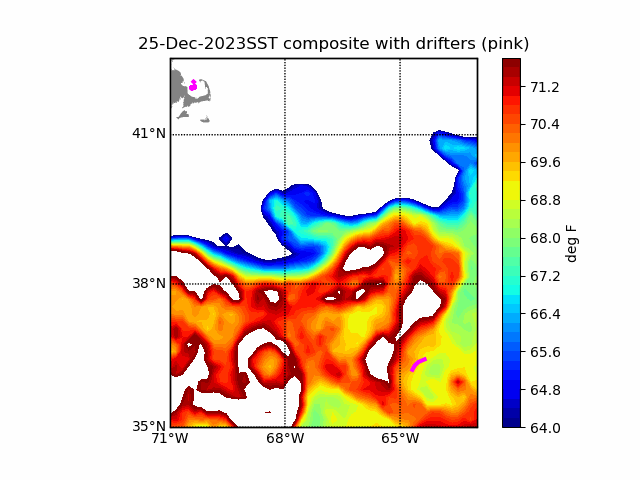
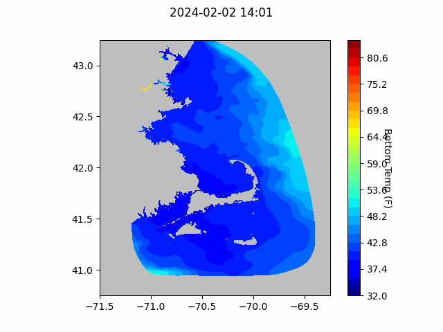
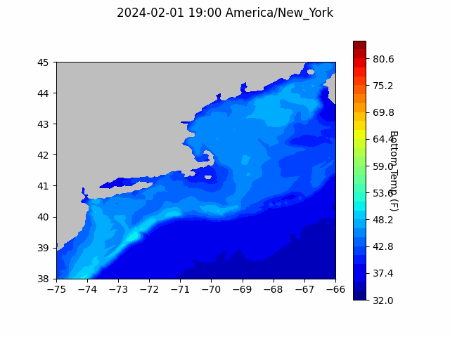

```{r setup, include=FALSE}
knitr::opts_chunk$set(echo = TRUE)
library(blastula)
# library(marmap)
# library(rstudioapi)
# source("../../../emolt_serverside/API/API_header.R")
# today=Sys.Date()
# lastWeek=today-days(7)
# conn=dbConnector(db_config)
```

<center> 

<font size="5"> *eMOLT Update `r Sys.Date()` * </font>

</center>
### Weekly Update

This week, we've been busy prepping for the 2024 Northeast Cooperative Research Summit down in Cape May next week. It should be a great meeting with lots of discussions of interest to everyone engaged in eMOLT.

- Dr. John Wilkin who leads the Doppio modeling effort at Rutgers will be presenting about how observations from commercial fishing vessels are incorporated into his work

- Samantha Alaimo, a PhD Student at Rutgers will present on how cold pool stratification in the Mid-Atlantic Bight influences commercially harvested species

- Captains Rob Jarmol (F/V Christy) and Bill Bright (F/V Retriever) will join Dr. Glen Gawarkiewicz (WHOI), Dr. Grace Saba (Rutgers), and Dr. John Manderson (OpenOcean Research) on a panel discussing the impacts of our changing climate on ecosystems and fisheries in our region.

plus, lots of other presentations and panels focused on everything from impacts of offshore wind development on fisheries to maintaining fish health in live fish markets. George, Erin, and Huanxin are looking forward to seeing many of you there. 

For those of you who haven't attended a Cooperative Research Summit before, last year's dual meetings in Providence, RI and Newport News, VA are summarized in a new report available [here](https://github.com/GMaynard1/emolt_project_management/blob/main/WeeklyUpdates/2024-01-26/NortheastCooperativeResearchSummits_Report_2023.pdf). Also, stay tuned for more information about 2025's Summit which will be held at a location TBD in Maine. 

### Drifter Update
The Students at Wellan Montesorri School (Newton Mass) are probably wondering why their [wooden loggerhead turtle]('https://studentdrifters.org/tracks/drift_wms_2023_1_on_deck.jpg')
deployed by Jeff White, a lobsterman out of York, Maine back in October, is now going around in circles south north of Bermuda. It turns out that, on about Christmas Day, it got caught in a "cold core ring" (~37 degrees north) and is still rotating this week as seen in the animation of sea surface temperatures below. You can also see at least four other drifters in this animation including one from the Southern Maine Community College that is entrained in the actual Gulf Stream and enters the frame on about 23 January 2024.



### Bottom Temperature Forecasts

#### Northeast Coastal Ocean Forecast System (NECOFS)

{width=800px}

{width=500px}

### Doppio Bottom Temperature Forecast

{width=800px} 

### Announcements and Other News
On-demand lobster and Jonah crab gear testing is underway off Massachusetts and Rhode Island. Science Center scientists are working with commercial lobster vessels to test on-demand (ropeless) fishing gear in state and federal waters normally closed to lobster and Jonah crab fishing with static vertical lines. Testing in this area will occur through April 30, 2024. 


Because on-demand gear has no surface buoys, it won’t be visible at the surface. To visualize the gear positions and orientations, mariners can download and subscribe to the EdgeTech Trap Tracker app ($25) on the [Apple](https://apps.apple.com/us/app/trap-tracker/id1450280978) or [Google Play](https://play.google.com/store/apps/details?id=com.edgetech.TrapTracker&hl=en&gl=US) app stores. For more information on this work, click [here](https://www.fisheries.noaa.gov/new-england-mid-atlantic/marine-mammal-protection/2024-northeast-experimental-demand-gear-system).
Mariners: There is a potential gear conflict area immediately west of the Great South Channel in former Groundfish Closed Area 1. On-demand gear in that area is set northwest to southeast in trawls approximately 1.5 nautical miles in length. If anyone accidentally tows up the on-demand gear, don’t discard it. Hold onto the gear and contact our Gear Research Team. Contact info can be found [here](https://www.fisheries.noaa.gov/new-england-mid-atlantic/marine-mammal-protection/2024-northeast-experimental-demand-gear-system#contacts).

- Full proposals for the [Bycatch Reduction Engineering Program](https://www.grants.gov/web/grants/search-grants.html?keywords=brep) are due 3/20/24

All the best,

-George and JiM
