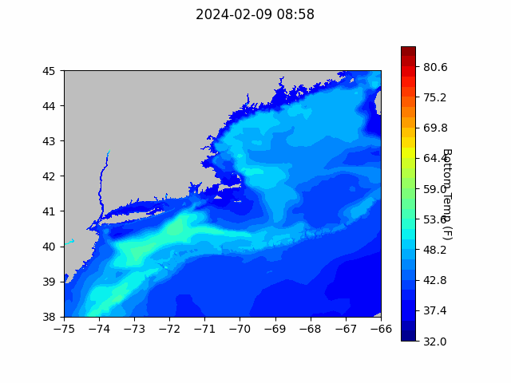
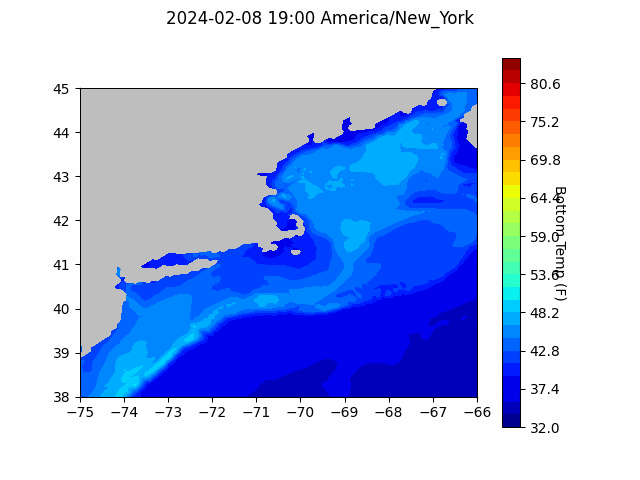

```{r setup, include=FALSE}
knitr::opts_chunk$set(echo = TRUE)
library(blastula)
# library(marmap)
# library(rstudioapi)
# source("../../../emolt_serverside/API/API_header.R")
# today=Sys.Date()
# lastWeek=today-days(7)
# conn=dbConnector(db_config)
```

<center> 

<font size="5"> *eMOLT Update `r Sys.Date()` * </font>

</center>
### Weekly Update

Thanks to everyone who showed up at the Cooperative Research Summit down in Cape May. It was great to see some familiar faces and meet some new people too. Special thanks to Captain Rob Jarmol for his contribution to the afternoon discussion panel about how environmental information helps improve fishing and Dr. John Wilkin for his presentation about incorporating eMOLT data into the Doppio forecast model.

For those of you down in New Jersey who don't have temperature systems yet, thanks for your interest in helping with the project. We'll be working to secure some funding for new hardware down that way. It could be a little while before any is available, but we will keep you in the loop. 

One comment that came up a few times from the industry members in the room was that we need to do a better job of making data products available to our industry collaborators. Some of your suggestions included

- Making the forecast gifs available more frequently
- Making shapefiles of model outputs available for chartplotters
- Zooming in to specific areas of interest in the models
- Displaying the full water column, not just surface or bottom temps

Because the model outputs are pretty complicated, a lot of this will take us time to work up, but I'm happy to say that we are already making some headway. Earlier this week, the team at Lowell Instruments started making some software tweaks to integrate the regional forecast gif into our deckbox software. Once that's ready, we'll have a new tab on the deckbox to view the most up to date forecast each time your box powers up in cell range. 

We also put together a first attempt at zooming in on an area of interest suggested by Captain Brady on the F/V Salted. Below is a graphic of bottom temperatures between Baltimore Canyon and Spencer Canyon. If you have an area you'd like to see closer up, please feel free to reach out. 

#### Baltimore to Spencer Canyon Bottom Temperature Forecast

{width=800px}

### Bottom Temperature Forecasts

#### Northeast Coastal Ocean Forecast System (NECOFS)

{width=800px}

### Doppio Bottom Temperature Forecast

{width=800px} 

### Announcements and Other News
- The Commercial Fisheries Research Foundation is hosting several workshops in March to help understand how changing ocean conditions might impact the scallop fishery and the communities it supports. Workshops will take place on March 19, 21, and 22, and will focus on how the industry can help monitor these impacts and adapt to them. For more information, please visit the [CFRF website](https://www.cfrfoundation.org/atlantic-sea-scallop-socialecological-system) or contact [Victoria Thomas](vthomas@cfrfoundation.org).


- On-demand lobster and Jonah crab gear testing is underway off Massachusetts and Rhode Island. Science Center scientists are working with commercial lobster vessels to test on-demand (ropeless) fishing gear in state and federal waters normally closed to lobster and Jonah crab fishing with static vertical lines. Testing in this area will occur through April 30, 2024. 


Because on-demand gear has no surface buoys, it won’t be visible at the surface. To visualize the gear positions and orientations, mariners can download and subscribe to the EdgeTech Trap Tracker app ($25) on the [Apple](https://apps.apple.com/us/app/trap-tracker/id1450280978) or [Google Play](https://play.google.com/store/apps/details?id=com.edgetech.TrapTracker&hl=en&gl=US) app stores. For more information on this work, click [here](https://www.fisheries.noaa.gov/new-england-mid-atlantic/marine-mammal-protection/2024-northeast-experimental-demand-gear-system).
Mariners: There is a potential gear conflict area immediately west of the Great South Channel in former Groundfish Closed Area 1. On-demand gear in that area is set northwest to southeast in trawls approximately 1.5 nautical miles in length. If anyone accidentally tows up the on-demand gear, don’t discard it. Hold onto the gear and contact our Gear Research Team. Contact info can be found [here](https://www.fisheries.noaa.gov/new-england-mid-atlantic/marine-mammal-protection/2024-northeast-experimental-demand-gear-system#contacts).

- Full proposals for the [Bycatch Reduction Engineering Program](https://www.grants.gov/web/grants/search-grants.html?keywords=brep) are due 3/20/24

All the best,

-George and JiM
