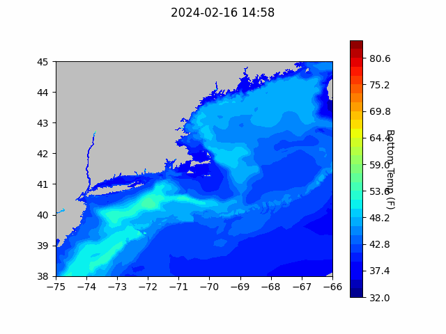
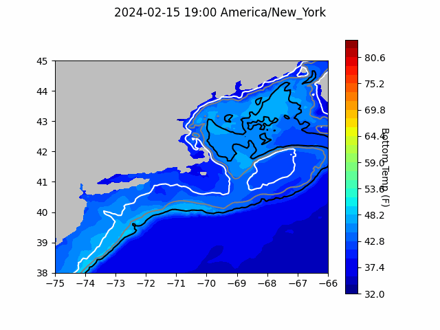

```{r setup, include=FALSE}
knitr::opts_chunk$set(echo = TRUE)
library(blastula)
# library(marmap)
# library(rstudioapi)
# source("../../../emolt_serverside/API/API_header.R")
# today=Sys.Date()
# lastWeek=today-days(7)
# conn=dbConnector(db_config)
```

<center> 

<font size="5"> *eMOLT Update `r Sys.Date()` * </font>

</center>
### Weekly Update

This week we got some good news on the international front. As some of you already know, the eMOLT program is a member of the Fishing Vessel Ocean Observing Network (FVON). Like eMOLT, the other members of FVON work to democratize ocean observing by empowering you, the fishing industry, to collect data in a way that is useful to your businesses and the broader scientific enterprise, including ocean forecasting and stock assessments. Already, our international collaborations have yielded improvements in sensor design (the Moana sensors that many of you have were developed by our colleagues at the Moana Project in New Zealand) and data pathways (the Moana Project team along with Ocean Data Network are leading a charge to get fishing vessel data incorporated into global weather and ocean forecasting data). The programs and people that make up FVON applied for and were recently awarded recognition under the UN's Ocean Decade under the CoastPredict program of the Global Ocean Observing System (GOOS). This will hopefully open doors to additional funding opportunities and new collaborations. To learn more about some of our international partners and their efforts, check out the links below:

- [The Moana Project (New Zealand)](https://www.moanaproject.org/)
- [The Adriatic Fisheries Ocean Observing System (Italy)](https://essd.copernicus.org/articles/15/3513/2023/)
- [Ocean Data Network (based in Portland, ME supporting fishermen and scientists from Alaska to Ghana and many places in between)](https://oceandata.net/)
- [Smart Fisheries Network (Japan)](https://www.sciencedirect.com/science/article/abs/pii/S0079661113001948)
- [OBSERVA.FISH (Portugal)](https://www.researchgate.net/publication/341541755_Autonomous_Observing_Systems_in_Fishing_Vessels)

In keeping with our effort to provide better visualizations to our industry partners, here's an updated version of the zoomed in forecast with 30, 50, and 100 fathom lines marked with white, gray, and black lines respectively. On the regional forecast, we've made one plot with all of the lines and one plot with just the 50 and 100 fathom lines so it's not so busy. Let us know what you think. Is it helpful to have those lines, or is it useless clutter at the bigger scale?

We're still working on vertical slices to look at the full water column and building these out as shapefiles for integration into chart plotters. Thanks again to Dr. John Wilkin for providing some resources on this front, and thanks to the captains who wrote in with additional suggestions. Building these tools is an interesting exercise for me, but ultimately, as I said in our discussion group at the Cooperative Research Forum, the goal is to make something that's useful for all of you who are actually collecting the data. 

#### Baltimore to Spencer Canyon Bottom Temperature Forecast

{width=800px}

### Bottom Temperature Forecasts

#### Northeast Coastal Ocean Forecast System (NECOFS)

{width=800px}
{width=800px}
#### Doppio Bottom Temperature Forecast

{width=800px} 

{width=800px}

### Announcements and Other News
- The Commercial Fisheries Research Foundation is hosting several workshops in March to help understand how changing ocean conditions might impact the scallop fishery and the communities it supports. Workshops will take place on March 19, 21, and 22, and will focus on how the industry can help monitor these impacts and adapt to them. For more information, please visit the [CFRF website](https://www.cfrfoundation.org/atlantic-sea-scallop-socialecological-system) or contact [Victoria Thomas](vthomas@cfrfoundation.org).


- On-demand lobster and Jonah crab gear testing is underway off Massachusetts and Rhode Island. Science Center scientists are working with commercial lobster vessels to test on-demand (ropeless) fishing gear in state and federal waters normally closed to lobster and Jonah crab fishing with static vertical lines. Testing in this area will occur through April 30, 2024. 


Because on-demand gear has no surface buoys, it won’t be visible at the surface. To visualize the gear positions and orientations, mariners can download and subscribe to the EdgeTech Trap Tracker app ($25) on the [Apple](https://apps.apple.com/us/app/trap-tracker/id1450280978) or [Google Play](https://play.google.com/store/apps/details?id=com.edgetech.TrapTracker&hl=en&gl=US) app stores. For more information on this work, click [here](https://www.fisheries.noaa.gov/new-england-mid-atlantic/marine-mammal-protection/2024-northeast-experimental-demand-gear-system).
Mariners: There is a potential gear conflict area immediately west of the Great South Channel in former Groundfish Closed Area 1. On-demand gear in that area is set northwest to southeast in trawls approximately 1.5 nautical miles in length. If anyone accidentally tows up the on-demand gear, don’t discard it. Hold onto the gear and contact our Gear Research Team. Contact info can be found [here](https://www.fisheries.noaa.gov/new-england-mid-atlantic/marine-mammal-protection/2024-northeast-experimental-demand-gear-system#contacts).

- Full proposals for the [Bycatch Reduction Engineering Program](https://www.grants.gov/web/grants/search-grants.html?keywords=brep) are due 3/20/24

All the best,

-George and JiM
