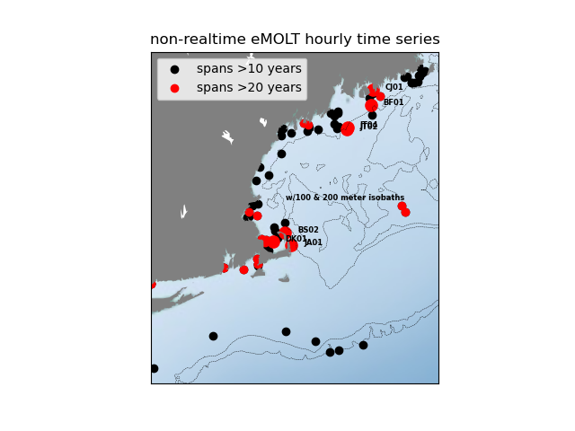
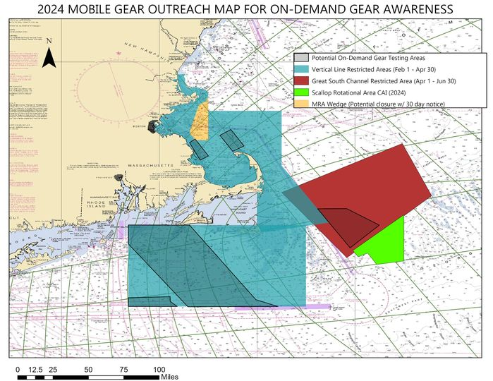

```{r setup, include=FALSE}
knitr::opts_chunk$set(echo = TRUE)
library(blastula)
library(marmap)
library(rstudioapi)
```

<center> 

<font size="5"> *eMOLT Update `r Sys.Date()` * </font>


</center>

### Weekly Recap 

George and Huanxin were both out of the office for a large part of this week because of school vacations, so things were pretty quiet. However, the next few weeks will be pretty busy...

While there is no eMOLT seminar scheduled at the Maine Fishermen's Forum, we encourage you to stop by the Gulf of Maine Lobster Foundation (outside the large meeting rooms) and the Northeastern Regional Association of Coastal Ocean Observing Systems (near main lobby) booths.  If you do not find anyone there and/or would like to make an appointment, please call/text Erin Pelletier (GOMLF) at 207-205-8088 or Tom (NERACOOS) at 207-650-9766  to schedule a chat. George and JiM will not be at the forum but if you'd like to set up a time to learn about options to visualize your data, feel free to reach out to George ahead of the Forum at 508-299-9693. 

Also before the Forum, Erin Pelletier (Gulf of Maine Lobster Foundation) and Andrew Goode (The Lobster Institute) will be attending the Island Institute's Climate Round Table discussion in Rockland, ME next Wednesday February 28 from 1030-1630 to present our plans to expand eMOLT in the Gulf of Maine and get feedback from the fishing industry. This event is an annual opportunity for fishermen and scientists to come together and share notes about the past fishing year, as well as the longer-term environmental changes they are noticing on the water. If you are interested in attending and would like more information, please contact Andrew at andrew.goode@maine.edu

We met virtually with NERACOOS personnel recently to discuss the non-realtime eMOLT updates on their climatology website.
We decided to display results for at least a half dozen of the 20+ year time series which have recent years included.
As seen in the graphics below, there are many hourly time series available including more than a dozen that span more than two decades!



### Bottom Temperature Forecasts


#### Northeast Coastal Ocean Forecast System (NECOFS)

{width=800px} 

#### Doppio Bottom Temperature Forecast

{width=800px} 

{width=800px}

### Announcements and Other News

- For Massachusetts fishermen: South Fork Wind (owned by Ørsted) announced that their eligibility application for direct compensation has opened for commercial and recreational fishing vessels that have experienced economic impacts from construction and/or interruptions during operation from offshore wind vessels operating in the South Fork Wind Project Area. PKF O’Connor Davis (PKFOD), the third-party administrator for South Fork Wind, will be reviewing and processing eligibility and direct compensation claims. For more info, [click here](https://www.fisheriescompensationprogram.com/massachusetts-fisheries-direct-compensation-program)

- The Commercial Fisheries Research Foundation is hosting several workshops in March to help understand how changing ocean conditions might impact the scallop fishery and the communities it supports. Workshops will take place on March 19, 21, and 22, and will focus on how the industry can help monitor these impacts and adapt to them. For more information, please visit the [CFRF website](https://www.cfrfoundation.org/atlantic-sea-scallop-socialecological-system) or contact [Victoria Thomas](vthomas@cfrfoundation.org).


- On-demand lobster and Jonah crab gear testing is underway off Massachusetts and Rhode Island. Science Center scientists are working with commercial lobster vessels to test on-demand (ropeless) fishing gear in state and federal waters normally closed to lobster and Jonah crab fishing with static vertical lines. Testing in this area will occur through April 30, 2024. 



Because on-demand gear has no surface buoys, it won’t be visible at the surface. To visualize the gear positions and orientations, mariners can download and subscribe to the EdgeTech Trap Tracker app ($25) on the [Apple](https://apps.apple.com/us/app/trap-tracker/id1450280978) or [Google Play](https://play.google.com/store/apps/details?id=com.edgetech.TrapTracker&hl=en&gl=US) app stores. For more information on this work, click [here](https://www.fisheries.noaa.gov/new-england-mid-atlantic/marine-mammal-protection/2024-northeast-experimental-demand-gear-system).
Mariners: There is a potential gear conflict area immediately west of the Great South Channel in former Groundfish Closed Area 1. On-demand gear in that area is set northwest to southeast in trawls approximately 1.5 nautical miles in length. If anyone accidentally tows up the on-demand gear, don’t discard it. Hold onto the gear and contact our Gear Research Team. Contact info can be found [here](https://www.fisheries.noaa.gov/new-england-mid-atlantic/marine-mammal-protection/2024-northeast-experimental-demand-gear-system#contacts).

- Full proposals for the [Bycatch Reduction Engineering Program](https://www.grants.gov/web/grants/search-grants.html?keywords=brep) are due 3/20/24

- The Bottom Longline Survey marks 10 years of a cooperative, industry-based survey in the Gulf of Maine. Check out some [reflections on that decade](https://www.fisheries.noaa.gov/science-blog/fall-bottom-longline-survey-survey-chronicles) from Giovanni Gianesin, chief scientist aboard the F/V Tenacious II

All the best,

-George and JiM
