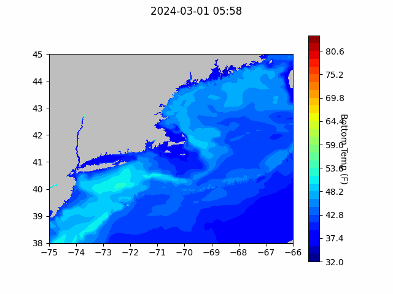
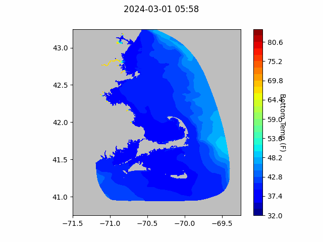

```{r setup, include=FALSE}
knitr::opts_chunk$set(echo = TRUE)
library(blastula)
library(marmap)
library(rstudioapi)
```

<center> 

<font size="5"> *eMOLT Update `r Sys.Date()` * </font>


</center>

### Weekly Recap 

Just a reminder, if you have a temperature depth system on board your vessel and it's not working, please reach out to George so we can get it fixed for you. Call or text 508-299-9693 or email george.maynard@noaa.gov. 

Thanks to Capt. Troy on the F/V Debbie Sue, Capt. Mike on the F/V Mister G, and Capt. Sam on the Alison Ann for flagging issues with their systems this week. We'll be in touch to figure things out. 

This week has been a busy one for the eMOLT crew. George worked with the  team from Lowell Instruments on some hardware testing earlier this week in preparation for yesterday's visit to Point Judith with some of the NEFSC  Study Fleet team. We installed new temperature / depth sensors and deckboxes on two Study Fleet partner vessels, the F/V Cody and the F/V Nicholas C. Although the install aboard the F/V Cody went to plan, we were plagued by bluetooth issues aboard the F/V Nicholas C, just a reminder that every vessel is different. The Nicholas C headed out last night, but we'll make an effort to get back down to the Point with engineers from Lowell Instruments in the near future to wrap that one up. 
Erin Pelletier and Andrew Goode participated in the Fishermen's Climate Roundtable hosted by the Island Institute on Wednesday. Huanxin headed up to Maine to work with Erin on installing a new eMOLT system aboard the F/V Bella Elena and then both of them headed over to the Fishermen's Forum. 

For those of you attending the Maine Fishermen's Forum, we encourage you to stop by the Gulf of Maine Lobster Foundation (outside the large meeting rooms) and the Northeastern Regional Association of Coastal Ocean Observing Systems (near main lobby) booths.  If you do not find anyone there and/or would like to make an appointment, please call/text Erin Pelletier (GOMLF) at 207-205-8088 or Tom (NERACOOS) at 207-650-9766  to schedule a chat. George and JiM are not at the forum this year

### Bottom Temperature Forecasts


#### Northeast Coastal Ocean Forecast System (NECOFS)

{width=800px} 

{width=500px}

#### Doppio Bottom Temperature Forecast

{width=800px} 

{width=800px}

### Announcements and Other News

- For Massachusetts fishermen: South Fork Wind (owned by Ørsted) announced that their eligibility application for direct compensation has opened for commercial and recreational fishing vessels that have experienced economic impacts from construction and/or interruptions during operation from offshore wind vessels operating in the South Fork Wind Project Area. PKF O’Connor Davis (PKFOD), the third-party administrator for South Fork Wind, will be reviewing and processing eligibility and direct compensation claims. For more info, [click here](https://www.fisheriescompensationprogram.com/massachusetts-fisheries-direct-compensation-program)

- The Commercial Fisheries Research Foundation is hosting several workshops in March to help understand how changing ocean conditions might impact the scallop fishery and the communities it supports. Workshops will take place on March 19, 21, and 22, and will focus on how the industry can help monitor these impacts and adapt to them. For more information, please visit the [CFRF website](https://www.cfrfoundation.org/atlantic-sea-scallop-socialecological-system) or contact [Victoria Thomas](vthomas@cfrfoundation.org).


- On-demand lobster and Jonah crab gear testing is underway off Massachusetts and Rhode Island. Science Center scientists are working with commercial lobster vessels to test on-demand (ropeless) fishing gear in state and federal waters normally closed to lobster and Jonah crab fishing with static vertical lines. Testing in this area will occur through April 30, 2024. 


Because on-demand gear has no surface buoys, it won’t be visible at the surface. To visualize the gear positions and orientations, mariners can download and subscribe to the EdgeTech Trap Tracker app ($25) on the [Apple](https://apps.apple.com/us/app/trap-tracker/id1450280978) or [Google Play](https://play.google.com/store/apps/details?id=com.edgetech.TrapTracker&hl=en&gl=US) app stores. For more information on this work, click [here](https://www.fisheries.noaa.gov/new-england-mid-atlantic/marine-mammal-protection/2024-northeast-experimental-demand-gear-system).
Mariners: There is a potential gear conflict area immediately west of the Great South Channel in former Groundfish Closed Area 1. On-demand gear in that area is set northwest to southeast in trawls approximately 1.5 nautical miles in length. If anyone accidentally tows up the on-demand gear, don’t discard it. Hold onto the gear and contact our Gear Research Team. Contact info can be found [here](https://www.fisheries.noaa.gov/new-england-mid-atlantic/marine-mammal-protection/2024-northeast-experimental-demand-gear-system#contacts).

- Full proposals for the [Bycatch Reduction Engineering Program](https://www.grants.gov/web/grants/search-grants.html?keywords=brep) are due 3/20/24

All the best,

-George and JiM
