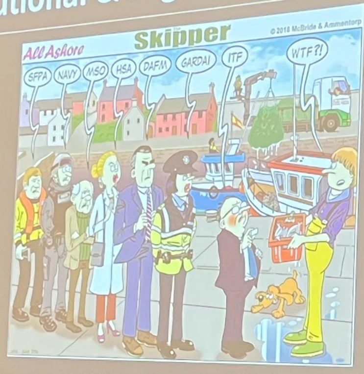
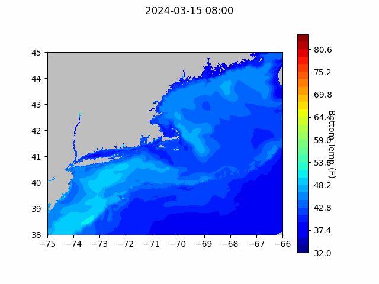
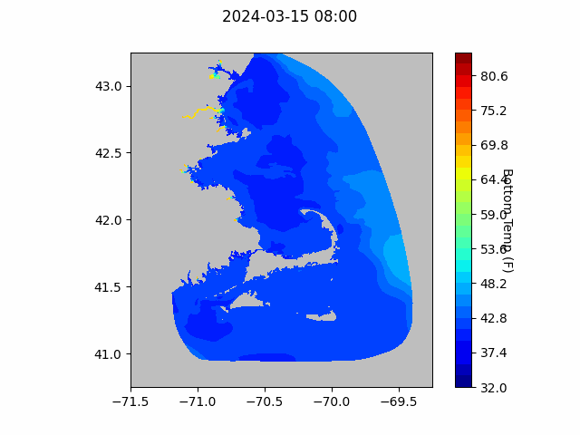

```{r setup, include=FALSE}
knitr::opts_chunk$set(echo = TRUE)
library(blastula)
library(marmap)
library(rstudioapi)
```

<center> 

<font size="5"> *eMOLT Update `r Sys.Date()` * </font>


</center>

### Weekly Recap 

This week, we had a great initial meeting with a team from Rutgers University led by [Kacey Coleman](https://rucool.marine.rutgers.edu/people/kaycee-coleman/) and [Dr. Thomas Grothues](https://rucool.marine.rutgers.edu/people/thomas-grothues/) and Capt. Kevin from the F/V Dana Christine II about bringing more eMOLT systems to the Mid-Atlantic. If all goes well, we hope to develop a similar partnership to what we've built with the Lobster Institute at UMaine that has allowed an expansion of eMOLT in small ports Downeast. Thanks to all the New Jersey captains I've spoken with recently for your patience. We're working on finding a long-term sustainable way to bring you all online. 

Last Friday, Nick Lowell joined part of the Study Fleet Field Team in Point Judith to take another stab at installing a temperature / depth monitoring system on the F/V Nicholas C. The system on this vessel will be the first field trials of a new logger produced by Nick and his team at Lowell Instruments. Similar to the blue Moana loggers from New Zealand that many of you already have, the Lowell TDO logger is able to collect water temperature profiles. These new loggers also include an orientation sensor, which could help better understand how gear behaves underwater. If the testing goes well, this could provide the eMOLT program another tool to monitor oceanographic conditions and gear performance. 

George and Cooper were out in Seattle last week at the World Fisheries Congress. For those who are unaware, the WFC is a meeting held every few years to bring together fisheries scientists, managers, and stakeholders from around the world to share research and best practices. Some of the highlights:

- Jordi Ribera from The Catalan Institute of Research for the Governance of the Sea (ICATMAR) in Spain walked us through the [online dashboard](https://icatmar.cat/en/catch-composition/) they've developed for making fishermen-collected data more accessible and usable by their industry partners. ICATMAR has a program similar to Study Fleet that collects data on fishing effort and conducts biological sampling, but they also charter industry vessels for their trawl survey (individually selectable trawl paths in the dashboard are from chartered survey trips). 

- The role that programs like eMOLT could play in fisheries science was emphasized again and again, with many speakers lamenting the need to rely on models for environmental variables instead of having real-world data available. Another theme that was repeated again and again was the need to develop lasting relationships and build trust if we're going to manage fisheries well. Dr. Michael Ntiba from the Kenyan Ministry of Fisheries said that "short term projects can do more harm than good. They collapse at the end and the next project must begin at step one, all over again." This constant rebooting can be exhausting, especially for stakeholders. So, thank you all for your willingness to participate in this program. The core eMOLT team is in it for the long haul, and we hope you are too.

- There was also a call for those of us in the science and regulatory worlds to do better at streamlining systems for those of you out working on the water. This cartoon was from a presentation about cooperative research from Ireland. 
{width=500px}
The acronyms on the left hand side are an alphabet soup of Irish regulatory agencies including

> 
- Sea Fisheries Protection Authority 
- Marine Survey Office
- Health and Safety Authority
- Dept. of Agriculture, Food, and Marine Resources
- International Transport Workers Federation

I'm sure the fisherman's acronym on the right hand side needs no explanation. 

For those of you who've ever attended cooperative research summits or other meetings involving the fishing industry, it's perhaps no surprise that those can get testy at times, especially around topics like offshore wind. What may surprise our industry partners is that these science conferences aren't all kumbayah and handholding either. The session on bottom trawling got pretty spicy with scientists debating how much of an impact the gear has on benthic ecosystems and carbon sequestration.

#### Data portal access

For fishermen currently participating in the eMOLT system, you already see the plots of data from your vessel in the wheelhouse, but did you know you can look back at historic data from your vessel through a secure, online dashboard developed by our colleagues at Ocean Data Networks?

[Check out a demo](https://www.portal.fishydata.com/lucky_catch/) using data from traps deployed by the [F/V Lucky Catch and F/V St. Croix](https://www.luckycatch.com/), two lobstering tour boats operating in Casco Bay. If you'd like to see data from your vessel, [click here](https://www.portal.fishydata.com/register/) to sign up for a password-protected account. 

### Bottom Temperature Forecasts

We've had requests for a few additional features, but haven't had time to implement them yet. We're also working on a way to deliver these forecasts directly to your deckboxes, so stay tuned...

#### Northeast Coastal Ocean Forecast System (NECOFS)

{width=800px} 

{width=500px}

#### Doppio Bottom Temperature Forecast

{width=800px} 

### New Research

- Our FVON colleagues at AdriFOOS in Italy recently published a paper about the impacts environmental observations from fishing vessels can have on forecast models. In their case, they saw 44% reduction in root mean square temperature errors in the upper water column and 36% reduction in the lower layers. The full paper is available [here](https://www.sciencedirect.com/science/article/abs/pii/S0924796316300045?via%3Dihub) These are major improvements in forecast models and are only possible thanks to collaboration with the fishing industry

### Announcements and Other News

- For Massachusetts fishermen: South Fork Wind (owned by Ørsted) announced that their eligibility application for direct compensation has opened for commercial and recreational fishing vessels that have experienced economic impacts from construction and/or interruptions during operation from offshore wind vessels operating in the South Fork Wind Project Area. PKF O’Connor Davis (PKFOD), the third-party administrator for South Fork Wind, will be reviewing and processing eligibility and direct compensation claims. For more info, [click here](https://www.fisheriescompensationprogram.com/massachusetts-fisheries-direct-compensation-program)

- The Commercial Fisheries Research Foundation is hosting several workshops in March to help understand how changing ocean conditions might impact the scallop fishery and the communities it supports. Workshops will take place on March 19, 21, and 22, and will focus on how the industry can help monitor these impacts and adapt to them. For more information, please visit the [CFRF website](https://www.cfrfoundation.org/atlantic-sea-scallop-socialecological-system) or contact [Victoria Thomas](vthomas@cfrfoundation.org).


- On-demand lobster and Jonah crab gear testing is underway off Massachusetts and Rhode Island. Science Center scientists are working with commercial lobster vessels to test on-demand (ropeless) fishing gear in state and federal waters normally closed to lobster and Jonah crab fishing with static vertical lines. Testing in this area will occur through April 30, 2024. 


Because on-demand gear has no surface buoys, it won’t be visible at the surface. To visualize the gear positions and orientations, mariners can download and subscribe to the EdgeTech Trap Tracker app ($25) on the [Apple](https://apps.apple.com/us/app/trap-tracker/id1450280978) or [Google Play](https://play.google.com/store/apps/details?id=com.edgetech.TrapTracker&hl=en&gl=US) app stores. For more information on this work, click [here](https://www.fisheries.noaa.gov/new-england-mid-atlantic/marine-mammal-protection/2024-northeast-experimental-demand-gear-system).
Mariners: There is a potential gear conflict area immediately west of the Great South Channel in former Groundfish Closed Area 1. On-demand gear in that area is set northwest to southeast in trawls approximately 1.5 nautical miles in length. If anyone accidentally tows up the on-demand gear, don’t discard it. Hold onto the gear and contact our Gear Research Team. Contact info can be found [here](https://www.fisheries.noaa.gov/new-england-mid-atlantic/marine-mammal-protection/2024-northeast-experimental-demand-gear-system#contacts).

- Full proposals for the [Bycatch Reduction Engineering Program](https://www.grants.gov/web/grants/search-grants.html?keywords=brep) are due 3/20/24

All the best,

-George and JiM
