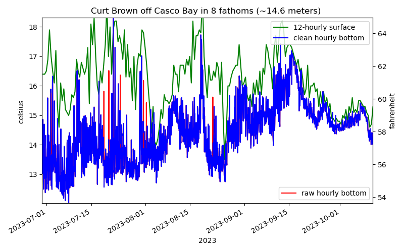
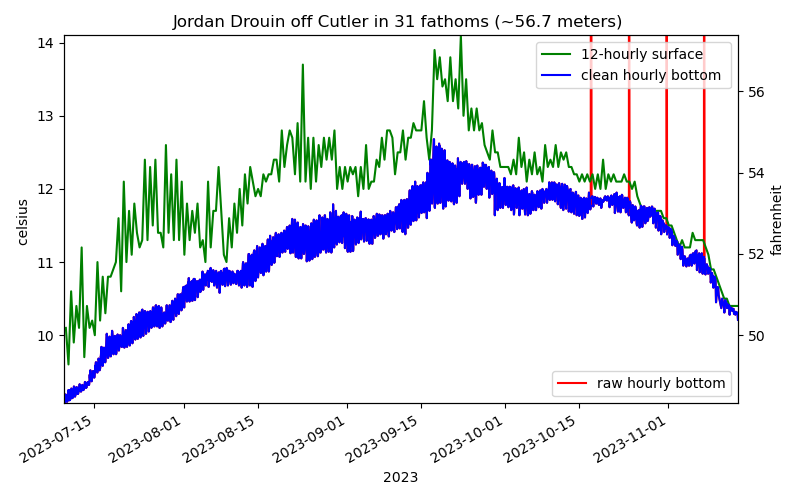
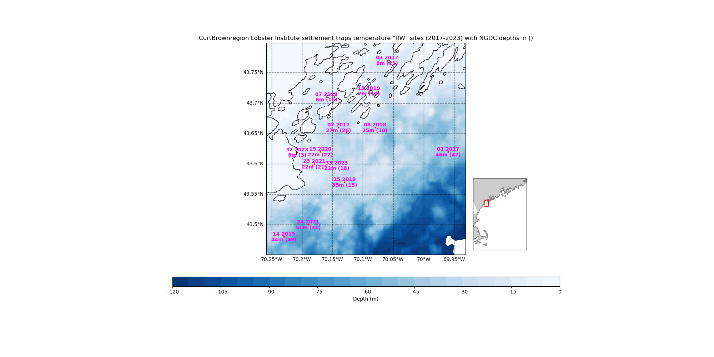
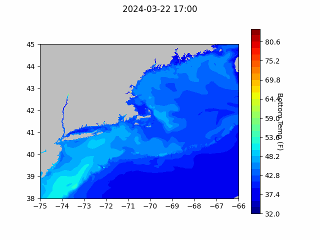
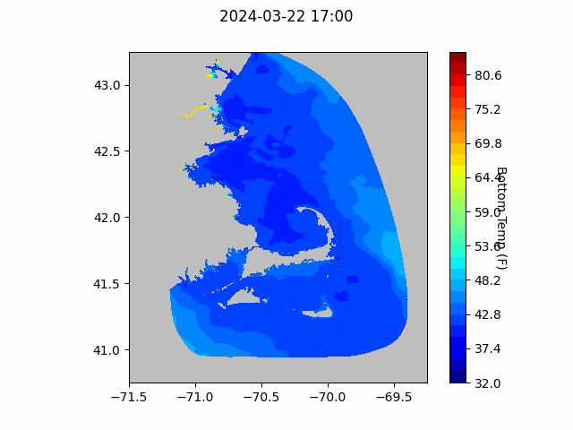

```{r setup, include=FALSE}
knitr::opts_chunk$set(echo = TRUE)
library(blastula)
library(marmap)
library(rstudioapi)
```

<center> 

<font size="5"> *eMOLT Update `r Sys.Date()` * </font>

</center>

### Weekly Recap 

Today, a large chunk of the eMOLT team spent time at the Mass Lobstermen's Association annual trade show and meeting. We'll be there again tomorrow. Our booth is right between NERACOOS and the Center for Coastal Studies, across from Massachusetts DMF. If you're around the show tomorrow, stop by and bring your friends and coworkers! For eMOLT participants both long-term and new, we also have an ask for you. If you'd like to see the program grow and empower more fishermen to collect environmental data, please consider signing a letter of support for our application to the MassTech Program. Funding from this program would allow us to outfit an additional 150 vessels in Southern New England and the Mid-Atlantic and fund the development of a new low-cost CTD for deployment on fishing gear. These new instruments would allow eMOLT participants to start collecting salinity data along with temperature and dissolved oxygen. If you won't be at the trade show and are still interested in supporting our application to MassTech, please reach out to George at george.maynard@noaa.gov

For several years, we have been processing bottom temperature records from the lobster larvae settlement traps off the coast of Maine. With Rick Wahle's retirement, the trap collections are now coordinated by other folks like Dr. Andrew Goode at the Lobster Institute. A few different fishermen have been involved each year with Minilog temperature probes install at three different depths off their region of the coast. This past year, HOBO temperature probes were also installed at the surface (see example timeseries figures below). We can see in Curt Brown's shallow (8 fth) site, the vertical stratification of temperature can break down for short periods (evidently due to wind, moon tide, or river runoff events) during the summer and more permanently in the fall. As can be seen in the map below for the Casco Bay case (currently occupied by Curt Brown and crew), the traps are located in different areas each year.





### Bottom Temperature Forecasts

#### Northeast Coastal Ocean Forecast System (NECOFS)

{width=800px} 

{width=500px}

#### Doppio Bottom Temperature Forecast

{width=800px} 

### Announcements and Other News
- For Massachusetts fishermen: South Fork Wind (owned by Ørsted) announced that their eligibility application for direct compensation has opened for commercial and recreational fishing vessels that have experienced economic impacts from construction and/or interruptions during operation from offshore wind vessels operating in the South Fork Wind Project Area. PKF O’Connor Davis (PKFOD), the third-party administrator for South Fork Wind, will be reviewing and processing eligibility and direct compensation claims. For more info, [click here](https://www.fisheriescompensationprogram.com/massachusetts-fisheries-direct-compensation-program)

- On-demand lobster and Jonah crab gear testing is underway off Massachusetts and Rhode Island. Science Center scientists are working with commercial lobster vessels to test on-demand (ropeless) fishing gear in state and federal waters normally closed to lobster and Jonah crab fishing with static vertical lines. Testing in this area will occur through April 30, 2024. 


Because on-demand gear has no surface buoys, it won’t be visible at the surface. To visualize the gear positions and orientations, mariners can download and subscribe to the EdgeTech Trap Tracker app ($25) on the [Apple](https://apps.apple.com/us/app/trap-tracker/id1450280978) or [Google Play](https://play.google.com/store/apps/details?id=com.edgetech.TrapTracker&hl=en&gl=US) app stores. For more information on this work, click [here](https://www.fisheries.noaa.gov/new-england-mid-atlantic/marine-mammal-protection/2024-northeast-experimental-demand-gear-system).
Mariners: There is a potential gear conflict area immediately west of the Great South Channel in former Groundfish Closed Area 1. On-demand gear in that area is set northwest to southeast in trawls approximately 1.5 nautical miles in length. If anyone accidentally tows up the on-demand gear, don’t discard it. Hold onto the gear and contact our Gear Research Team. Contact info can be found [here](https://www.fisheries.noaa.gov/new-england-mid-atlantic/marine-mammal-protection/2024-northeast-experimental-demand-gear-system#contacts).

All the best,

-George and JiM
