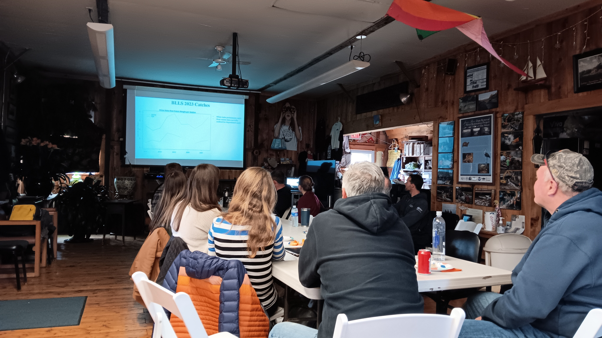
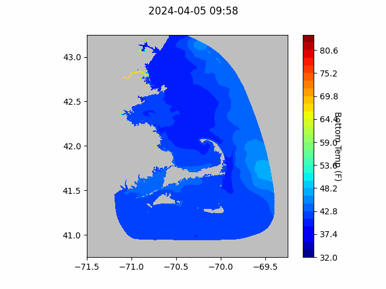
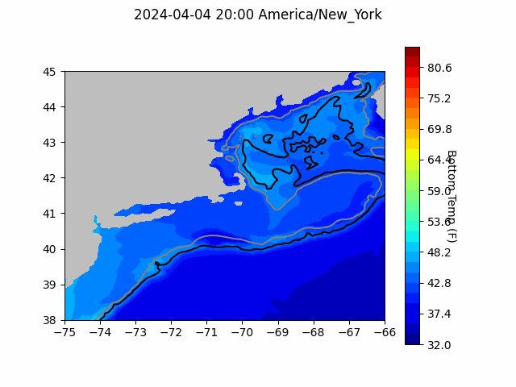

```{r setup, include=FALSE}
knitr::opts_chunk$set(echo = TRUE)
library(blastula)
library(marmap)
library(rstudioapi)
```

<center> 

<font size="5"> *eMOLT Update `r Sys.Date()` * </font>

</center>

### Weekly Recap 

Thanks to all of you who signed the letter of support for our application to the MassTech program for a large eMOLT expansion over the next few years. Over thirty industry members signed on including many current eMOLT participants and many captains who'd like to participate. We're hoping to use that money to develop a low-cost CTD to feed into this system, deploy new eMOLT systems on an additional 150 vessels, and work with DMF to expand our dissolved oxygen monitoring efforts to the North Shore of Massachusetts. We should hear back from MassTech over the next month or two about the status of that application, so keep your fingers crossed.

This week, George was down in Narragansett on Thursday to help with a hard drive issue on the F/V Cody. Thanks to our partners in Study Fleet for their quick reporting of the problem, and thanks to Lowell Instruments for prepping a replacement drive on short notice. We've also been working to prepare gear for our continued expansion efforts up in Maine. Dr. Andrew Goode is working with three partner vessels to monitor dissolved oxygen in Boothbay Harbor this summer, so we're trying to get that hardware out the door sooner rather than later. Today is the annual meeting for the Bottom Longline Survey, a Cooperative Research Project that is celebrating 10 years on the water! 

{width=500px}

### Bottom Temperature Forecasts

#### Northeast Coastal Ocean Forecast System (NECOFS)

{width=800px} 

{width=500px}

#### Doppio Bottom Temperature Forecast

{width=800px} 

### Announcements and Other News
- For Massachusetts fishermen: South Fork Wind (owned by Ørsted) announced that their eligibility application for direct compensation has opened for commercial and recreational fishing vessels that have experienced economic impacts from construction and/or interruptions during operation from offshore wind vessels operating in the South Fork Wind Project Area. PKF O’Connor Davis (PKFOD), the third-party administrator for South Fork Wind, will be reviewing and processing eligibility and direct compensation claims. For more info, [click here](https://www.fisheriescompensationprogram.com/massachusetts-fisheries-direct-compensation-program)

- On-demand lobster and Jonah crab gear testing is underway off Massachusetts and Rhode Island. Science Center scientists are working with commercial lobster vessels to test on-demand (ropeless) fishing gear in state and federal waters normally closed to lobster and Jonah crab fishing with static vertical lines. Testing in this area will occur through April 30, 2024. 


Because on-demand gear has no surface buoys, it won’t be visible at the surface. To visualize the gear positions and orientations, mariners can download and subscribe to the EdgeTech Trap Tracker app ($25) on the [Apple](https://apps.apple.com/us/app/trap-tracker/id1450280978) or [Google Play](https://play.google.com/store/apps/details?id=com.edgetech.TrapTracker&hl=en&gl=US) app stores. For more information on this work, click [here](https://www.fisheries.noaa.gov/new-england-mid-atlantic/marine-mammal-protection/2024-northeast-experimental-demand-gear-system).
Mariners: There is a potential gear conflict area immediately west of the Great South Channel in former Groundfish Closed Area 1. On-demand gear in that area is set northwest to southeast in trawls approximately 1.5 nautical miles in length. If anyone accidentally tows up the on-demand gear, don’t discard it. Hold onto the gear and contact our Gear Research Team. Contact info can be found [here](https://www.fisheries.noaa.gov/new-england-mid-atlantic/marine-mammal-protection/2024-northeast-experimental-demand-gear-system#contacts).

All the best,

-George and JiM
