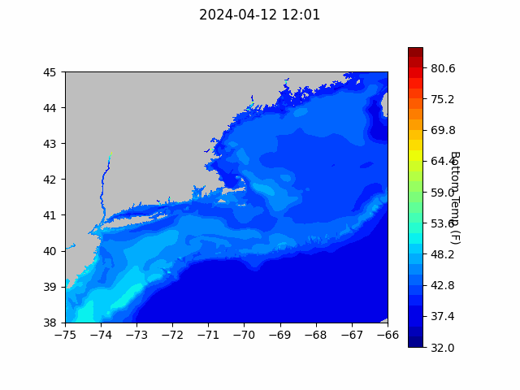
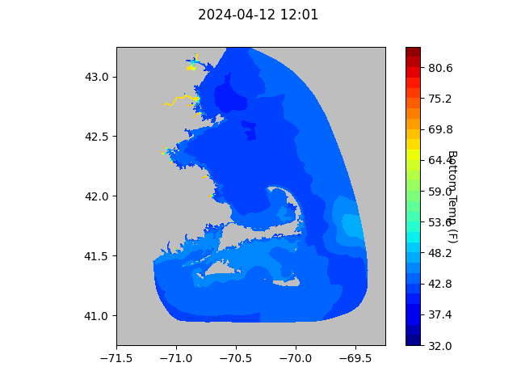
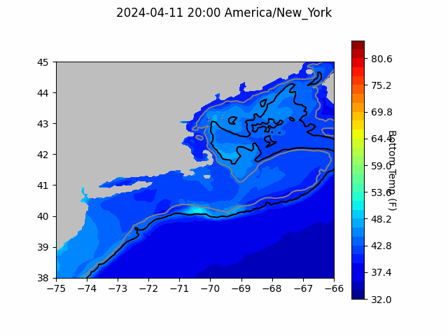

```{r setup, include=FALSE}
knitr::opts_chunk$set(echo = TRUE)
library(blastula)
library(marmap)
library(rstudioapi)
```

<center> 

<font size="5"> *eMOLT Update `r Sys.Date()` * </font>

</center>

### Weekly Recap 

This week's update is a pretty short one. George was out of the office to spend time with family earlier this week, and on the road to a cyberinfrastructure workshop in New Hampshire for the second half of the week. The workshop was focused on designing computer systems to support more real time ecological forecasting (e.g. predicting vibrio levels in the water for the next few days, development of harmful algal blooms for the next month, or bycatch hotspots for a particular species). The scientists who build these types of models are in need of low-latency, real world data like all of you provide, so it's good to understand how they find data to incorporate into the models and make sure that eMOLT is available to them. It was also helpful to hear from computer infrastructure experts from NASA, the US Geological Survey, and private companies to hear more about how we could improve our systems. 

The minilog probes will likely go into the mail next week. If we're successful in our MassTech application, 2024 could be the last year for those probes. While we plan to continue mailing out sensors to long-term participants, we're hoping to switch you all over to the newer style probes that record depth and record profiles every time you haul your gear. The semi-annual newsletter that goes out with those mailings will have more information about the switch, or you can contact George with any questions by [email](george.maynard@noaa.gov) or phone (call or text 508-299-9693). 

#### Unraveling Moana's Mysteries
A big thanks to the team at Lowell Instruments and Linus over at CFRF for digging into a problem in which some Moana sensors fail to download correctly. This problem has only impacted a handful of vessels so far, but we'll be patching the software on all vessels over the next few weeks to make sure it doesn't pop up elsewhere. As you're probably all sick of hearing me say, science is a team sport, and we really appreciate everyone's contributions.


### Bottom Temperature Forecasts

#### Northeast Coastal Ocean Forecast System (NECOFS)

{width=800px} 

{width=500px}

#### Doppio Bottom Temperature Forecast

{width=800px} 

### Announcements and Other News
- For Massachusetts fishermen: South Fork Wind (owned by Ørsted) announced that their eligibility application for direct compensation has opened for commercial and recreational fishing vessels that have experienced economic impacts from construction and/or interruptions during operation from offshore wind vessels operating in the South Fork Wind Project Area. PKF O’Connor Davis (PKFOD), the third-party administrator for South Fork Wind, will be reviewing and processing eligibility and direct compensation claims. For more info, [click here](https://www.fisheriescompensationprogram.com/massachusetts-fisheries-direct-compensation-program)

- On-demand lobster and Jonah crab gear testing is underway off Massachusetts and Rhode Island. Science Center scientists are working with commercial lobster vessels to test on-demand (ropeless) fishing gear in state and federal waters normally closed to lobster and Jonah crab fishing with static vertical lines. Testing in this area will occur through April 30, 2024. 


Because on-demand gear has no surface buoys, it won’t be visible at the surface. To visualize the gear positions and orientations, mariners can download and subscribe to the EdgeTech Trap Tracker app ($25) on the [Apple](https://apps.apple.com/us/app/trap-tracker/id1450280978) or [Google Play](https://play.google.com/store/apps/details?id=com.edgetech.TrapTracker&hl=en&gl=US) app stores. For more information on this work, click [here](https://www.fisheries.noaa.gov/new-england-mid-atlantic/marine-mammal-protection/2024-northeast-experimental-demand-gear-system).
Mariners: There is a potential gear conflict area immediately west of the Great South Channel in former Groundfish Closed Area 1. On-demand gear in that area is set northwest to southeast in trawls approximately 1.5 nautical miles in length. If anyone accidentally tows up the on-demand gear, don’t discard it. Hold onto the gear and contact our Gear Research Team. Contact info can be found [here](https://www.fisheries.noaa.gov/new-england-mid-atlantic/marine-mammal-protection/2024-northeast-experimental-demand-gear-system#contacts).

All the best,

-George and JiM
