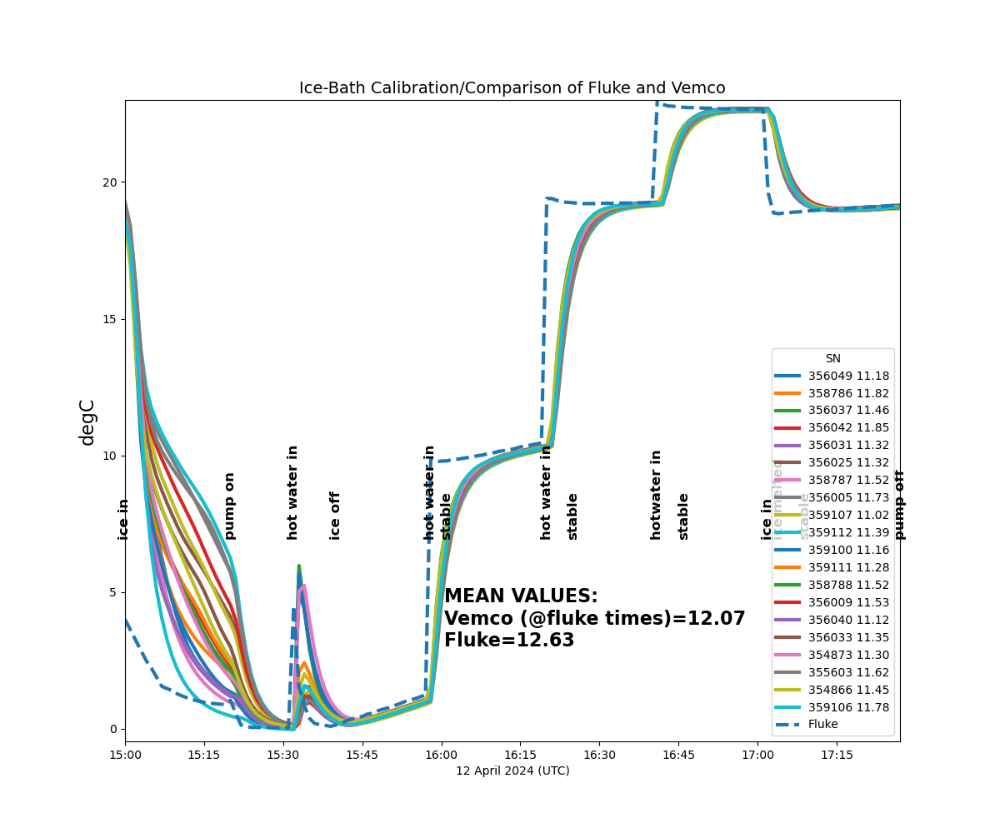
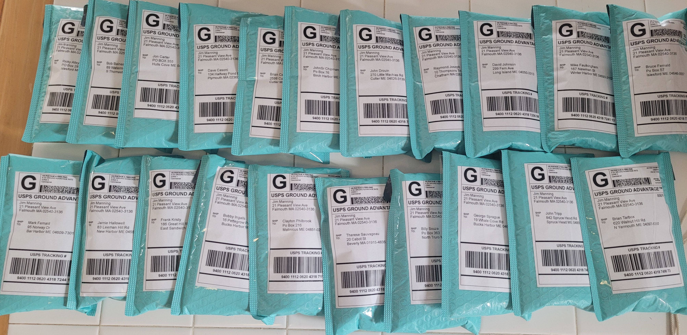
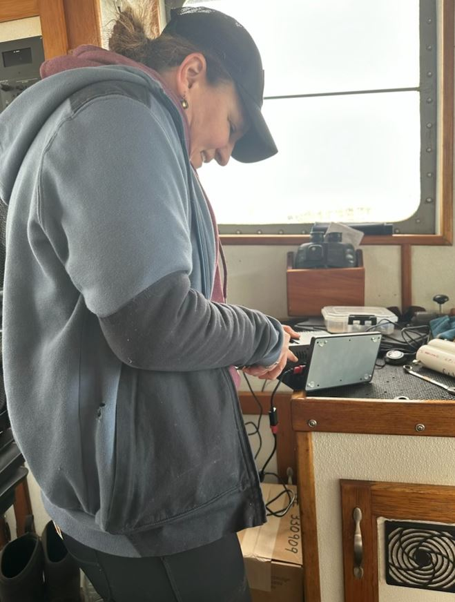
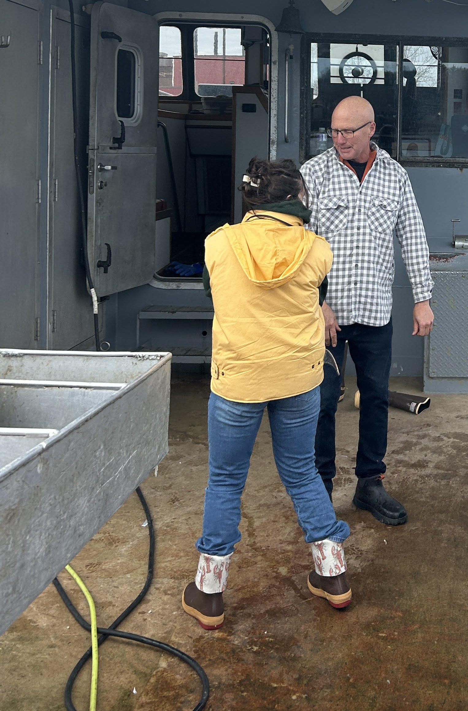
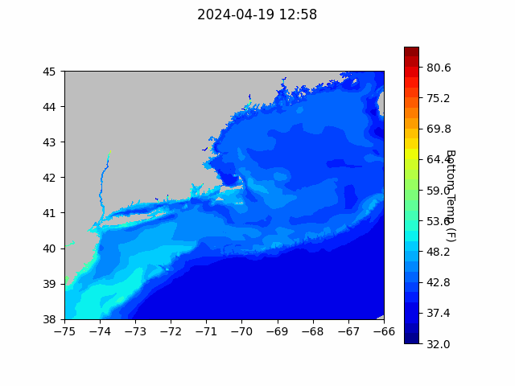
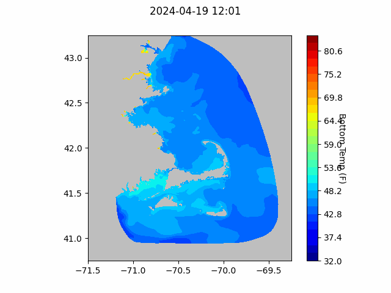
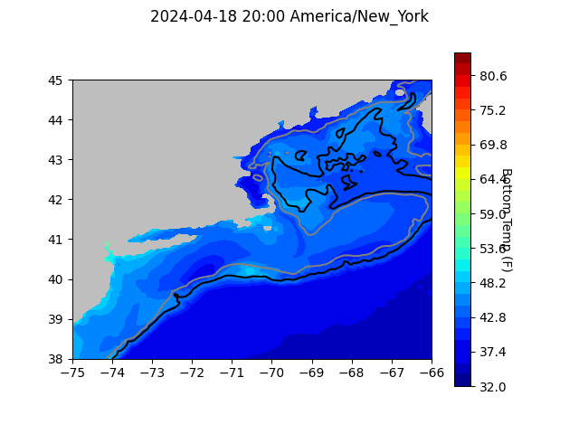

```{r setup, include=FALSE}
knitr::opts_chunk$set(echo = TRUE)
library(blastula)
library(marmap)
library(rstudioapi)
```

<center> 

<font size="5"> *eMOLT Update `r Sys.Date()` * </font>

</center>

### Weekly Recap 

#### Huanxin is this week's MVP 

Huanxin has been working hard on migrating all of the data generated by the realtime eMOLT program over the years from our old servers to our new cloud infrastructure. This migration is necessary to ensure all of the eMOLT data are stored in a standardized, accessible way so that we can respond quickly to data requests from stock assessment scientists, forecasters, and the fishing industry. However, like any major change, there are often growing pains. In this case, a strangely formatted file in the mix put enough sand in the gears to stall out our new ERDDAP server. So if you've noticed a lack of new data there, that's why. 

Huanxin also spent a few days in JiM’s basement working together to conduct calibration checks on Minilog temperature probes. This is an operation that JiM has conducted nearly every year since eMOLT began where dozens of probes are exposed to a range of temperatures (0-20 degC) similar to that experienced in the Gulf of Maine. For the last several years, the probes have been compared to a highly accurate (0.001 degC)  Fluke temperature sensor. As seen in the graphic below, a) the pump is critical to provide a well-mixed bath, b) the time response of the Fluke thermistor is much faster than the Minilogs, and c)  the mean difference between the Fluke and Minilog probes was ~0.1 degC after waiting for the response.

{width=600px}

If you participate in the non-realtime program, you should be receiving your probe in the mail soon. If you don't, please reach out to George by calling / texting 508-299-9693 or emailing george.maynard@noaa.gov and we'll get it sorted out. 

{width=600px}

#### This Week in Red Tape

In a true to form moment for the government, we were asked to update eMOLT's online presence to include new phrasing mandated by the ironically named Paperwork Reduction Act. The old emolt.org site and new ERDDAP server where we make the data available to ocean forecasters are now in compliance with the PRA, so we can all rest easy at night.

#### Notes from up North

We welcomed a new boat and crew to the program this week. Erin and Emma hopped aboard the F/V Gladys Elaine yesterday to install a new Deck Data Hub and hand off two Moana sensors to Capt. Pete, a longtime participant in the non-realtime eMOLT program.

{width=225px}
{width=200px}


Going back through my notes from last week's cyberinfrastructure workshop in Portsmouth, one quote from a speaker stood out to me. 

> *"Standards are like toothbrushes. Everyone wants one, but nobody wants to use anyone else's"*

I guess the analogy isn't perfect, because we are slowly working to get everyone to use the same toothbrush...gross, but efficient? As we collaborate with the software engineers at Lowell Instruments on the new version of DDH software, we're ensuring that the data collected on your deckboxes will adhere to international standards, so the data collected here in the Northeast USA can be interoperable with other, complimentary datasets like the deep sea Argo float data, or fishing vessel collected environmental data from elsewhere in the world. This interoperability means that more researchers around the world will be able to make use of eMOLT data in their research, increasing the value of the work you're all doing, and cementing eMOLT's role as a global leader in this space. 

### Bottom Temperature Forecasts

#### Northeast Coastal Ocean Forecast System (NECOFS)

{width=800px} 

{width=500px}

#### Doppio Bottom Temperature Forecast

{width=800px} 

### New Research
- Using a large dataset of fishermen-deployed satellite-track drifters,  JiM co-authored a recently- published a report entitled ["Decadal-Scale Variability in the Surface Flow of the Gulf of Maine Coastal Current: The Impact of Changing Climate Conditions on Coastal Circulation"](http://dx.doi.org/10.1029/2023JC020512). The big take home points are
  - Surface velocities in the Gulf of Maine Coastal Current  have slowed on inter‐decadal timescales, particularly south-west of Penobscot Bay
  - An intensification of the southwesterly component of the winds in the region likely contributed to the observed changes

- A team from Rutgers and NOAA Fisheries is working on better understanding how surfclams respond to increased ocean temperatures and acidification. You can learn more about the project [here](https://www.fisheries.noaa.gov/science-blog/how-do-atlantic-surfclams-respond-ocean-warming-and-acidification?utm_medium=email&utm_source=govdelivery)


### Announcements and Other News

- The New England Fishery Management Council is hosting three workshops to solicit public input on the Atlantic Cod Management Transition Plan. For more information please [click here](https://d23h0vhsm26o6d.cloudfront.net/NEFMC-Schedules-Three-Facilitated-Workshops-to-Solicit-Public-Input-on-Atlantic-Cod-Management-Transition-Plan.pdf). The workshops are in Portland on 4/30, Wakefield MA on 5/1, and South Kingstown RI on 5/2. All workshops beging at 0930. 

- On-demand lobster and Jonah crab gear testing is underway off Massachusetts and Rhode Island. Science Center scientists are working with commercial lobster vessels to test on-demand (ropeless) fishing gear in state and federal waters normally closed to lobster and Jonah crab fishing with static vertical lines. Testing in this area will occur through April 30, 2024. 


Because on-demand gear has no surface buoys, it won’t be visible at the surface. To visualize the gear positions and orientations, mariners can download and subscribe to the EdgeTech Trap Tracker app ($25) on the [Apple](https://apps.apple.com/us/app/trap-tracker/id1450280978) or [Google Play](https://play.google.com/store/apps/details?id=com.edgetech.TrapTracker&hl=en&gl=US) app stores. For more information on this work, click [here](https://www.fisheries.noaa.gov/new-england-mid-atlantic/marine-mammal-protection/2024-northeast-experimental-demand-gear-system).
Mariners: There is a potential gear conflict area immediately west of the Great South Channel in former Groundfish Closed Area 1. On-demand gear in that area is set northwest to southeast in trawls approximately 1.5 nautical miles in length. If anyone accidentally tows up the on-demand gear, don’t discard it. Hold onto the gear and contact our Gear Research Team. Contact info can be found [here](https://www.fisheries.noaa.gov/new-england-mid-atlantic/marine-mammal-protection/2024-northeast-experimental-demand-gear-system#contacts).

All the best,

-George and JiM
