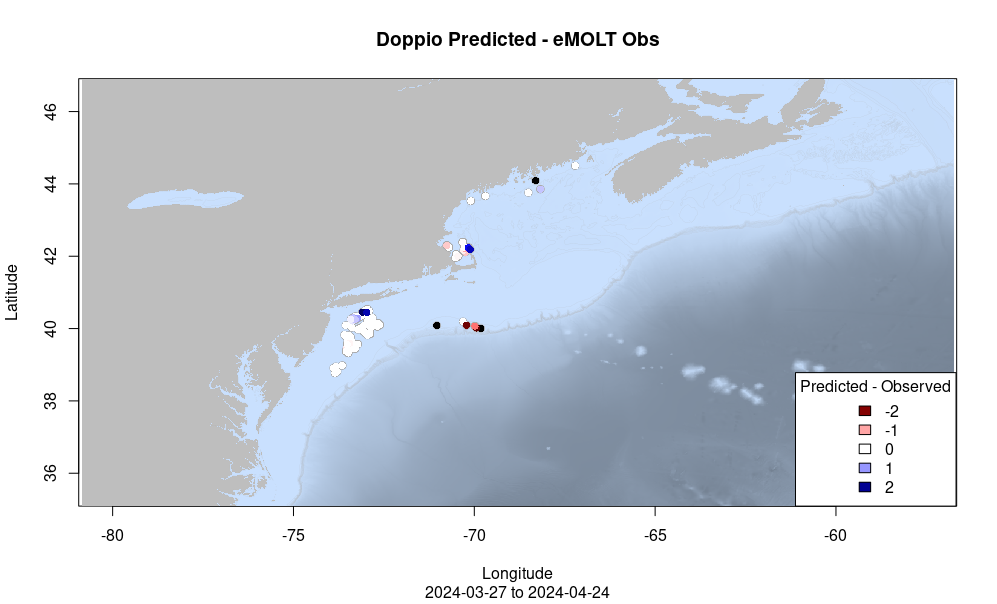
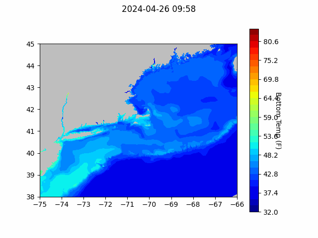
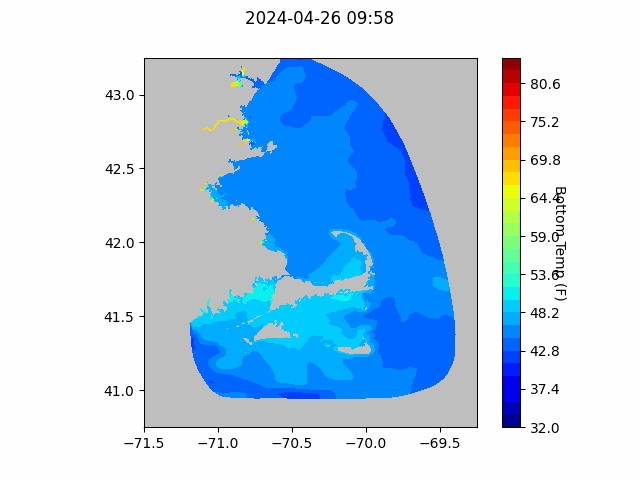
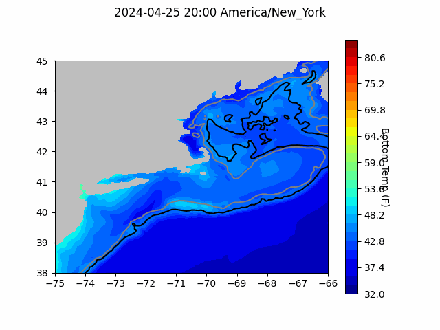

```{r setup, include=FALSE}
knitr::opts_chunk$set(echo = TRUE)
library(blastula)
library(marmap)
library(rstudioapi)
```

<center> 

<font size="5"> *eMOLT Update `r Sys.Date()` * </font>

</center>

### Weekly Recap 

This week, we've been working on getting hardware together for our upcoming installs locally here on the Cape as well as up in Maine. George also took a day to do safety training with the folks at Fishing Partnership Support Services. If you haven't taken one of their trainings, it's helpful to get some hands on experience with survival suits, flares, fire extinguishers, P-6 pumps, and more. If you're a commercial fisherman, you can also walk away with a heavily discounted or free PFD. You can see their list of upcoming classes [here](https://fishingpartnership.org/safety-survival-class/). There are safety and survival trainings coming up in Gloucester MA and Portland ME. 

This week, George also took a first stab at comparing forecasted bottom temperatures to real data so that we can identify where the forecasts match up with what you're seeing on the water and where they're a little off. This type of analysis will hopefully help you all know which model performs best in the areas you're interested in. Basically, the plots below show the difference between the most recent forecast before an observation and the observation itself. For example, an observation from fishing on 4/20 would be compared to the forecast from 4/19. Places where observation was warmer than the forecast are displayed as red; places where the observation was cooler than the forecast are displayed as blue, and places where the observation and forecast were within 1 degree (Celsius) of each other are white. This plot uses eMOLT data and forecasts from the Doppio model over the last month. 



Over the last month, the model appears to have performed best on the continental shelf east of New Jersey, but struggled a little along the shelf break, off the backside of Cape Cod, and around Penobscot Bay. 

I'm hoping to start incorporating these spatial model evaluations for other bottom temperature products in the near future, so stay tuned, and let me know if you have suggestions to make them better. For scientists interested in these comparisons, I'm also working on a way to provide the 

### Bottom Temperature Forecasts

#### Northeast Coastal Ocean Forecast System (NECOFS)

{width=800px} 

{width=500px}

#### Doppio Bottom Temperature Forecast

{width=800px} 

### Announcements and Other News

- The New England Fishery Management Council is hosting three workshops to solicit public input on the Atlantic Cod Management Transition Plan. For more information please [click here](https://d23h0vhsm26o6d.cloudfront.net/NEFMC-Schedules-Three-Facilitated-Workshops-to-Solicit-Public-Input-on-Atlantic-Cod-Management-Transition-Plan.pdf). The workshops are in Portland on 4/30, Wakefield MA on 5/1, and South Kingstown RI on 5/2. All workshops beging at 0930. 

- On-demand lobster and Jonah crab gear testing is underway off Massachusetts and Rhode Island. Science Center scientists are working with commercial lobster vessels to test on-demand (ropeless) fishing gear in state and federal waters normally closed to lobster and Jonah crab fishing with static vertical lines. Testing in this area will occur through April 30, 2024. 


Because on-demand gear has no surface buoys, it won’t be visible at the surface. To visualize the gear positions and orientations, mariners can download and subscribe to the EdgeTech Trap Tracker app ($25) on the [Apple](https://apps.apple.com/us/app/trap-tracker/id1450280978) or [Google Play](https://play.google.com/store/apps/details?id=com.edgetech.TrapTracker&hl=en&gl=US) app stores. For more information on this work, click [here](https://www.fisheries.noaa.gov/new-england-mid-atlantic/marine-mammal-protection/2024-northeast-experimental-demand-gear-system).
Mariners: There is a potential gear conflict area immediately west of the Great South Channel in former Groundfish Closed Area 1. On-demand gear in that area is set northwest to southeast in trawls approximately 1.5 nautical miles in length. If anyone accidentally tows up the on-demand gear, don’t discard it. Hold onto the gear and contact our Gear Research Team. Contact info can be found [here](https://www.fisheries.noaa.gov/new-england-mid-atlantic/marine-mammal-protection/2024-northeast-experimental-demand-gear-system#contacts).

All the best,

-George and JiM
