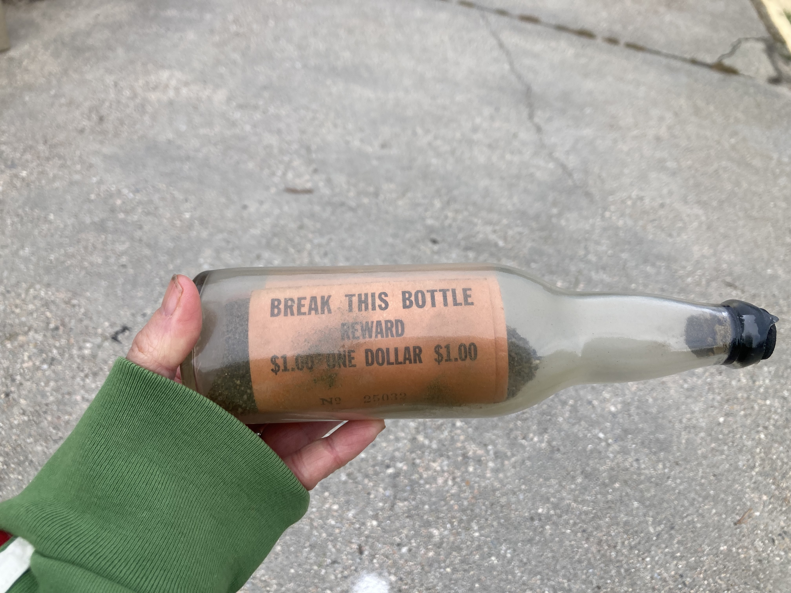
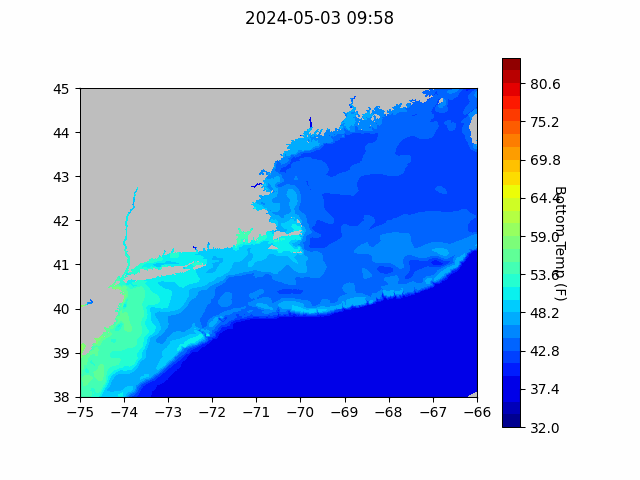
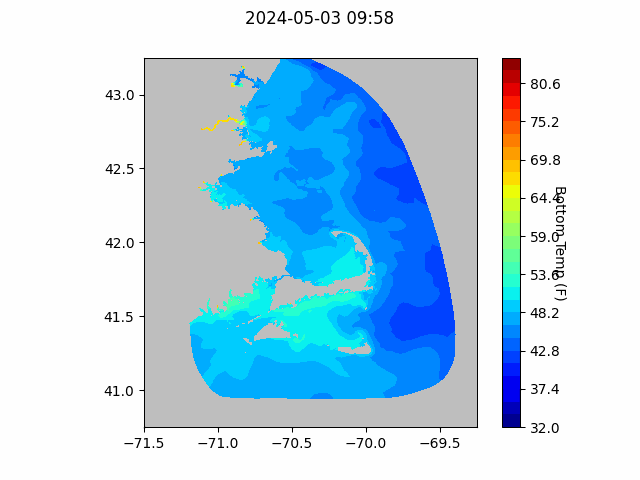
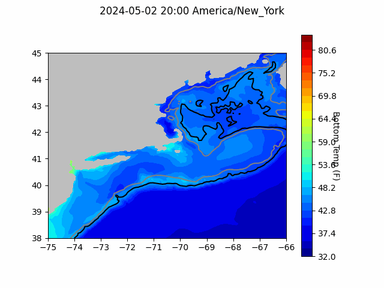
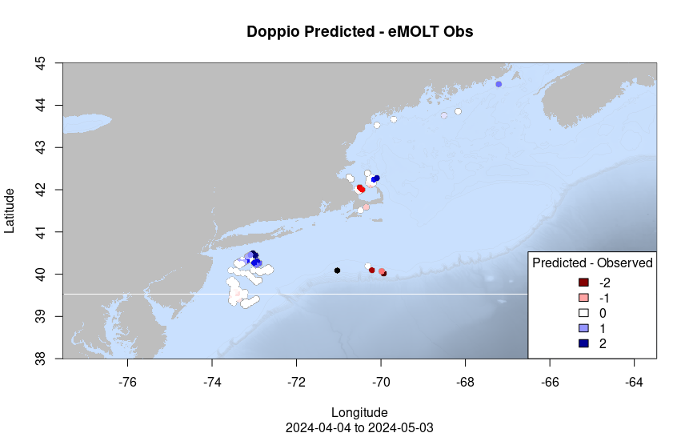

```{r setup, include=FALSE}
knitr::opts_chunk$set(echo = TRUE)
library(blastula)
library(marmap)
library(rstudioapi)
```

<center> 

<font size="5"> *eMOLT Update `r Sys.Date()` * </font>

</center>

### Weekly Recap 

This week, Huanxin and George visited the F/V Charger to upgrade the eMOLT system on board to one of the newer deckboxes and a profiling logger. Thanks to Captain Phil for coordinating with us. As we secure additional resources, we plan to continue upgrading all of our existing partners. If you have an old eMOLT system with a logger that requires charging, and you aren't on the list below, please reach out and we'll get you on the list. Vessels with an * next to their name are at the front of the line because we've already removed your old systems.  

>
 - F/V Adventure *
 - F/V Brooke C *
 - F/V Devocean
 - F/V Excalibur
 - F/V Fremantle Doctor
 - F/V Kaitlyn Victoria
 - F/V Kyler C
 - F/V Linda Marie
 - F/V Nathaniel Lee *
 - F/V Noella C
 - F/V Princess Scarlett *
 - F/V Resolve
 - F/V Sao Paulo
 - F/V Sea Watcher I
 - F/V Tom Slaughter
 - F/V Virginia Marie
 - F/V Virginia Marise

The team has also been working on preparing our presentation for the MassTech program's review board. That presentation takes place on May 16th, and afterwards we'll get feedback on the large proposal (150 new eMOLT systems + a purpose built CTD to measure salinity) that so many of you signed on in support of or wrote letters of support for. 

A friend of JiM's reported finding this drift bottle on Race Point Beach in Provincetown a few weeks ago.  After looking into it, JiM found it was deployed by Canadian researchers  back on August 28, 1961 near Machias Seal Island, a disputed little patch of rocks about 10 miles southwest of Grand Manan.  We are in communication with the folks at St Andrews Lab about these studies and the result of releasing nearly 100,000 of these bottles during the 50's and 60's off New Brunswick and Nova Scotia.  How many more are buried in Cape Cod sands to be unearthed during winter storms?



### Bottom Temperature Forecasts

#### Northeast Coastal Ocean Forecast System (NECOFS)

{width=800px} 

{width=500px}

#### Doppio Bottom Temperature Forecast

Doppio bottom temperature forecasts over the last month have been pretty close to observations in Southern Maine, on the South Shore of Massachusetts, and east of New Jersey. Observations were warmer than forecasts around Plymouth, MA, and along the continental shelf south of Massachusetts. Observations were cooler than forecasts Downeast, outside of Provincetown, and south of Long Island. It will be interesting to see if additional data points Downeast help improve the forecast in that area as the year progresses.   

{width=800px} 




All the best,

-George and JiM
