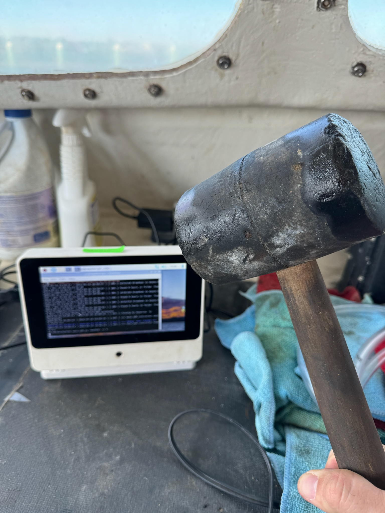
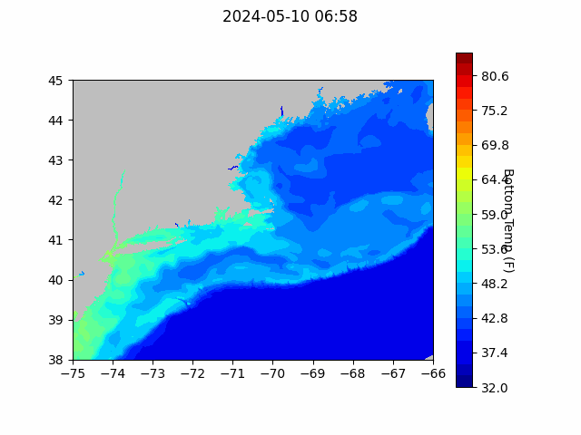
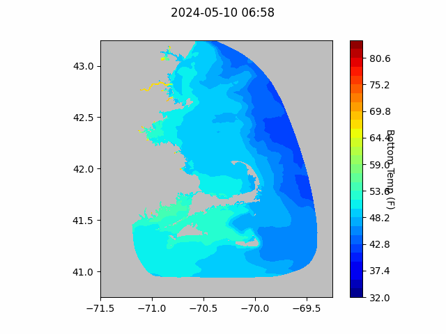
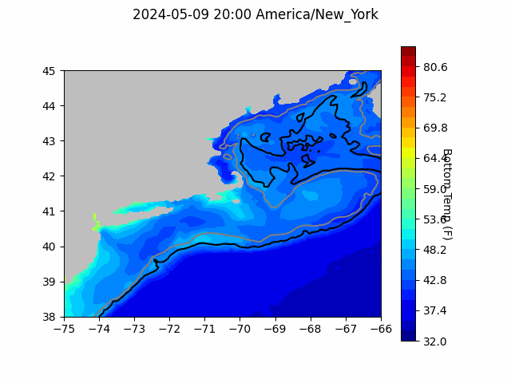

```{r setup, include=FALSE}
knitr::opts_chunk$set(echo = TRUE)
library(blastula)
library(marmap)
library(rstudioapi)
```

<center> 

<font size="5"> *eMOLT Update `r Sys.Date()` * </font>

</center>

### Weekly Recap 

This week, Owen visited the F/V Adventure to upgrade the old eMOLT system. It did not go as smoothly as planned, but as always, we appreciate the ingenuity of our partners. 


It's hard to say whether the software tweak or the presence of the mallet was the deciding factor, but we got the system up and running, so we'll call it a win.

The following vessels remain on our list for system upgrades. If you aren't on the list and think you should be, please reach out. 

>
 - F/V Brooke C *
 - F/V Devocean
 - F/V Excalibur
 - F/V Fremantle Doctor
 - F/V Kaitlyn Victoria
 - F/V Kyler C
 - F/V Linda Marie
 - F/V Nathaniel Lee *
 - F/V Noella C
 - F/V Princess Scarlett *
 - F/V Resolve
 - F/V Sao Paulo
 - F/V Sea Watcher I
 - F/V Tom Slaughter
 - F/V Virginia Marie
 - F/V Virginia Marise

Next week will be another busy one for the eMOLT team. George is presenting about eMOLT's data system to NOAA's Enterprise Data Working Group meeting on Wednesday, and our MassTech presentation is Thursday. The NSF project that has funded much of our recent expansion in the Gulf of Maine has an all hands meeting from Thursday afternoon through Saturday. While at that meeting, we'll be handing off several systems to Andrew and Chris from UMaine for installations around Boothbay in the near future.  

The ocean in our region remains relatively cool this spring, [as noted by DFO Canada scientists in a recent article from the Canadian Broadcasting Corporation](https://www.cbc.ca/news/canada/nova-scotia/north-atlantic-waters-cool-after-years-of-warming-1.7197115). Closer to home, scientists at SMAST, WHOI, and the NEFSC report fewer and weaker warm-core rings spinning off the Gulf Stream than in recent years and some of the coldest bottom temps in the Gulf of Maine observed since 2009. 

### Bottom Temperature Forecasts

#### Northeast Coastal Ocean Forecast System (NECOFS)

{width=800px} 

{width=500px}

#### Doppio Bottom Temperature Forecast

Doppio bottom temperature forecasts over the last month have been pretty close to observations along the Maine coast, on the South Shore of Massachusetts, and east of New Jersey. Observations were warmer than forecasts around Plymouth, MA, and along the continental shelf south of Massachusetts. Observations were cooler than forecasts outside of Provincetown, and south of Long Island. 

{width=800px} 


### Announcements

- On April 30, 2024, BOEM announced its proposal for a first offshore wind energy auction in the Gulf of Maine and an accompanying a 60-day public comment period (comments due by July 1, 2024). Public comments can be submitted [here](https://www.regulations.gov/document/BOEM-2024-0026-0001). Further information about the energy auction as well as in-person and virtual public hearing scheduled for May and June of 2024 can be found [here](https://www.boem.gov/renewable-energy/state-activities/maine/gulf-maine). 

All the best,

-George and JiM
