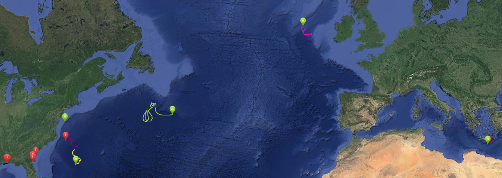
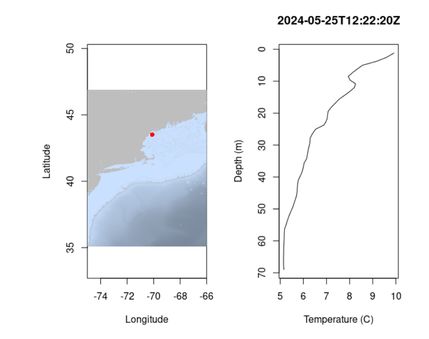
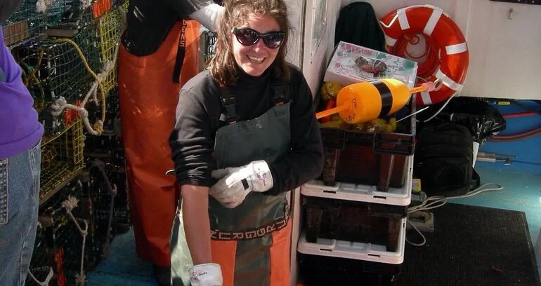
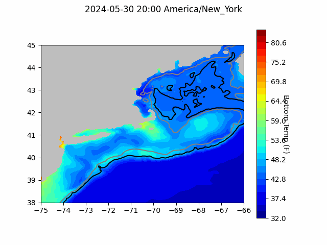
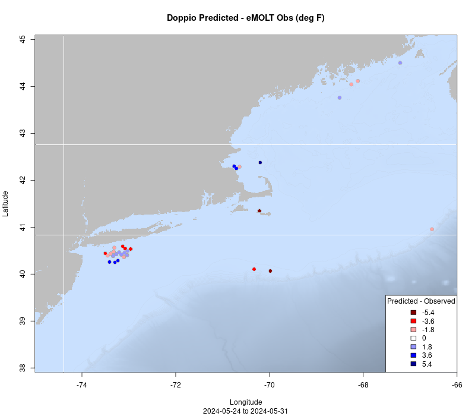

```{r setup, include=FALSE}
knitr::opts_chunk$set(echo = TRUE)
library(blastula)
library(marmap)
library(rstudioapi)
```

<center> 

<font size="5"> *eMOLT Update `r Sys.Date()` * </font>

</center>

### Weekly Recap 

More than a dozen drifters have been deployed in the past month as seen in the regularly updated tracks [here](https://studentdrifters.org/track/drift_X.html). Kudos to the eMOLT fishermen who have  helped us out with these educational efforts.  Captain Joe on the F/V Ryan Joseph started deploying a few classroom-built drifters this past weekend and plans to deploy a few more from Boston area schools in the coming weeks. Joe fishes in Mass Bay so, ideally, these units have some chance of documenting Boston Harbor outflow towards Cape Cod Bay, always an interesting track.  Captain Dave on the F/V Margaret M came into a 3rd grade Dorchester classroom (where one of the drifters was being built) with traps and live lobsters a few weeks ago. That will be one class these third graders will not forget!



Water temperatures in the Gulf of Maine remain cold as you can see in the profile below. Bottom temps across Gulf were around 41 F (5 Celsius) over the last week. 



This week, Emma Fowler from the Study Fleet team joined Huanxin and George in New Bedford to work on repairing and reinstalling eMOLT systems aboard the F/V Sea Watcher II, F/V Terri Ann, and F/V Princess Scarlett. A big thanks to Captain Charlie, Captain Dave, and the shore team at Atlantic Shellfish for their help getting everything squared away. Over the coming months, Emma will be lending a hand in New Bedford more frequently so we can address any issues with your systems there more quickly 


### Status of the Stocks

As noted in the most recent edition of [Science Highlights](https://content.govdelivery.com/accounts/USNOAAFISHERIES/bulletins/39f8234) from the Northeast Fisheries Science Center, the status of U.S. fish stocks continued to improve on the whole. In the words of Jon Hare

> *"The status of U.S. fisheries continues to improve. This message is often lost in reporting of global overfishing. It's important to recognize that U.S. fisheries are sustainable and well managed thanks to the Magnuson Stevens Fisheries Management and Conservation Act"*

### News from Maine

A big congratulations goes out to Chris Cash, one of our valued partners up in Maine, and the [newly appointed Executive Director of The Lobster Institute](https://www.nationalfisherman.com/northeast/chris-cash-named-executive-director-of-lobster-institute). Chris and I are both UMaine alums, but unlike me, she previously owned and operated a commercial lobster boat in Maine and brings that perspective into scientific projects. The whole eMOLT team has enjoyed working with Chris so far and look forward to many more years of constructive collaboration. Congratulations Chris!

{width=350px}


### News from New Zealand

In [news from the other side of the world](https://www.seafood.co.nz/news-and-events/news/detail/champions-of-our-oceans), the Moana Project in New Zealand (which developed the sensors many of you now deploy) has collected over 31 million temperature depth records by collaborating with the fishing industry to deploy hundreds of sensors on commercial fishing boats over the last five years. 

> Dr. Julie Jakoboski, MetOcean Oceanographer and Lead of The Moana Project temperature sensor programme, says the commercial fishing sector has set an example for the future of ocean observing.
*“It was fantastic to see the seafood sector be so willing to work together with scientists, to help us understand our oceans. **This really highlights what the industry is capable of and how much they care, which I think is not always fully appreciated by people outside the sector.”***

### System Upgrade List

The following vessels remain on our list for system upgrades. If you aren't on the list and think you should be, please reach out. 

>
 - F/V Brooke C *
 - F/V Devocean
 - F/V Excalibur
 - F/V Fremantle Doctor
 - F/V Kaitlyn Victoria
 - F/V Kyler C
 - F/V Linda Marie
 - F/V Nathaniel Lee *
 - F/V Noella C
 - F/V Resolve
 - F/V Sao Paulo
 - F/V Sea Watcher I
 - F/V Tom Slaughter
 - F/V Virginia Marie
 - F/V Virginia Marise

### Bottom Temperature Forecasts

#### Doppio Bottom Temperature Forecast

Comparisons between modeled bottom temperatures and observations south of Long Island were mixed over the last week, with observations closer to shore generally warmer than predictions, and observations further south cooler than predictions. The few observations along the continental shelf south of Cape Cod were warmer than predicted, and observations in Mass Bay were generally cooler than predicted. 

{width=800px} 



### Announcements


- On April 30, 2024, BOEM announced its proposal for a first offshore wind energy auction in the Gulf of Maine and an accompanying a 60-day public comment period (comments due by July 1, 2024). Public comments can be submitted [here](https://www.regulations.gov/document/BOEM-2024-0026-0001). Further information about the energy auction as well as in-person and virtual public hearing scheduled for May and June of 2024 can be found [here](https://www.boem.gov/renewable-energy/state-activities/maine/gulf-maine). 

All the best,

-George and JiM
