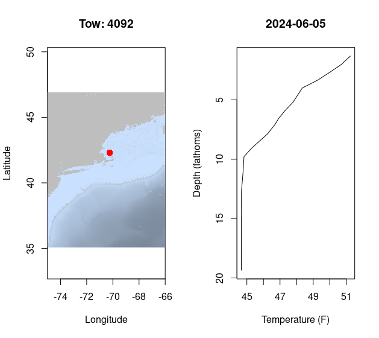
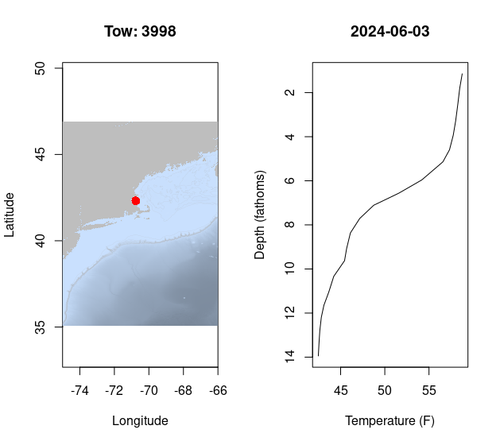
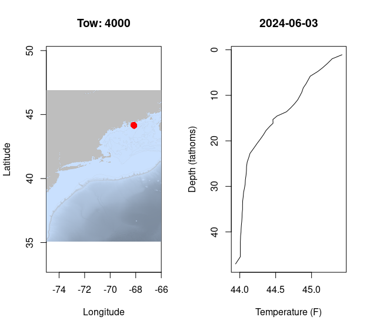
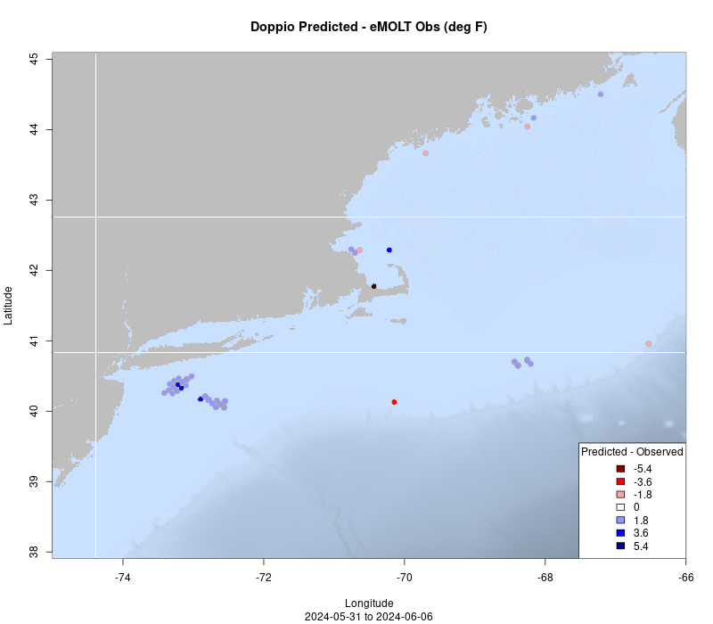
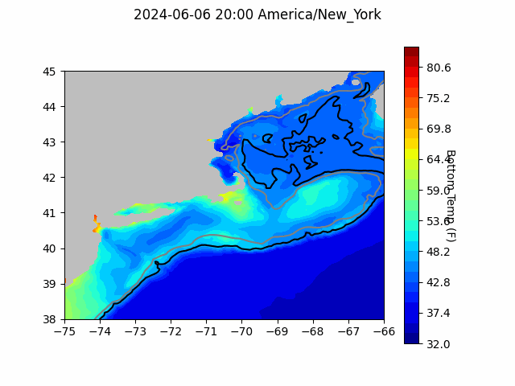
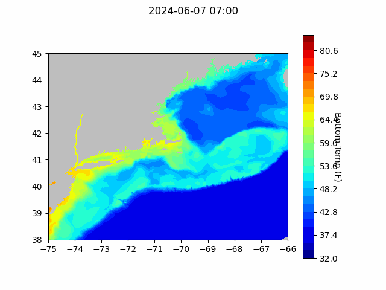

```{r setup, include=FALSE}
knitr::opts_chunk$set(echo = TRUE)
library(marmap)
library(rstudioapi)
source("/home/george/Documents/emolt_project_management/WeeklyUpdates/forecast_check/R/emolt_download.R")
data=emolt_download(days=7)
```

<center> 

<font size="5"> *eMOLT Update `r Sys.Date()` * </font>

</center>

### Weekly Recap 


This week, the eMOLT fleet recorded `r length(unique(data$tow_id))` tows of sensorized fishing gear.

Bottom temperatures north of Cape Cod Bay remained in the low to mid 40s, although surface waters are defintely warming up down this way. Surface waters are almost 10 degrees warmer off Provincetown than they are Downeast. Check out the profiles below from just north of P-town, the South Shore, Southern Maine, and Downeast, where there was little difference between surface water and bottom water in 40 fathoms!








Up north, Andrew Goode hit the docks with the UMaine summer interns to continue our expansion in coastal Maine. A big thanks to Capt. Nick P. on the F/V All Out and Capt. Nick H. on the F/V Illusion for their patience in working through some troubleshooting with their systems. As we do more of these remote-supported installations, we'll keep refining the process. Thanks also to Jack Carroll from Ocean Data Networks and Capt. Mike on the F/V Fremantle Doctor for their patience as we updated the software on their deckbox. 

We've completed cleaning and disassembling the dissolved oxygen loggers and are waiting for a shipment of batteries before they're ready to put back out in the field. In the next few weeks, we'll be contacting vessels around Cape Cod and the South Shore to start getting those in the water. Lowell Instruments also shipped a batch of new dissolved oxygen sensors up to the Darling Marine Center for Andrew and his team to install over the coming weeks. 

### System Upgrade List

The following vessels remain on our list for system upgrades. If you aren't on the list and think you should be, please reach out. 

>
 - F/V Brooke C *
 - F/V Devocean
 - F/V Excalibur
 - F/V Kaitlyn Victoria
 - F/V Kyler C
 - F/V Linda Marie
 - F/V Nathaniel Lee *
 - F/V Noella C
 - F/V Resolve
 - F/V Sao Paulo
 - F/V Sea Watcher I
 - F/V Tom Slaughter
 - F/V Virginia Marie
 - F/V Virginia Marise

### Bottom Temperature Forecasts

#### Doppio Performance Last Week

Observations south of Long Island last week were cooler than predicted, as was the single observation off Provincetown. The one outlier where observations were substantially warmer than predicted was on the continental shelf break south of the Islands. 



#### Doppio Bottom Temperature Forecast

{width=800px} 

#### Northeast Coastal Ocean Forecast System



### Announcements


- On April 30, 2024, BOEM announced its proposal for a first offshore wind energy auction in the Gulf of Maine and an accompanying a 60-day public comment period (comments due by July 1, 2024). Public comments can be submitted [here](https://www.regulations.gov/document/BOEM-2024-0026-0001). Further information about the energy auction as well as in-person and virtual public hearing scheduled for May and June of 2024 can be found [here](https://www.boem.gov/renewable-energy/state-activities/maine/gulf-maine). 

All the best,

-George and JiM
