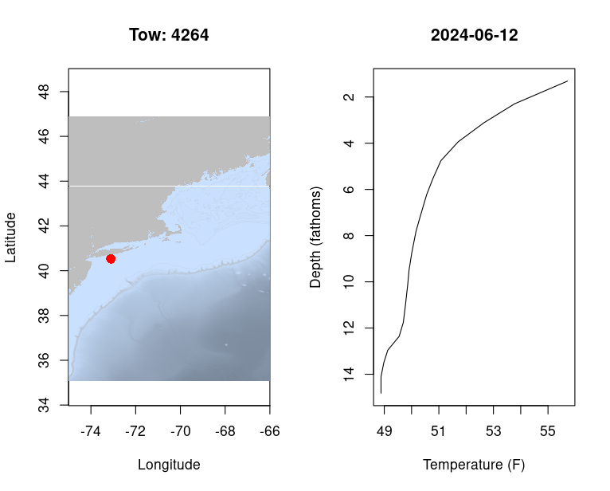
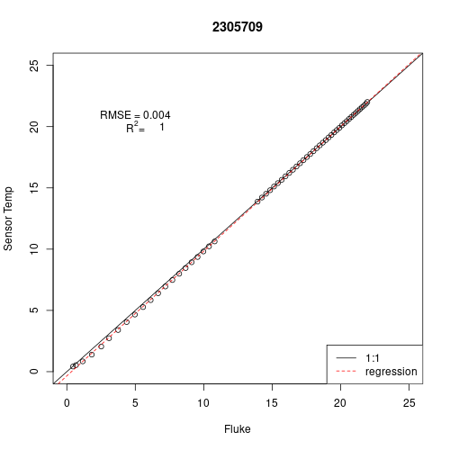
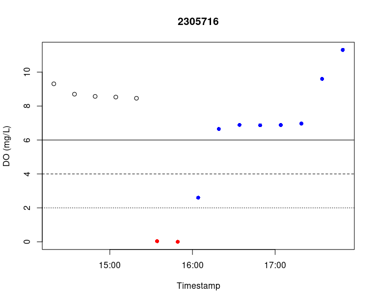
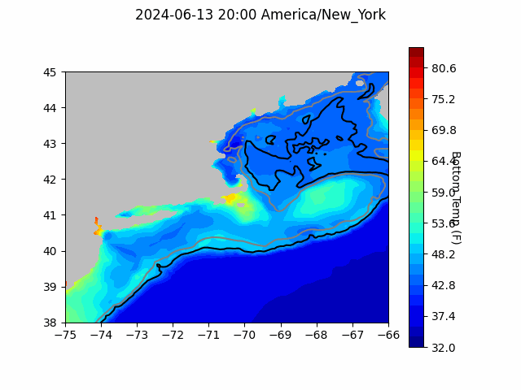
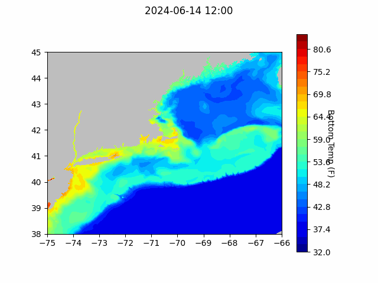
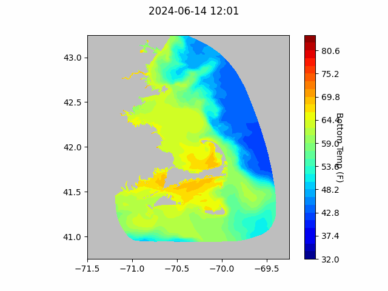

```{r setup, include=FALSE}
knitr::opts_chunk$set(echo = TRUE)
library(marmap)
library(rstudioapi)
source("/home/george/Documents/emolt_project_management/WeeklyUpdates/forecast_check/R/emolt_download.R")
data=emolt_download(days=7)
```

<center> 

<font size="5"> *eMOLT Update `r Sys.Date()` * </font>

</center>

### Weekly Recap 


This week, the eMOLT fleet recorded `r length(unique(data$tow_id))` tows of sensorized fishing gear.

Bottom temperatures south of Long Island in 14-16 fathoms are in the upper 40s and low 50s (see the plot below) with surface waters in the mid to upper 50s. Similar conditions can be found along the South Shore of Massachusetts. 



The southwestern part of Cape Cod Bay has some of the warmest bottom temps we're seeing at the moment (in the mid-50s). Heading up to Maine, east of Penobscot Bay, temps remain in the mid-40s at the bottom (~40 fathoms), with surface temperatures only a degree or two warmer. 

George and Huanxin completed a calibration check of the 25 DOT-2 dissolved oxygen and temperature loggers that we have here in the lab. There were a couple hiccups with one logger that may need to go back to the factory for more testing. The other 24 successfully detected hypoxic conditions in the first calibration bath and tracked temperature within fraction of a degree of the reference probe. If you have a Dissolved Oxygen probe, we'll be reaching out with prepaid envelopes to get those back to us for pre-season calibration checks and new batteries. 

The plot below shows our temperature test with one probe. The serial number of the DOT-2 probe is shown at the top of the plot. The white circles are a plot of the temperature measured by the Fluke 1523 Calibration Thermometer (x-axis -- horizontal) against the temperature measured by a DOT-2 probe (y-axis -- vertical). For example, if the Fluke 1523 read 5 degrees, we would expect the DOT-2 probe to also read 5 degrees. The black line is a 1:1 line, so if the DOT-2 probe performed flawlessly, all of the points would be on that line. As you can see, it was slightly off (Root Mean Squared Error of 0.004 degrees C or 0.0072 degrees F) and the estimated relationship between the calibration thermometer temps and the DOT-2 temps is shown by the dashed red line. Our highest Root Mean Squared Error was 0.025 degrees C or 0.045 degrees F.   



The second plot that we generated for each logger shows Dissolved Oxygen concentrations (mg/L) over time as the logger was moved between different water baths. In the plot below, you can see open circles that indicate the logger was in air, red circles indicating that the logger was in the low oxygen bath, and blue circles indicating that the logger was in the high oxygen bath. The single blue point in the middle is likely the logger taking some time to equilibrate back to higher dissolved oxygen levels after being in the low DO bath. In the real world, loggers are unlikely to go through this rapid of a shift. 



### Bottom Longline Survey Photo Gallery

The team from the Gulf of Maine Bottom Longline Survey (a cooperative research survey aboard the F/V Mary Elizabeth and F/V Tenacious II) shared a photo gallery and field blogs from the spring survey season. You can check it out [here](https://www.fisheries.noaa.gov/gallery/2024-bottom-longline-survey-photos).

### System Upgrade List

The following vessels remain on our list for system upgrades. If you aren't on the list and think you should be, please reach out. 

>
 - F/V Brooke C *
 - F/V Devocean
 - F/V Excalibur
 - F/V Kaitlyn Victoria
 - F/V Kyler C
 - F/V Linda Marie
 - F/V Nathaniel Lee *
 - F/V Noella C
 - F/V Resolve
 - F/V Sao Paulo
 - F/V Sea Watcher I
 - F/V Tom Slaughter
 - F/V Virginia Marie
 - F/V Virginia Marise

### Bottom Temperature Forecasts

#### Doppio 

The Doppio thredds server was upgraded last week, and I need to catch our scripts up to be able to generate the comparison plots, so there's no comparison plot this week. Thanks to Dr. John Wilkin at Rutgers for giving me a hand moving in the right direction on this front. Hopefully we'll have the comparisons up and running again next week. 



#### Northeast Coastal Ocean Forecast System





### Announcements

- The Woods Hole Science Stroll is taking place on August 10, 2024 in Woods Hole, MA from 10 am to 3 pm. Many of the labs in Woods Hole will have hands on science exhibits and several research vessels will be open for tours. The event is free and family friendly; you can learn more [here](https://www.fisheries.noaa.gov/event/2024-woods-hole-science-stroll-noaa-fisheries). 

- The [Saltonstall Kennedy Grant Competition](https://www.fisheries.noaa.gov/grant/saltonstall-kennedy-grant-competition) is open until July 23, 2024 with a maximum award amount of $500,000.  

- NOAA Fisheries is accepting public comment on the updated "Ecosystem Based Fisheries Management Road Map" until July 31, 2024. The Road Map can be downloaded [here](https://www.fisheries.noaa.gov/resource/document/ecosystem-based-fisheries-management-road-map-update) and comments can be sent to nmfs.ebfm.roadmap@noaa.gov

- On April 30, 2024, BOEM announced its proposal for a first offshore wind energy auction in the Gulf of Maine and an accompanying a 60-day public comment period (comments due by July 1, 2024). Public comments can be submitted [here](https://www.regulations.gov/document/BOEM-2024-0026-0001). Further information about the energy auction as well as in-person and virtual public hearing scheduled for May and June of 2024 can be found [here](https://www.boem.gov/renewable-energy/state-activities/maine/gulf-maine). 

All the best,

-George and JiM
