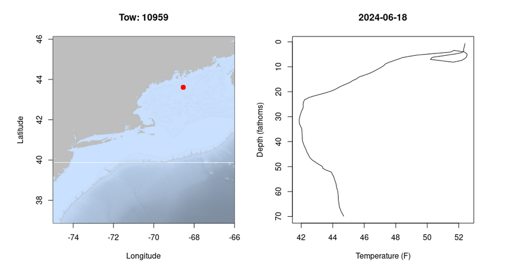
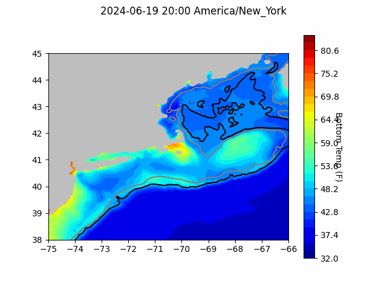
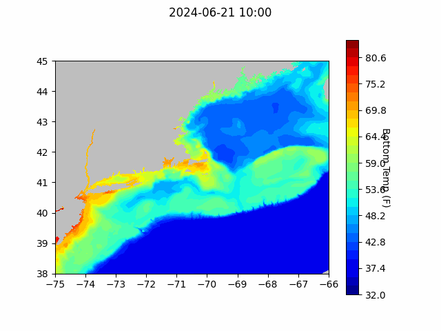
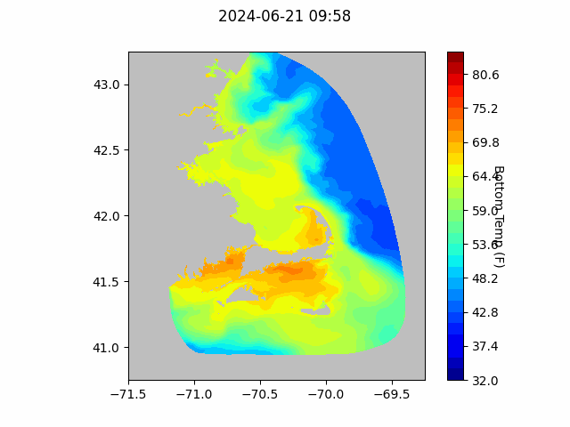

```{r setup, include=FALSE}
knitr::opts_chunk$set(echo = TRUE)
library(marmap)
library(rstudioapi)
source("/home/george/Documents/emolt_project_management/WeeklyUpdates/forecast_check/R/emolt_download.R")
data=emolt_download(days=7)
```

<center> 

<font size="5"> *eMOLT Update `r Sys.Date()` * </font>

</center>

### Weekly Recap 


This week, the eMOLT fleet recorded `r length(unique(data$tow_id))` tows of sensorized fishing gear.

Things are definitely warming up out there. Up in the Gulf of Maine, bottom temps remain in the mid 40s, but surface temps off the Mid-Coast are up into the low 50s. 



On the shelf south of New England, bottom temps are in the mid-50s and surface temps are up into the mid-60s. The same was true south of Long Island, although moving further west, surface temperatures started to drop closer to 60 and bottom temperatures dropped into the upper 40s and low 50s.

Next week, we'll be working with fixed gear boats on the South Shore and Cape Cod to start deploying Dissolved Oxygen sensors for the summer season. 

### Thin shelled clams

For those of you involved in the surfclam / ocean quahog fishery, if you run into any sets of clams with brittle shells, please consider sharing the location and some samples with Dr. Daphne Munroe and her team at Rutgers University. They are researching shell strength of these animals and how it relates to environmental conditions. Dr. Munroe's lab can cover the cost of shipping frozen clams to their lab. Please reach out to George or Dr. Munroe (*dmunroe@hsrl.rutgers.edu*) directly for more information. 

### Gliders

In case people are interested, another source of in-situ data for the Mid Atlantic is available through the Rutgers University Center for Ocean Observing Leadership. They currently have two gliders deployed on the shelf east of New Jersey. You can see their tracks [here](https://marine.rutgers.edu/cool/data/gliders/#). You can also see glider measurements of oxygen, temperature, salinity, chlorophyll a and more [here](https://marine.rutgers.edu/cool/data/gliders/deployments/deployment.php?deployment=maracoos_05-20240619T1716) and [here](https://marine.rutgers.edu/cool/data/gliders/deployments/deployment.php?deployment=ru29-20240419T1430). Click on the plots to make them bigger. 

### System Hardware Upgrade List

The following vessels remain on our list for hardware upgrades. If you aren't on the list and think you should be, please reach out. 

>
 - F/V Brooke C *
 - F/V Devocean
 - F/V Excalibur
 - F/V Kaitlyn Victoria
 - F/V Kyler C
 - F/V Linda Marie
 - F/V Nathaniel Lee *
 - F/V Noella C
 - F/V Resolve
 - F/V Sao Paulo
 - F/V Sea Watcher I
 - F/V Tom Slaughter
 - F/V Virginia Marie
 - F/V Virginia Marise

### Bottom Temperature Forecasts

#### Doppio 

Doppio comparisons are back this week. The forecasts appear to be performing well out on Georges, along the Maine coast, and south of Long Island. However, Cape Cod Bay and the shelf break south of New England presented some problems last week. Observations from Cape Cod Bay were several degrees cooler than predicted, and observations from the shelf break were several degrees warmer than predicted. 




#### Northeast Coastal Ocean Forecast System





### Announcements

- The Woods Hole Science Stroll is taking place on August 10, 2024 in Woods Hole, MA from 10 am to 3 pm. Many of the labs in Woods Hole will have hands on science exhibits and several research vessels will be open for tours. The event is free and family friendly; you can learn more [here](https://www.fisheries.noaa.gov/event/2024-woods-hole-science-stroll-noaa-fisheries). 

- The [Saltonstall Kennedy Grant Competition](https://www.fisheries.noaa.gov/grant/saltonstall-kennedy-grant-competition) is open until July 23, 2024 with a maximum award amount of $500,000.  

- NOAA Fisheries is accepting public comment on the updated "Ecosystem Based Fisheries Management Road Map" until July 31, 2024. The Road Map can be downloaded [here](https://www.fisheries.noaa.gov/resource/document/ecosystem-based-fisheries-management-road-map-update) and comments can be sent to nmfs.ebfm.roadmap@noaa.gov

- On April 30, 2024, BOEM announced its proposal for a first offshore wind energy auction in the Gulf of Maine and an accompanying a 60-day public comment period (comments due by July 1, 2024). Public comments can be submitted [here](https://www.regulations.gov/document/BOEM-2024-0026-0001). Further information about the energy auction as well as in-person and virtual public hearing scheduled for May and June of 2024 can be found [here](https://www.boem.gov/renewable-energy/state-activities/maine/gulf-maine). 

All the best,

-George and JiM
