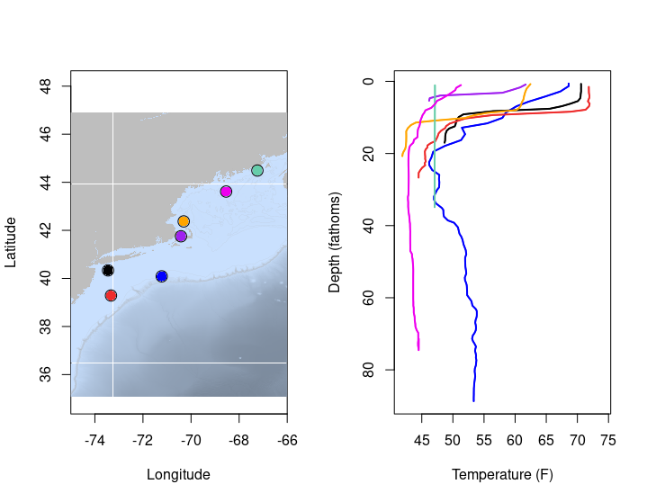
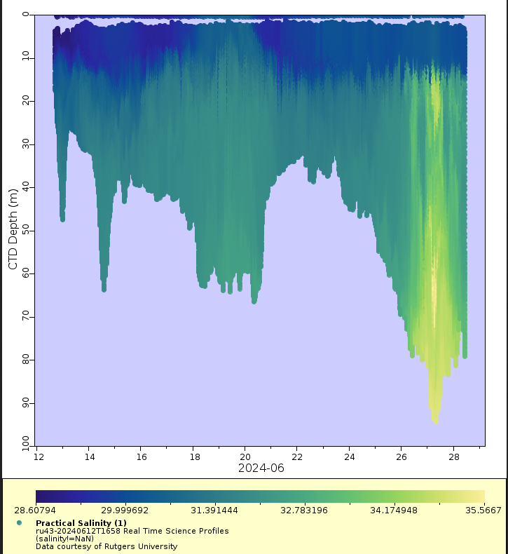
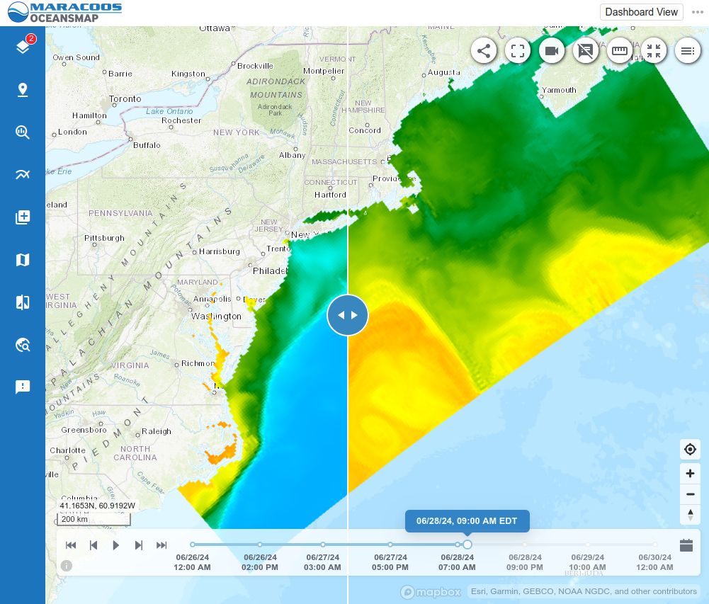
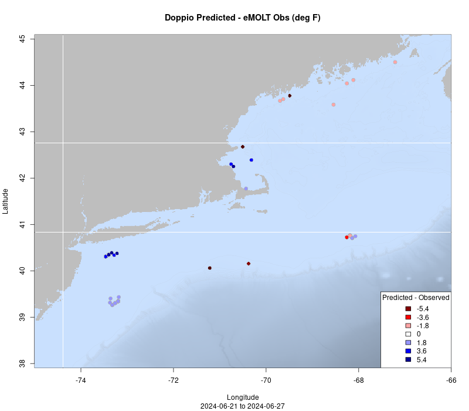
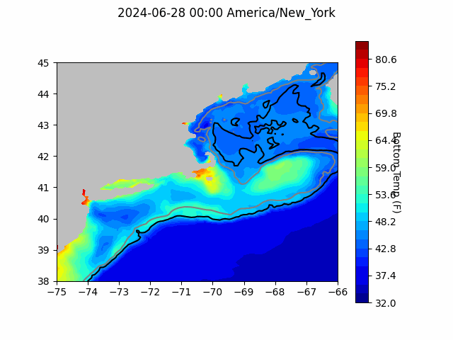
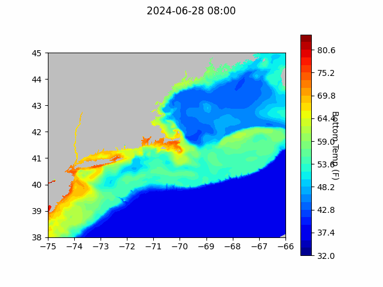
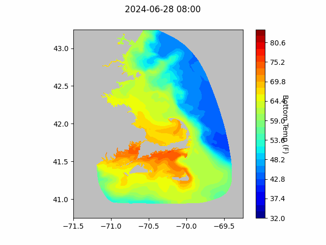

```{r setup, include=FALSE}
knitr::opts_chunk$set(echo = TRUE)
library(marmap)
library(rstudioapi)
source("/home/george/Documents/emolt_project_management/WeeklyUpdates/forecast_check/R/emolt_download.R")
data=emolt_download(days=7)
start_date=Sys.Date()-lubridate::days(7)
## Use the dates from above to create a URL for grabbing the data
full_data=read.csv(
    paste0(
      "http://54.208.149.221:8080/erddap/tabledap/eMOLT_RT.csvp?tow_id%2Csegment_type%2Ctime%2Clatitude%2Clongitude%2Cdepth%2Ctemperature%2Csensor_type&segment_type=%22Fishing%22&time%3E=",
      lubridate::year(start_date),
      "-",
      lubridate::month(start_date),
      "-",
      lubridate::day(start_date),
      "T00%3A00%3A00Z&time%3C=",
      lubridate::year(Sys.Date()),
      "-",
      lubridate::month(Sys.Date()),
      "-",
      lubridate::day(Sys.Date()),
      "T12%3A02%3A43Z"
    )
  )
sensor_time=0
for(tow in unique(full_data$tow_id)){
  x=subset(full_data,full_data$tow_id==tow)
  sensor_time=sensor_time+difftime(max(x$time..UTC.),units='hours',min(x$time..UTC.))
}
```

<center> 

<font size="5"> *eMOLT Update `r Sys.Date()` * </font>

</center>

### Weekly Recap 

This week, the eMOLT fleet recorded `r length(unique(data$tow_id))` tows of sensorized fishing gear totaling `r as.numeric(sensor_time)` sensor hours underwater.

Most areas covered by the eMOLT fleet now show seasonal **thermoclines** around 10 fathoms. The only exceptions can be found Downeast (teal profile), where the surface waters remain below 50 degrees. 

> *A [thermocline](https://oceanservice.noaa.gov/facts/thermocline.html) is the transition layer between warmer water at the ocean's surface and cooler water below.* 



A **[halocline](https://www.americanoceans.org/facts/what-is-halocline/)** around 2 fathoms thick is also visible in some of Rutgers glider data east of New Jersey from the last few weeks. In the plot below, you can see freshwater near the surface and saltier water down below.  

> *A halocline is a vertical gradient of salinity within a body of water.* 



These differences in temperature and salinity indicate that the Mid-Atlantic is setting up to be strongly stratified again this summer. 

### New data visualization from MARACOOS and the Doppio team

The [Mid Atlantic Regional Association Coastal Ocean Observing System (MARACOOS)](https://maracoos.org/) and the Doppio forecast team at Rutgers have made a new data visualization product available [here](https://oceansmap.maracoos.org/?permalink=N4IgtghgDgwhYFMBOEQC5QGMEDsAuy6oANjgOboC0A7AIwB0tAbAJwAs1ArOy7WwEwBmNgBoQxCHnSCAHPS7VB3TioAM1DYIC+YgF4B7fWHScxAIwQQkAS3LpVYqNbyYAFvZ3hoAZTwBPYgQiEGsAE3QQK0wAcWsAZwAVfSh9MhQoV2tMEDEceCC0ECSUtOhM7LE8VwBXMDM862II1zw8KDi0AHpOuOQAN2R6KLJ4-RxiWwR6TCNO4fjOpAQ4vB7+rOXOgHV9JGJQgH1i-QOAWWhO86hvfuROvEaETtVn55yQFYCC0AGkOOsxugZGIyMQ-Bk4hFIFAzPoAB5dToAMzGeDinWhsLhnWAKPwKwgmAA1locShyAgtPQYUj3nF9NUkNhIRgQHhkql0uVgv4oAUQCgVoRKo8WQBtEAtNodbq9JC-IZMkb08aTaazebopYrNbyjbonZ7Q7HM4XK43eV3B6BHG6UnAPz2uFaEAAXRFgW81l0BX4nCYYkkeBsZmqD0BhQAonEbCIAATRKxgWzx6KRgBCMAA8vGAHJZgCCBbjueiABEYPGIDhQnH9FVkHGZvgQ2HdpCtJ4JH5kOLQGEIuySlysu9efzBQQkHSGUz+UPOWVR2JkzgDEZ7CuIHD18Y0Px+FpXZ2t1AAApIfQAKwQmHDOChyEwkl270wjKW+CuCWsiCFUAifhVH4NhKFUJhKH4GQEloQQ0FUVR4NUegENUAAtd5oR-P8CAAtBBCYVCENPbCEAMHB+QLRAbGfTpcwQAB3A4AE1diJTDoFI-8ACVqzIAoJSAkCwIg-gmASVQ2CQpCUIQjCxCE0DwMoQRVAkqSEJk1CMPdEBqhwZxvD8IU93ABBg2XLwoAAGQgHs-mCGYIBWCYKJZftwkKJyXMmSFKnBfl9F+btKFCgY71fMRelaWwyHcrs7MIVkwlwB4kWsJKQG8vBXOWMdnECCIYH0ZycsmN9JAQMhdgy8UspKnyKLdTxrWWABVPYCyQFA-HQCUpXaRF9Gwas4mheg4kEIZIHIiAGLidUwHuUVOmy3L0WAO0cWdHFHWpMxaV0-TrAAR2qBAAElQgAMQy-YIizdMAClIxgBILrLEBPAQUI4gOUJkicE4CDAPkUDwRlvhCTyQB+v6AagIGDhBsHJEhscAoiZ88AgYhUlCyhsuhOlzIech4u+37-sBgEDlhVojGRhBQeQNGlmCAdCjh6nEdp+n2TAJmWfB9H-L5LHJFx-HQqJ6ASZi8miE7Tx6SQAhQls+yPrq7mEaRlHWYh9mxF1mmTn5xmDZF436tK9a3TEUJJbgHG8bIW7iCnYIVhsOxCi+sQZlBqwEEjPIzECTzg3OwOjCgEOy0l4Jql6bxXBD0JSPQaOEDEFOEDTjPI0CPpJABB80BzvPU-TpZQl8L5s6QGOPgQQI7x+q4IjMZygjEGrUrLiMQF+B5nyaKLXH0BjvAmUIkqrj45+QM99BZZCmH4WhaBkWQEM31TOEEU8G8K5KYaiWJEg5UoMksvJEAiY5b+5SoajqBomkKAaZV1BVNTGLlRacwlQLG1KsOUfR9TbF2PsI4HJTRQEuD4W4SBlo2heJguk-gz4-F7OXIEIIwQQihNALEiI8RogxGQ+EOJKEEmJPack-EqQ0hnIyZkPIb4jmyKyccERJzCjZKKPqkpWiDVlKgxUmBlSALVEHEBMiwHLAgesZkMCjTwJSIg5B1xUHoKeJte0jptoul0q1L0Pp0B+gDJEVorZ7wRGjLGBMSYUwJgzNmPMhZiylgrFWGsdYGxICbKiBx7YvoJXsn2aGg5uFLgqGyTGhRBHTiirObAcThwJMwrYXcm4vA7kMHuA8R4TwgB7qnXY6tNbIG1qI02vNzb1gFkLVGRs+620anlXSQd45LG8NUn6tSkD1LQBKRp+tmbtNFl0sqbkHZWS4rhaQhEiKBw-Klb8v4VEIDwiARSIlILQVgtJBCsl0IcSgMsvZvEKSiMOcpMS6kznIW0u8R5EFVIvM0uc95x4xBnWQH4D2U53KRHiMjAKBw4i1EgEgXq4zdJxEyFAA4nMxS6QgJC8cMK4VWD8MjFAxI+rItReiw4wZCTsSRZ4TAxAU5ThGWMzFYhfj-AjLQLQQA). You can use the link to see the latest Doppio seawater temperature forecasts at the bottom and at the surface across the entire forecast region. A sliding arrow in the middle of the screen allows you to view bottom and surface side by side (see screenshot below). On the left hand side (bottom temps) you can see the Mid-Atlantic Cold Pool south of Long Island and on the right hand side (surface temps), you can see the Gulf Stream eddying south of Massachusetts.



### Teamwork is the lifeblood of eMOLT 

This week, we spent some time at the Sandwich Marina upgrading eMOLT systems and distributing dissolved oxygen loggers. Thanks to Denny, Capt. Tim of the F/V Virginia Marie, Capt. Tony of the F/V Miss Julie, and Capt. James of the F/V Trap Queen for your patience as we got your systems up and running. Thanks also to Noelle and Linus from the Commercial Fisheries Research Foundation for taking the time to meet with us so that we can streamline data collection systems on board vessels participating in both the eMOLT program and the CFRF Lobster / Jonah Crab Research Fleet. Finally, a big thanks to Owen and Tommy at the Center for Coastal Studies and Joaquim from Lowell Instruments. We got some new hardware out to the F/V Donna Marie and upgraded the software aboard the F/V Lisa Marie thanks to their efforts. 

### System Hardware Upgrade List

The following vessels remain on our list for hardware upgrades. If you aren't on the list and think you should be, please reach out. 

>
 - F/V Brooke C *
 - F/V Devocean
 - F/V Excalibur
 - F/V Kaitlyn Victoria
 - F/V Kyler C
 - F/V Linda Marie
 - F/V Nathaniel Lee *
 - F/V Noella C
 - F/V Resolve
 - F/V Sao Paulo
 - F/V Sea Watcher I
 - F/V Tom Slaughter
 - F/V Virginia Marise

### Bottom Temperature Forecasts

#### Doppio 

The Doppio bottom temp forecast performed well off the coast of Maine and east of New Jersey this week. Bottom temperatures were quite a bit cooler than forecasted just south of Long Island and in Massachusetts Bay. Temperatures were warmer than expected along the shelf break south of New England. 





#### Northeast Coastal Ocean Forecast System





### Announcements

- The Woods Hole Science Stroll is taking place on August 10, 2024 in Woods Hole, MA from 10 am to 3 pm. Many of the labs in Woods Hole will have hands on science exhibits and several research vessels will be open for tours. The event is free and family friendly; you can learn more [here](https://www.fisheries.noaa.gov/event/2024-woods-hole-science-stroll-noaa-fisheries). 

- The [Saltonstall Kennedy Grant Competition](https://www.fisheries.noaa.gov/grant/saltonstall-kennedy-grant-competition) is open until July 23, 2024 with a maximum award amount of $500,000.  

- NOAA Fisheries is accepting public comment on the updated "Ecosystem Based Fisheries Management Road Map" until July 31, 2024. The Road Map can be downloaded [here](https://www.fisheries.noaa.gov/resource/document/ecosystem-based-fisheries-management-road-map-update) and comments can be sent to nmfs.ebfm.roadmap@noaa.gov

- On April 30, 2024, BOEM announced its proposal for a first offshore wind energy auction in the Gulf of Maine and an accompanying a 60-day public comment period (comments due by July 1, 2024). Public comments can be submitted [here](https://www.regulations.gov/document/BOEM-2024-0026-0001). Further information about the energy auction as well as in-person and virtual public hearing scheduled for May and June of 2024 can be found [here](https://www.boem.gov/renewable-energy/state-activities/maine/gulf-maine). 

All the best,

-George and JiM
