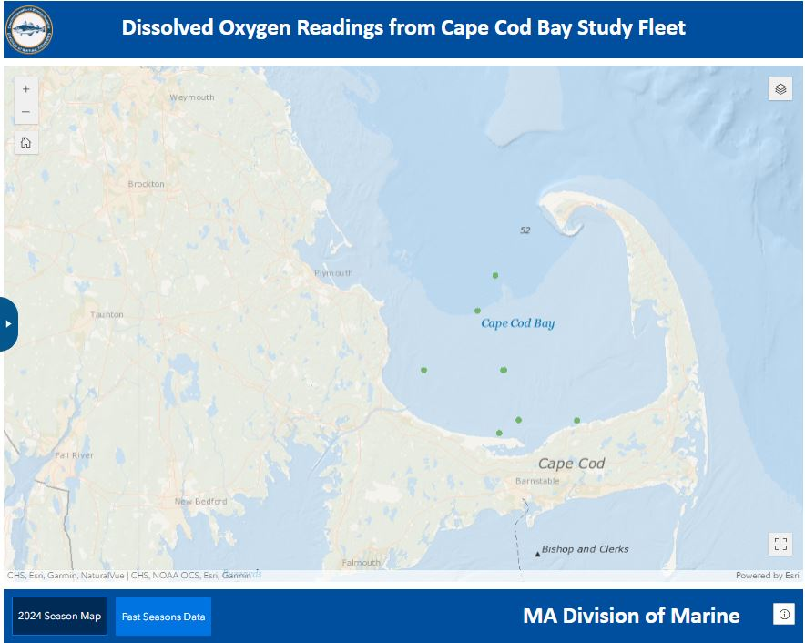

```{r setup, include=FALSE}
knitr::opts_chunk$set(echo = TRUE)
library(marmap)
library(rstudioapi)
if(Sys.info()["sysname"]=="Windows"){
  source("C:/Users/george.maynard/Documents/GitHubRepos/emolt_project_management/WeeklyUpdates/forecast_check/R/emolt_download.R")
} else {
  source("/home/george/Documents/emolt_project_management/WeeklyUpdates/forecast_check/R/emolt_download.R")
}

data=emolt_download(days=7)
start_date=Sys.Date()-lubridate::days(7)
## Use the dates from above to create a URL for grabbing the data
full_data=read.csv(
    paste0(
      "https://erddap.emolt.net/erddap/tabledap/eMOLT_RT.csvp?tow_id%2Csegment_type%2Ctime%2Clatitude%2Clongitude%2Cdepth%2Ctemperature%2Csensor_type&segment_type=%22Fishing%22&time%3E=",
      lubridate::year(start_date),
      "-",
      lubridate::month(start_date),
      "-",
      lubridate::day(start_date),
      "T00%3A00%3A00Z&time%3C=",
      lubridate::year(Sys.Date()),
      "-",
      lubridate::month(Sys.Date()),
      "-",
      lubridate::day(Sys.Date()),
      "T12%3A02%3A43Z"
    )
  )
sensor_time=0
for(tow in unique(full_data$tow_id)){
  x=subset(full_data,full_data$tow_id==tow)
  sensor_time=sensor_time+difftime(max(x$time..UTC.),units='hours',min(x$time..UTC.))
}
```

<center> 

<font size="5"> *eMOLT Update `r Sys.Date()` * </font>

</center>

### Weekly Recap 

This week, the eMOLT fleet recorded `r length(unique(data$tow_id))` tows of sensorized fishing gear totaling `r as.numeric(sensor_time)` sensor hours underwater.

First off, a huge congratulations to the UMaine field team led by Dr. Andrew Goode. Yesterday, they installed eMOLT systems on three new vessels up in Maine, and all three visits went off without a hitch. It's exciting to see everyone's efforts to standardize and streamline these installations pay off in more efficient dockside visits. Thanks to the UMaine team's work this week, we can now welcome the fishing vessels Aldebaren, Patience, and Lil More Tail to the eMOLT program. 

Thanks also to Captain Joe on the F/V Ryan Joseph, Captain Mike on the F/V Phyliss P, and Captain Phil on the F/V Charger for having us aboard this week. We're working hard to expand our dissolved oxygen monitoring efforts beyond Cape Cod Bay to meet requests from our industry partners and regional scientists. The Phyliss P and Ryan Joseph will provide coverage off the South Shore of Massachusetts, and we're hoping to add a few systems on the North Shore as funding allows. 

To allow easier access to these Dissolved Oxygen data, we are in the process of developing an online dashboard (similar to [Massachusetts DMF's Cape Cod Bay dashboard](https://experience.arcgis.com/experience/0d553dfc6c60487cb1f4d20b5366ee0b/page/Map-Page/)). It's not fully functional yet, as you can see from the chicken scratch below but currently the plan is to display DO data in an interactive map with buttons to allow users to select a timeframe of interest and filter the data by location. All locations displayed through this portal are rounded off to avoid showing exact fishing spots. If you have suggestions for how we can make these data visualizations more useful to you, please reach out to [George](george.maynard@noaa.gov).

.png)

### System Hardware Upgrade List

The following vessels remain on our list for hardware upgrades. If you aren't on the list and think you should be, please reach out. 

>
 - F/V Brooke C *
 - F/V Devocean
 - F/V Excalibur
 - F/V Kaitlyn Victoria
 - F/V Kyler C
 - F/V Linda Marie
 - F/V Nathaniel Lee *
 - F/V Noella C
 - F/V Resolve
 - F/V Sao Paulo
 - F/V Sea Watcher I
 - F/V Tom Slaughter
 - F/V Virginia Marise

### [Dissolved Oxygen in Cape Cod Bay](https://experience.arcgis.com/experience/0d553dfc6c60487cb1f4d20b5366ee0b/page/Map-Page/)
#### Courtesy of the Massachusetts Division of Marine Fisheries and the Massachusetts Lobstermen's Association

So far so good this season, with all sensors reporting oxygen values in the "normal" range over the last week.



### Bottom Temperature Forecasts

#### Doppio 

The Doppio bottom temperature forecast skewed high across much of the region last week with observations from the fishing grounds south of Long Island and in Massachusetts Bay much colder than predicted. Colder than expected temperatures in the Mid-Atlantic seem to be a theme, with ocean observing systems at Rutgers reporting bottom temps 4 degrees C (~ 7 degrees F) colder than normal. In contrast, observations from Nantucket Sound and off Cape Ann were several degrees warmer than predicted. Observations from coastal Maine and down near Hudson Canyon were pretty close to predictions.


#### Northeast Coastal Ocean Forecast System


### Cooperative Research Opportunities

- The Atlantic States Marine Fisheries Commission is soliciting for five survey vessels for the pilot hook and line survey in Fall 2024 and Spring 2025. The deadline for proposals is midnight EST on August 5, 2024. The Request for Proposals can be found [here](https://asmfc.org/files/RFPs/FY2025_RFP_OffshoreWindPilotHL_Surveys.pdf). For questions about the RFP, please contact [Jason Morson](jason.morson@noaa.gov) at the Northeast Fisheries Science Center.

- There are two openings for new vessels in the Study Fleet. The full solicitation can be found [here](https://sam.gov/opp/25f452f4ea2e4a6696d1262bbc9829ed/view). These new vessels will collect high resolution catch, effort, and environmental data to address science and management needs for the longfin squid, shortfin squid,mackerel, butterfish, scup, black sea bass, summer flounder, whiting, and haddock fisheries. The deadline for quotes is July 31st, and the vessel owner must have an account in the System for Award Management (SAM.gov). Setting up a SAM account can be an onerous process, so don't leave this until the last minute. If you have questions, please contact [Katie Burchard](katie.burchard@noaa.gov) at the Northeast Fisheries Science Center. 

### Announcements

- Massachusetts Division of Marine Fisheries and Office of Coastal Zone Management are hosting an information session for BOEM to hear from the Outer Cape communities on the proposed offshore wind leasing activities in the Gulf of Maine, including the recently published Proposed Sale Notice and Draft Environmental Assessment. This meeting is scheduled for July 17, 2024 from 6-8PM at the Four Points Sheraton in Eastham ([3800 State Highway, Eastham, MA 02642](https://maps.app.goo.gl/bznqHfaJKbf7VU7X7)).

- The [Saltonstall Kennedy Grant Competition](https://www.fisheries.noaa.gov/grant/saltonstall-kennedy-grant-competition) is open until July 23, 2024 with a maximum award amount of $500,000.  

- NOAA Fisheries is accepting public comment on the updated "Ecosystem Based Fisheries Management Road Map" until July 31, 2024. The Road Map can be downloaded [here](https://www.fisheries.noaa.gov/resource/document/ecosystem-based-fisheries-management-road-map-update) and comments can be sent to nmfs.ebfm.roadmap@noaa.gov

- The Woods Hole Science Stroll is taking place on August 10, 2024 in Woods Hole, MA from 10 am to 3 pm. Many of the labs in Woods Hole will have hands on science exhibits and several research vessels will be open for tours. The event is free and family friendly; you can learn more [here](https://www.fisheries.noaa.gov/event/2024-woods-hole-science-stroll-noaa-fisheries). 

All the best,

-George and JiM
