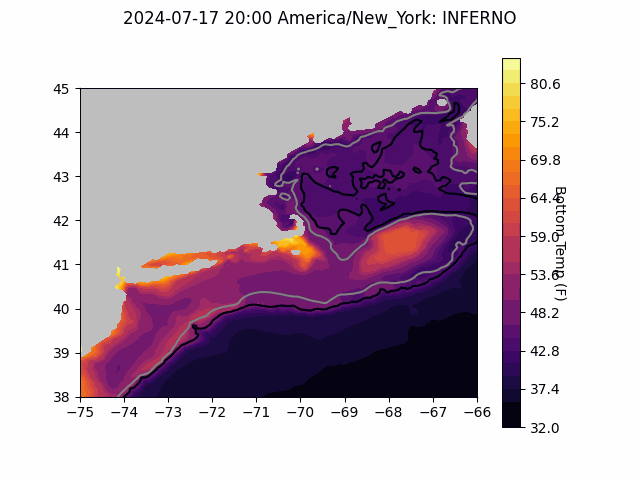
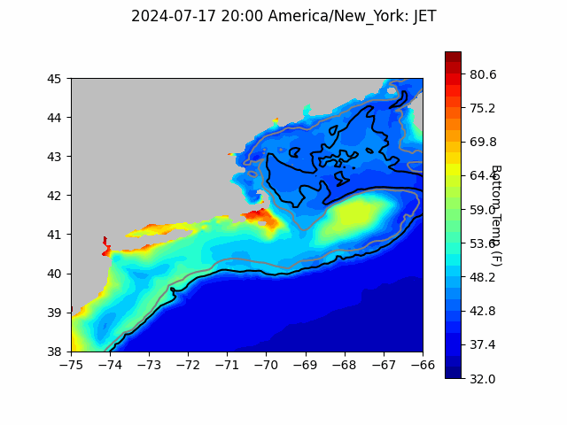
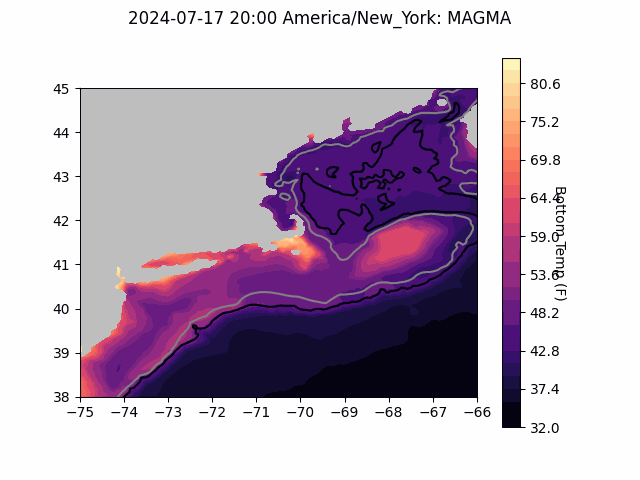
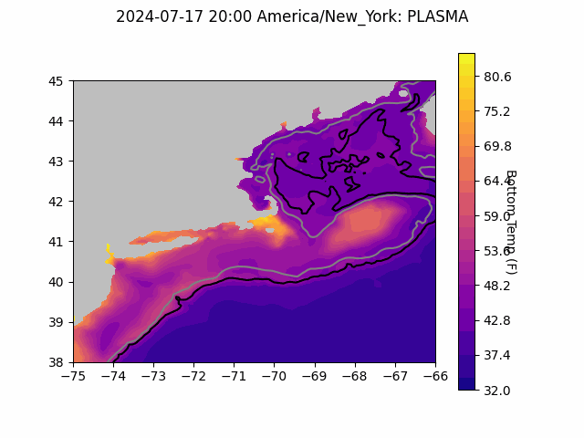
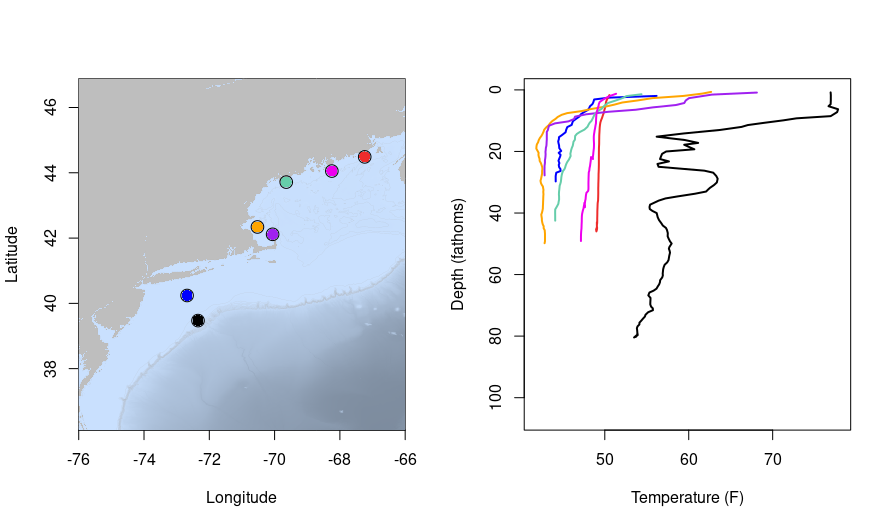
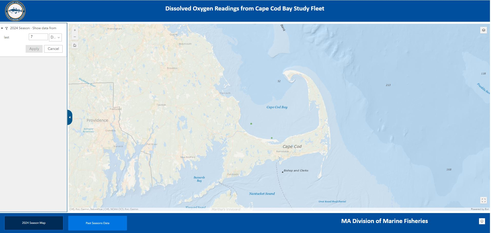
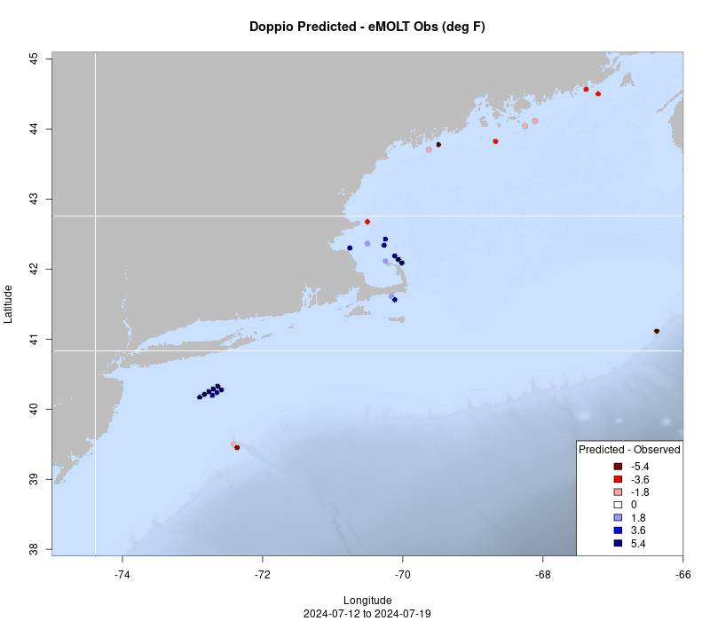
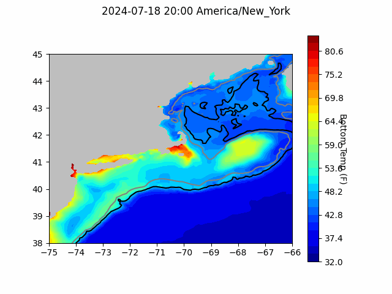
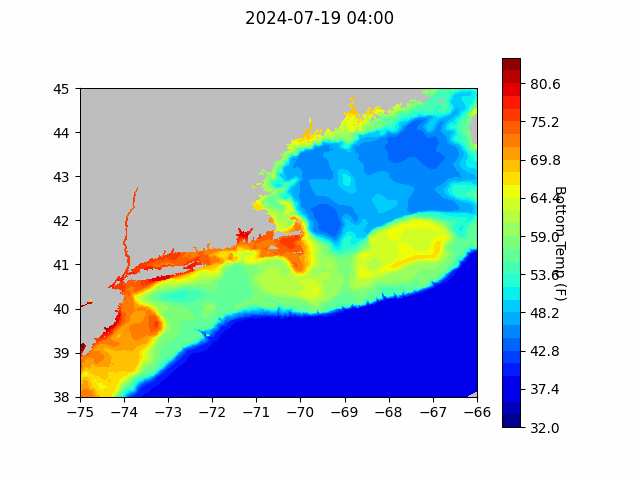
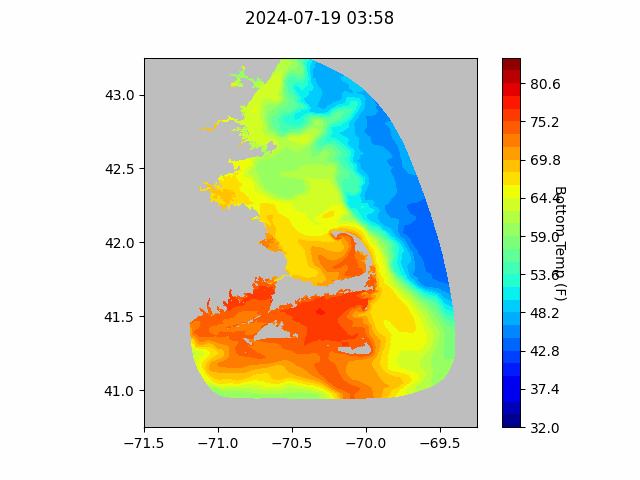

```{r setup, include=FALSE}
knitr::opts_chunk$set(echo = TRUE)
library(marmap)
library(rstudioapi)
if(Sys.info()["sysname"]=="Windows"){
  source("C:/Users/george.maynard/Documents/GitHubRepos/emolt_project_management/WeeklyUpdates/forecast_check/R/emolt_download.R")
} else {
  source("/home/george/Documents/emolt_project_management/WeeklyUpdates/forecast_check/R/emolt_download.R")
}

data=emolt_download(days=7)
start_date=Sys.Date()-lubridate::days(7)
## Use the dates from above to create a URL for grabbing the data
full_data=read.csv(
    paste0(
      "https://erddap.emolt.net/erddap/tabledap/eMOLT_RT.csvp?tow_id%2Csegment_type%2Ctime%2Clatitude%2Clongitude%2Cdepth%2Ctemperature%2Csensor_type&segment_type=%22Fishing%22&time%3E=",
      lubridate::year(start_date),
      "-",
      lubridate::month(start_date),
      "-",
      lubridate::day(start_date),
      "T00%3A00%3A00Z&time%3C=",
      lubridate::year(Sys.Date()),
      "-",
      lubridate::month(Sys.Date()),
      "-",
      lubridate::day(Sys.Date()),
      "T12%3A02%3A43Z"
    )
  )
sensor_time=0
for(tow in unique(full_data$tow_id)){
  x=subset(full_data,full_data$tow_id==tow)
  sensor_time=sensor_time+difftime(max(x$time..UTC.),units='hours',min(x$time..UTC.))
}
```

<center> 

<font size="5"> *eMOLT Update `r Sys.Date()` * </font>

</center>

### Weekly Recap 

This week, the eMOLT fleet recorded `r length(unique(data$tow_id))` tows of sensorized fishing gear totaling `r as.numeric(sensor_time)` sensor hours underwater.

Thanks this week to Capt. Dave on the F/V Grace Sarah for agreeing to be our 
guinea pig for the upgrade to v 4.0 of the deckbox software. We rolled the upgrade out yesterday afternoon with some help from the team at Lowell Instruments. We'll monitor the Grace Sarah's system over the next few days to make sure it all works as intended and hopefully start to roll the update out to the rest of the fleet over the next week. 

One of the neat features of v 4.0 is that it will display bottom temperature forecast gifs, similar to the gifs that are included in this email, but the box updates every time a new forecast comes out. In order to make those gifs more accessible to people who are colorblind, we are trying out some new color schemes. Check them out below and let us know if you have an opinion. All the plots show the same data, just with different colors (named above the plot)

#### Inferno



#### Jet



#### Magma



#### Plasma



### System Hardware Upgrade List

The following vessels remain on our list for hardware upgrades. If you aren't on the list and think you should be, please reach out. 

>
 - F/V Brooke C *
 - F/V Excalibur
 - F/V Kaitlyn Victoria
 - F/V Kyler C
 - F/V Linda Marie
 - F/V Nathaniel Lee *
 - F/V Noella C
 - F/V Resolve
 - F/V Sao Paulo
 - F/V Sea Watcher I
 - F/V Tom Slaughter
 - F/V Virginia Marise

### Profiles from Last Week

Here are some temperature profiles collected by eMOLT participants last week. Interestingly, the coldest bottom temperatures in the region covered by eMOLT vessels were observed off the South Shore of Massachusetts (orange profile) and the backside of Cape Cod (purple profile).



### [Dissolved Oxygen in Cape Cod Bay](https://experience.arcgis.com/experience/0d553dfc6c60487cb1f4d20b5366ee0b/page/Map-Page/)
#### Courtesy of the Massachusetts Division of Marine Fisheries and the Massachusetts Lobstermen's Association

So far so good this season, with all sensors reporting oxygen values in the "normal" range over the last week.



### Bottom Temperature Forecasts

#### Doppio 





#### Northeast Coastal Ocean Forecast System





### Cooperative Research Opportunities

- The Atlantic States Marine Fisheries Commission is soliciting for five survey vessels for the pilot hook and line survey in Fall 2024 and Spring 2025. The deadline for proposals is midnight EST on August 5, 2024. The Request for Proposals can be found [here](https://asmfc.org/files/RFPs/FY2025_RFP_OffshoreWindPilotHL_Surveys.pdf). For questions about the RFP, please contact [Jason Morson](jason.morson@noaa.gov) at the Northeast Fisheries Science Center.

- There are two openings for new vessels in the Study Fleet. The full solicitation can be found [here](https://sam.gov/opp/25f452f4ea2e4a6696d1262bbc9829ed/view). These new vessels will collect high resolution catch, effort, and environmental data to address science and management needs for the longfin squid, shortfin squid,mackerel, butterfish, scup, black sea bass, summer flounder, whiting, and haddock fisheries. The deadline for quotes is July 31st, and the vessel owner must have an account in the System for Award Management (SAM.gov). Setting up a SAM account can be an onerous process, so don't leave this until the last minute. If you have questions, please contact [Katie Burchard](katie.burchard@noaa.gov) at the Northeast Fisheries Science Center. 

### Announcements

- The [Saltonstall Kennedy Grant Competition](https://www.fisheries.noaa.gov/grant/saltonstall-kennedy-grant-competition) is open until July 23, 2024 with a maximum award amount of $500,000.  

- NOAA Fisheries is accepting public comment on the updated "Ecosystem Based Fisheries Management Road Map" until July 31, 2024. The Road Map can be downloaded [here](https://www.fisheries.noaa.gov/resource/document/ecosystem-based-fisheries-management-road-map-update) and comments can be sent to nmfs.ebfm.roadmap@noaa.gov

- The Woods Hole Science Stroll is taking place on August 10, 2024 in Woods Hole, MA from 10 am to 3 pm. Many of the labs in Woods Hole will have hands on science exhibits and several research vessels will be open for tours. The event is free and family friendly; you can learn more [here](https://www.fisheries.noaa.gov/event/2024-woods-hole-science-stroll-noaa-fisheries). 

All the best,

-George and JiM
