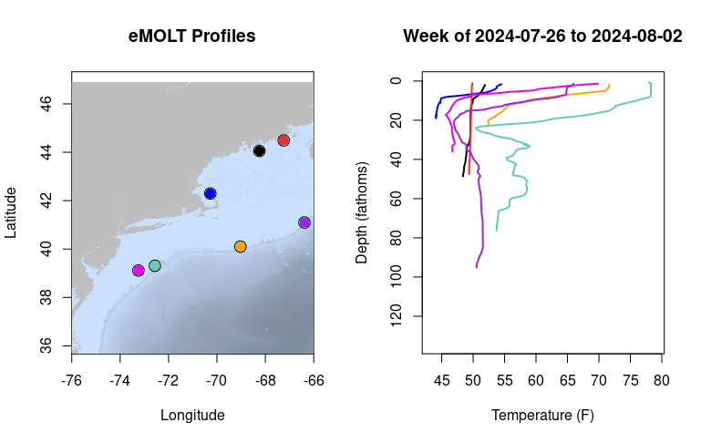
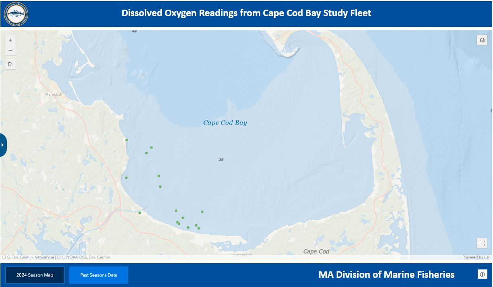
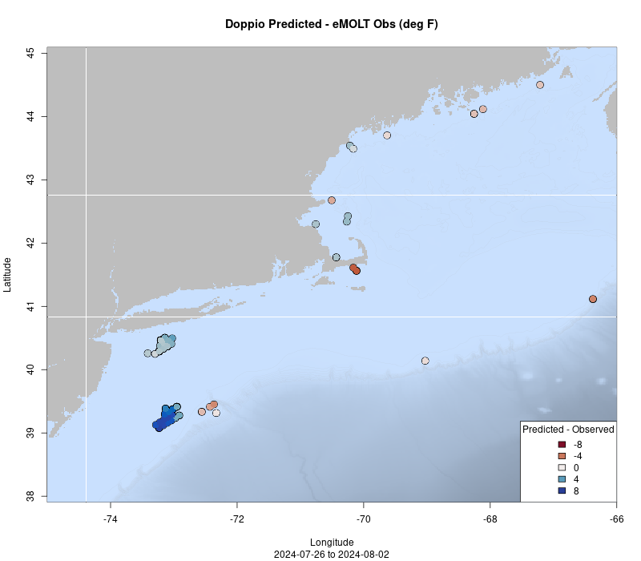
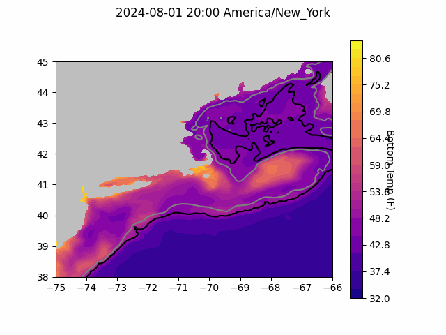
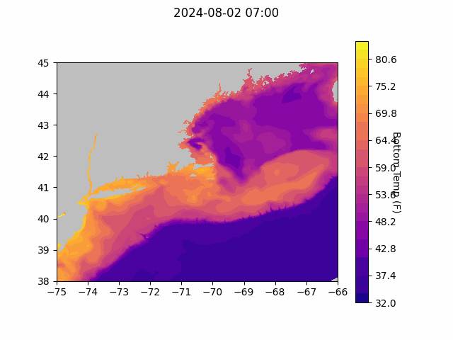
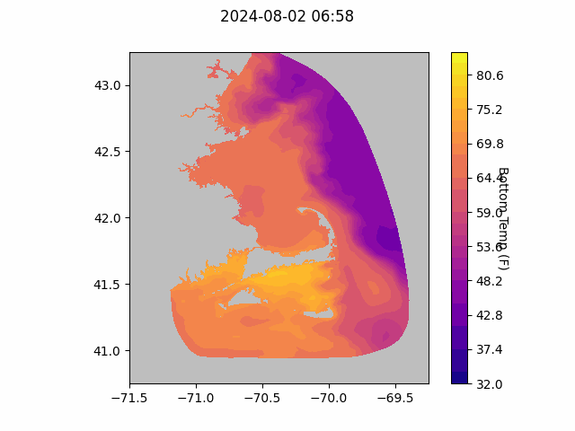

```{r setup, include=FALSE}
knitr::opts_chunk$set(echo = TRUE)
library(marmap)
library(rstudioapi)
if(Sys.info()["sysname"]=="Windows"){
  source("C:/Users/george.maynard/Documents/GitHubRepos/emolt_project_management/WeeklyUpdates/forecast_check/R/emolt_download.R")
} else {
  source("/home/george/Documents/emolt_project_management/WeeklyUpdates/forecast_check/R/emolt_download.R")
}

data=emolt_download(days=7)
start_date=Sys.Date()-lubridate::days(7)
## Use the dates from above to create a URL for grabbing the data
full_data=read.csv(
    paste0(
      "https://erddap.emolt.net/erddap/tabledap/eMOLT_RT.csvp?tow_id%2Csegment_type%2Ctime%2Clatitude%2Clongitude%2Cdepth%2Ctemperature%2Csensor_type&segment_type=%22Fishing%22&time%3E=",
      lubridate::year(start_date),
      "-",
      lubridate::month(start_date),
      "-",
      lubridate::day(start_date),
      "T00%3A00%3A00Z&time%3C=",
      lubridate::year(Sys.Date()),
      "-",
      lubridate::month(Sys.Date()),
      "-",
      lubridate::day(Sys.Date()),
      "T12%3A02%3A43Z"
    )
  )
sensor_time=0
for(tow in unique(full_data$tow_id)){
  x=subset(full_data,full_data$tow_id==tow)
  sensor_time=sensor_time+difftime(max(x$time..UTC.),units='hours',min(x$time..UTC.))
}
```

<center> 

<font size="5"> *eMOLT Update `r Sys.Date()` * </font>

</center>

### Weekly Recap 

This week, the eMOLT fleet recorded `r length(unique(data$tow_id))` tows of sensorized fishing gear totaling `r as.numeric(sensor_time)` sensor hours underwater. The warmest recorded bottom temperature was `r round(max(full_data$temperature..degree_C.)*9/5+32,1)` in Nantucket Sound in approximately `r round(full_data[which(full_data$temperature..degree_C.==max(full_data$temperature..degree_C.)),"depth..m."]*0.546807,0)` fathoms and the coldest recorded bottom temperature was `r round(min(full_data$temperature..degree_C.)*9/5+32,1)` on Stellwagen Bank in approximately `r round(full_data[which(full_data$temperature..degree_C.==min(full_data$temperature..degree_C.)),"depth..m."]*0.546807,0)[1]` fathoms. Below, you can see a few temperature profiles of interest across the region from the last week. Surface waters are unsurprisingly coolest in Eastern Maine (red and black) and warmest along the shelf break (purple, orange, teal, and pink).



We continued upgrading deckboxes to the new "Green Boat" software this week, with the F/Vs Bookie, Donna Marie, Ryan Joseph, Resolve, and Phyliss P coming online with the new software. We've also been working on a few additional proposals with our collaborators at the University of Maine and Woods Hole Oceanographic Institution. These proposals would provide funding to maintain the existing eMOLT network (hardware maintenance) and apply the eMOLT dataset in new ways. 

### Dissolved Oxygen Dashboard Live (sort of)

Our new Dissolved Oxygen dashboard is available [here](https://connect.fisheries.noaa.gov/content/512fdb3f-c26f-41b2-b12d-2ed073c68086/). For now, it allows users to filter observations by date and location. Observation coordinates are rounded to 1/100th of a degree, so they are within ~0.25 nautical miles of the actual fishing location, but actual fishing locations are NOT displayed. We've gotten some feedback from colleagues at Maine DMR and Massachusetts DMF already, but if you have ideas to make this dashboard better, please reach out. Future plans include:

- Adding a Fahrenheit scale to the temperature plot
- Adding colors to the Dissolved Oxygen plot
- Adding a depth filter using GEBCO bathymetric data (since there are no pressure sensors on the DOT loggers)

Perhaps the biggest lift that remains though is ironing out the data pipeline on the back end so that this year's data start flowing in. Currently, the dashboard only displays a subset of eMOLT collected DO data from last year. We'll keep you up to date as we move forward with that. 

### Save the Date

We have officially booked [The Westin Portland Harborview](https://maps.app.goo.gl/TRsvzYP6AogdDMXW9) for the 2025 Northeast Cooperative Research Summit, which will be held on January 28th, 2025! Please mark your calendars. More information including registration and lodging info and a schedule of topics will be coming soon. We look forward to seeing you there!

### System Hardware Upgrade List

The following vessels remain on our list for hardware upgrades. If you aren't on the list and think you should be, please reach out. *Note that this list is different from our new install queue.*

>
 - F/V Brooke C *
 - F/V Excalibur
 - F/V Kaitlyn Victoria
 - F/V Kyler C
 - F/V Linda Marie
 - F/V Nathaniel Lee *
 - F/V Noella C
 - F/V Sao Paulo
 - F/V Sea Watcher I
 - F/V Tom Slaughter
 - F/V Virginia Marise

### [Dissolved Oxygen in Cape Cod Bay](https://experience.arcgis.com/experience/0d553dfc6c60487cb1f4d20b5366ee0b/page/Map-Page/)
#### Courtesy of the Massachusetts Division of Marine Fisheries and the Massachusetts Lobstermen's Association

So far so good this season, with all sensors reporting oxygen values in the "normal" range over the last week.



### Bottom Temperature Forecasts

#### Doppio 

Over the last week, the Doppio model performed pretty well through most of the region. Observations south of Long Island and in Massachusetts Bay trended slightly cooler than predictions, while observations along the Maine coast trended slightly warmer than the forecast. Along the shelf break, observations were slightly warmer but generally close to the forecast model. Observations east of New Jersey were several degrees cooler than predicted, and observations in Nantucket sound were several degrees warmer than predicted. 





#### Northeast Coastal Ocean Forecast System





### Cooperative Research Opportunities

- The Atlantic States Marine Fisheries Commission is soliciting for five survey vessels for the pilot hook and line survey in Fall 2024 and Spring 2025. The deadline for proposals is midnight EST on August 5, 2024. The Request for Proposals can be found [here](https://asmfc.org/files/RFPs/FY2025_RFP_OffshoreWindPilotHL_Surveys.pdf). For questions about the RFP, please contact [Jason Morson](jason.morson@noaa.gov) at the Northeast Fisheries Science Center.


### Announcements

- The Woods Hole Science Stroll is taking place on August 10, 2024 in Woods Hole, MA from 10 am to 3 pm. Many of the labs in Woods Hole will have hands on science exhibits and several research vessels will be open for tours. The event is free and family friendly; you can learn more [here](https://www.fisheries.noaa.gov/event/2024-woods-hole-science-stroll-noaa-fisheries). 

All the best,

-George and JiM
