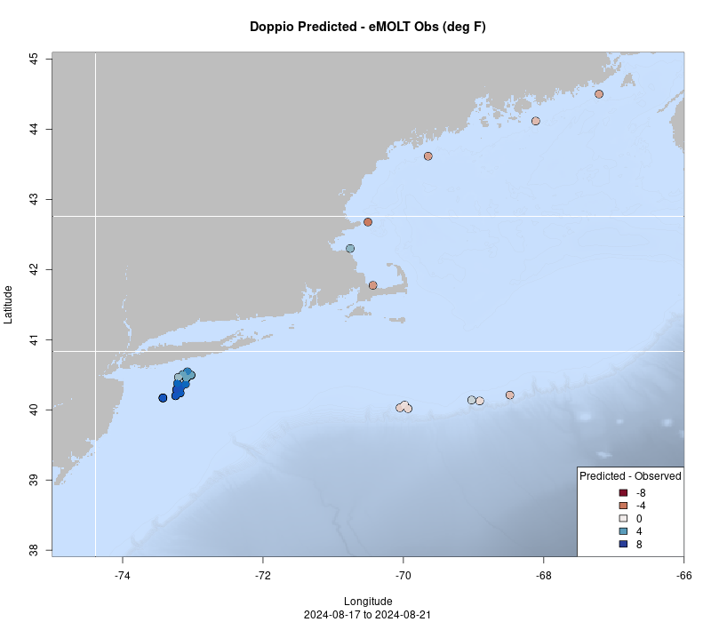
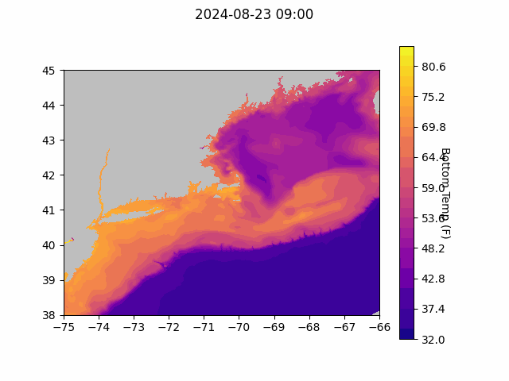
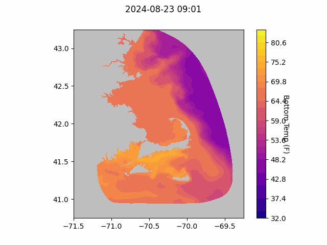

```{r setup, include=FALSE}
knitr::opts_chunk$set(echo = TRUE)
library(marmap)
library(rstudioapi)
if(Sys.info()["sysname"]=="Windows"){
  source("C:/Users/george.maynard/Documents/GitHubRepos/emolt_project_management/WeeklyUpdates/forecast_check/R/emolt_download.R")
} else {
  source("/home/george/Documents/emolt_project_management/WeeklyUpdates/forecast_check/R/emolt_download.R")
}

data=emolt_download(days=7)
start_date=Sys.Date()-lubridate::days(7)
## Use the dates from above to create a URL for grabbing the data
full_data=read.csv(
    paste0(
      "https://erddap.emolt.net/erddap/tabledap/eMOLT_RT.csvp?tow_id%2Csegment_type%2Ctime%2Clatitude%2Clongitude%2Cdepth%2Ctemperature%2Csensor_type&segment_type=%22Fishing%22&time%3E=",
      lubridate::year(start_date),
      "-",
      lubridate::month(start_date),
      "-",
      lubridate::day(start_date),
      "T00%3A00%3A00Z&time%3C=",
      lubridate::year(Sys.Date()),
      "-",
      lubridate::month(Sys.Date()),
      "-",
      lubridate::day(Sys.Date()),
      "T12%3A02%3A43Z"
    )
  )
sensor_time=0
for(tow in unique(full_data$tow_id)){
  x=subset(full_data,full_data$tow_id==tow)
  sensor_time=sensor_time+difftime(max(x$time..UTC.),units='hours',min(x$time..UTC.))
}
```

<center> 

<font size="5"> *eMOLT Update `r Sys.Date()` * </font>

</center>

### Weekly Recap 

The drifter program has been active these last few months with about a dozen drifters reporting from Southern New England Waters.
Thanks to eMOLT participant Joe Barrows, for example, there is one unit that has come down into Cape Cod Bay this week. Tracks for the past month can always be seen as [https://studentdrifters.org/tracks/drift_X.html](https://studentdrifters.org/tracks/drift_X.html)  
and an animation of these tracks for the past month can always be seen at [https://gisviz.mit.edu/marine-debris](https://gisviz.mit.edu/marine-debris).

  
This week, the eMOLT fleet recorded `r length(unique(data$tow_id))` tows of sensorized fishing gear totaling `r as.numeric(sensor_time)` sensor hours underwater. The warmest recorded bottom temperature was `r round(max(full_data$temperature..degree_C.)*9/5+32,1)` in Nantucket Sound in approximately `r round(full_data[which(full_data$temperature..degree_C.==max(full_data$temperature..degree_C.)),"depth..m."]*0.546807,0)` fathoms and the coldest recorded bottom temperature was `r round(min(full_data$temperature..degree_C.)*9/5+32,1)` on the eastern edge of Stellwagen Bank in approximately `r round(full_data[which(full_data$temperature..degree_C.==min(full_data$temperature..degree_C.)),"depth..m."]*0.546807,0)[1]` fathoms. Below, you can see a few temperature profiles of interest across the region from the last week. Surface waters are unsurprisingly coolest in Eastern Maine (orange and gold) where there is no stratification and warmest along the shelf break (black and blue). Bottom waters remain cold north of Cape Cod (teal and pink) and off Southern Maine (green). 


We continued upgrading deckboxes to the new "Green Boat" software this week, with the F/Vs Lisa Marie, Adventure, Virginia Marie, and Mary Elizabeth coming online with the new software. We're also planning to get on board the F/V Tom Slaughter to replace their sensor and deckbox in the very near future. 


### Save the Date

We have officially booked [The Westin Portland Harborview](https://maps.app.goo.gl/TRsvzYP6AogdDMXW9) for the 2025 Northeast Cooperative Research Summit, which will be held on January 28th, 2025! Please mark your calendars. More information including registration and lodging info and a schedule of topics will be coming soon. We look forward to seeing you there!

### System Hardware Upgrade List

The following vessels remain on our list for hardware upgrades. If you aren't on the list and think you should be, please reach out. *Note that this list is different from our new install queue.*

>
 - F/V Brooke C *
 - F/V Excalibur
 - F/V Kaitlyn Victoria
 - F/V Kyler C
 - F/V Linda Marie
 - F/V Nathaniel Lee *
 - F/V Noella C
 - F/V Sao Paulo
 - F/V Sea Watcher I
 - F/V Tom Slaughter
 - F/V Virginia Marise

### [Dissolved Oxygen in Cape Cod Bay](https://experience.arcgis.com/experience/0d553dfc6c60487cb1f4d20b5366ee0b/page/Map-Page/)
#### Courtesy of the Massachusetts Division of Marine Fisheries and the Massachusetts Lobstermen's Association

So far so good this season, with all sensors reporting oxygen values in the "normal" range over the last week.


### Bottom Temperature Forecasts

#### Doppio 

eMOLT observations were slightly warmer than predicted along the Maine Coast north and east of Casco Bay. Observations were much warmer than predicted along the shelf break and slightly cooler than predicted north and east of Cape Cod. 




#### Northeast Coastal Ocean Forecast System






### Announcements

All the best,

-George and JiM
